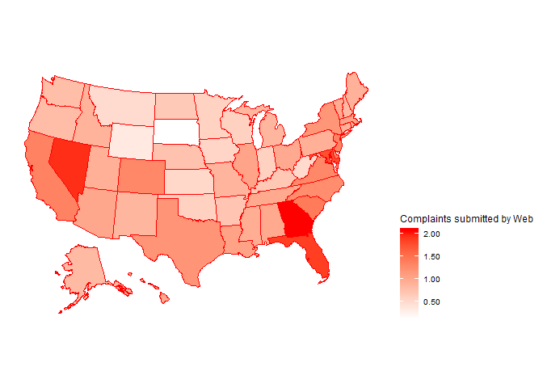

# 1. Packages needed

```r
library(dplyr)
library(ggplot2)
library(knitr)
library(kableExtra)
library(wordcloud)
library(plotly)
library(ggthemes)
library(gapminder)
library(scales)
library(usmap)
library(tidycensus)
library(lubridate)
library(TTR)
library(tm)
library(SnowballC)
library(RColorBrewer)
library(tidytext)
library(stringr)
```

# 2. Import data
```
complaints <- read.csv('complaints.csv',stringsAsFactors = FALSE)
saveRDS(complaints, file = "complaints_raw.rds") # This line change complaints.csv to dataset that works with R. 
complaints_raw <- readRDS("complaints_raw.rds")
```

# 3. Randomly draw 5000 rows of data to do the analysis.
```
subset <- complaints_raw[sample(nrow(complaints_raw), size = 5000, replace = FALSE),]
saveRDS(subset, file = "complaints_sub.rds")
```

# 4. take a look at it.

```r
complaints_test <- readRDS('complaints_sub.rds')
head(complaints_test,100) %>%
  View()
glimpse(complaints_test)
```

```
## Observations: 5,000
## Variables: 18
## $ Date.received                <chr> "2019-08-23", "2019-10-17", "2018-03-2...
## $ Product                      <chr> "Credit reporting, credit repair servi...
## $ Sub.product                  <chr> "Credit reporting", "Credit reporting"...
## $ Issue                        <chr> "Incorrect information on your report"...
## $ Sub.issue                    <chr> "Information belongs to someone else",...
## $ Consumer.complaint.narrative <chr> "", "Equifax is reporting incorrectly ...
## $ Company.public.response      <chr> "Company has responded to the consumer...
## $ Company                      <chr> "TRANSUNION INTERMEDIATE HOLDINGS, INC...
## $ State                        <chr> "GA", "CA", "FL", "CA", "IL", "NY", "T...
## $ ZIP.code                     <chr> "30349", "952XX", "347XX", "95835", "6...
## $ Tags                         <chr> "", "", "", "", "", "", "", "", "", ""...
## $ Consumer.consent.provided.   <chr> "Consent not provided", "Consent provi...
## $ Submitted.via                <chr> "Web", "Web", "Web", "Web", "Web", "We...
## $ Date.sent.to.company         <chr> "2019-08-23", "2019-10-17", "2018-03-2...
## $ Company.response.to.consumer <chr> "Closed with explanation", "Closed wit...
## $ Timely.response.             <chr> "Yes", "Yes", "Yes", "Yes", "Yes", "Ye...
## $ Consumer.disputed.           <chr> "N/A", "N/A", "N/A", "No", "No", "No",...
## $ Complaint.ID                 <int> 3351802, 3409076, 2851469, 2373071, 11...
```

# 5. Change date received to year-month-day

```r
complaints_test <- complaints_test %>%
  mutate(year = as.integer(substr(Date.received, start = 1, stop = 4))) %>%
  mutate(month = as.integer(substr(Date.received, start = 6, stop = 7))) %>%
  mutate(day = as.integer(substr(Date.received, start =9 , stop = 10)))
complaints_test$Date.received <- ymd(complaints_test$Date.received)
str(complaints_test)
```

```
## 'data.frame':	5000 obs. of  21 variables:
##  $ Date.received               : Date, format: "2019-08-23" "2019-10-17" ...
##  $ Product                     : chr  "Credit reporting, credit repair services, or other personal consumer reports" "Credit reporting, credit repair services, or other personal consumer reports" "Credit reporting, credit repair services, or other personal consumer reports" "Mortgage" ...
##  $ Sub.product                 : chr  "Credit reporting" "Credit reporting" "Credit reporting" "Conventional fixed mortgage" ...
##  $ Issue                       : chr  "Incorrect information on your report" "Problem with a credit reporting company's investigation into an existing problem" "Incorrect information on your report" "Settlement process and costs" ...
##  $ Sub.issue                   : chr  "Information belongs to someone else" "Their investigation did not fix an error on your report" "Information belongs to someone else" "" ...
##  $ Consumer.complaint.narrative: chr  "" "Equifax is reporting incorrectly collections in the amount of {$48.00} ; {$42.00} and {$28.00} on the XXXX XXXX"| __truncated__ "CALLTHE COMPANY TOLD THEY THIS ACCOUNT DOSENT BELONG TO ME EVEN EMAIL AND DISPUTE THIS ACCOUNT" "" ...
##  $ Company.public.response     : chr  "Company has responded to the consumer and the CFPB and chooses not to provide a public response" "" "Company has responded to the consumer and the CFPB and chooses not to provide a public response" "" ...
##  $ Company                     : chr  "TRANSUNION INTERMEDIATE HOLDINGS, INC." "EQUIFAX, INC." "Experian Information Solutions Inc." "Selene Finance LP" ...
##  $ State                       : chr  "GA" "CA" "FL" "CA" ...
##  $ ZIP.code                    : chr  "30349" "952XX" "347XX" "95835" ...
##  $ Tags                        : chr  "" "" "" "" ...
##  $ Consumer.consent.provided.  : chr  "Consent not provided" "Consent provided" "Consent provided" "Consent not provided" ...
##  $ Submitted.via               : chr  "Web" "Web" "Web" "Web" ...
##  $ Date.sent.to.company        : chr  "2019-08-23" "2019-10-17" "2018-03-22" "2017-03-07" ...
##  $ Company.response.to.consumer: chr  "Closed with explanation" "Closed with explanation" "Closed with non-monetary relief" "Closed with explanation" ...
##  $ Timely.response.            : chr  "Yes" "Yes" "Yes" "Yes" ...
##  $ Consumer.disputed.          : chr  "N/A" "N/A" "N/A" "No" ...
##  $ Complaint.ID                : int  3351802 3409076 2851469 2373071 1118688 1874286 3371286 3133247 1797570 1483556 ...
##  $ year                        : int  2019 2019 2018 2017 2014 2016 2019 2019 2016 2015 ...
##  $ month                       : int  8 10 3 3 11 4 9 1 2 7 ...
##  $ day                         : int  23 17 22 7 16 11 11 25 22 23 ...
```

# 6. Ploting of the number of complaints throughout the year
### Ploting overall number of complaints throughout the year

```r
p <- complaints_test %>% 
  mutate(date = as.POSIXct(paste(month , day , sep = "." )  , format = "%m.%d" )) %>%
  group_by(date) %>%
  summarise(number_of_complaints = n()) %>%
  ggplot(aes(x = date, y = number_of_complaints))+ geom_point()+ylab("Number of complaints")+
  theme_economist()+
  scale_x_datetime(labels=  date_format("%b-%d"),date_breaks = '1 month')+
  geom_smooth(lwd=1, se=FALSE,color = 'red')+
  geom_line(aes(x=date, y=SMA(number_of_complaints,10), color = 'red'))+ 
  theme(legend.position="none")+
  ggtitle("Overall number of complaints throughout a year")
ggplotly(p)
```

<!--html_preserve--><div id="htmlwidget-f1bf5c0f480848e18151" style="width:672px;height:480px;" class="plotly html-widget"></div>
<script type="application/json" data-for="htmlwidget-f1bf5c0f480848e18151">{"x":{"data":[{"x":[1577854800,1577941200,1578027600,1578114000,1578200400,1578286800,1578373200,1578459600,1578546000,1578632400,1578718800,1578805200,1578891600,1578978000,1579064400,1579150800,1579237200,1579323600,1579410000,1579496400,1579582800,1579669200,1579755600,1579842000,1579928400,1580014800,1580101200,1580187600,1580274000,1580360400,1580446800,1580533200,1580619600,1580706000,1580792400,1580878800,1580965200,1581051600,1581138000,1581224400,1581310800,1581397200,1581483600,1581570000,1581656400,1581742800,1581829200,1581915600,1582002000,1582088400,1582174800,1582261200,1582347600,1582434000,1582520400,1582606800,1582693200,1582779600,1582866000,1582952400,1583038800,1583125200,1583211600,1583298000,1583384400,1583470800,1583557200,1583643600,1583726400,1583812800,1583899200,1583985600,1584072000,1584158400,1584244800,1584331200,1584417600,1584504000,1584590400,1584676800,1584763200,1584849600,1584936000,1585022400,1585108800,1585195200,1585281600,1585368000,1585454400,1585540800,1585627200,1585713600,1585800000,1585886400,1585972800,1586059200,1586145600,1586232000,1586318400,1586404800,1586491200,1586577600,1586664000,1586750400,1586836800,1586923200,1587009600,1587096000,1587182400,1587268800,1587355200,1587441600,1587528000,1587614400,1587700800,1587787200,1587873600,1587960000,1588046400,1588132800,1588219200,1588305600,1588392000,1588478400,1588564800,1588651200,1588737600,1588824000,1588910400,1588996800,1589083200,1589169600,1589256000,1589342400,1589428800,1589515200,1589601600,1589688000,1589774400,1589860800,1589947200,1590033600,1590120000,1590206400,1590292800,1590379200,1590465600,1590552000,1590638400,1590724800,1590811200,1590897600,1590984000,1591070400,1591156800,1591243200,1591329600,1591416000,1591502400,1591588800,1591675200,1591761600,1591848000,1591934400,1592020800,1592107200,1592193600,1592280000,1592366400,1592452800,1592539200,1592625600,1592712000,1592798400,1592884800,1592971200,1593057600,1593144000,1593230400,1593316800,1593403200,1593489600,1593576000,1593662400,1593748800,1593835200,1593921600,1594008000,1594094400,1594180800,1594267200,1594353600,1594440000,1594526400,1594612800,1594699200,1594785600,1594872000,1594958400,1595044800,1595131200,1595217600,1595304000,1595390400,1595476800,1595563200,1595649600,1595736000,1595822400,1595908800,1595995200,1596081600,1596168000,1596254400,1596340800,1596427200,1596513600,1596600000,1596686400,1596772800,1596859200,1596945600,1597032000,1597118400,1597204800,1597291200,1597377600,1597464000,1597550400,1597636800,1597723200,1597809600,1597896000,1597982400,1598068800,1598155200,1598241600,1598328000,1598414400,1598500800,1598587200,1598673600,1598760000,1598846400,1598932800,1599019200,1599105600,1599192000,1599278400,1599364800,1599451200,1599537600,1599624000,1599710400,1599796800,1599883200,1599969600,1600056000,1600142400,1600228800,1600315200,1600401600,1600488000,1600574400,1600660800,1600747200,1600833600,1600920000,1601006400,1601092800,1601179200,1601265600,1601352000,1601438400,1601524800,1601611200,1601697600,1601784000,1601870400,1601956800,1602043200,1602129600,1602216000,1602302400,1602388800,1602475200,1602561600,1602648000,1602734400,1602820800,1602907200,1602993600,1603080000,1603166400,1603252800,1603339200,1603425600,1603512000,1603598400,1603684800,1603771200,1603857600,1603944000,1604030400,1604116800,1604203200,1604293200,1604379600,1604466000,1604552400,1604638800,1604725200,1604811600,1604898000,1604984400,1605070800,1605157200,1605243600,1605330000,1605416400,1605502800,1605589200,1605675600,1605762000,1605848400,1605934800,1606021200,1606107600,1606194000,1606280400,1606366800,1606453200,1606539600,1606626000,1606712400,1606798800,1606885200,1606971600,1607058000,1607144400,1607230800,1607317200,1607403600,1607490000,1607576400,1607662800,1607749200,1607835600,1607922000,1608008400,1608094800,1608181200,1608267600,1608354000,1608440400,1608526800,1608613200,1608699600,1608786000,1608872400,1608958800,1609045200,1609131600,1609218000,1609304400,1609390800],"y":[5,13,10,15,16,16,22,21,11,19,12,17,13,12,13,14,20,22,11,18,9,8,14,21,14,11,11,10,14,17,12,21,12,11,13,15,12,14,10,14,16,18,18,14,9,11,12,12,10,10,14,14,18,20,10,11,15,18,17,2,17,16,11,15,19,14,19,14,13,12,15,17,17,26,12,14,18,13,19,18,21,16,13,9,14,18,16,18,15,7,6,8,18,22,14,17,13,15,10,8,9,24,13,14,10,18,16,11,14,13,18,10,14,12,26,16,13,18,12,8,16,13,11,9,17,10,11,9,17,13,9,11,11,10,14,16,22,15,10,11,12,22,14,17,19,14,8,11,15,10,23,13,14,8,9,10,14,14,12,13,8,11,9,8,16,13,13,7,9,11,19,20,14,7,14,9,9,15,13,13,20,9,7,16,14,3,17,9,15,10,17,12,9,8,9,15,11,13,21,16,11,12,17,13,18,14,13,21,12,13,19,18,22,18,16,21,9,9,15,18,23,12,14,12,15,11,10,17,11,8,9,16,8,10,16,16,16,9,9,15,13,15,12,13,5,8,11,18,11,20,11,16,26,11,15,19,14,8,10,18,20,18,10,18,10,9,13,19,19,23,12,13,7,15,9,15,12,20,12,18,6,12,18,17,15,12,11,10,14,20,22,13,15,7,19,18,25,12,13,12,8,13,20,23,21,21,12,9,15,12,15,24,17,15,7,6,4,10,16,16,21,13,11,8,15,10,9,9,11,8,10,14,12,12,12,7,13,19,10,9,15,8,12,11,16,14,11,18,12,14,15,10,11,21,23,12,8,6,8,6,12,10,12,9,23,9],"text":["date: 2020-01-01<br />number_of_complaints:  5","date: 2020-01-02<br />number_of_complaints: 13","date: 2020-01-03<br />number_of_complaints: 10","date: 2020-01-04<br />number_of_complaints: 15","date: 2020-01-05<br />number_of_complaints: 16","date: 2020-01-06<br />number_of_complaints: 16","date: 2020-01-07<br />number_of_complaints: 22","date: 2020-01-08<br />number_of_complaints: 21","date: 2020-01-09<br />number_of_complaints: 11","date: 2020-01-10<br />number_of_complaints: 19","date: 2020-01-11<br />number_of_complaints: 12","date: 2020-01-12<br />number_of_complaints: 17","date: 2020-01-13<br />number_of_complaints: 13","date: 2020-01-14<br />number_of_complaints: 12","date: 2020-01-15<br />number_of_complaints: 13","date: 2020-01-16<br />number_of_complaints: 14","date: 2020-01-17<br />number_of_complaints: 20","date: 2020-01-18<br />number_of_complaints: 22","date: 2020-01-19<br />number_of_complaints: 11","date: 2020-01-20<br />number_of_complaints: 18","date: 2020-01-21<br />number_of_complaints:  9","date: 2020-01-22<br />number_of_complaints:  8","date: 2020-01-23<br />number_of_complaints: 14","date: 2020-01-24<br />number_of_complaints: 21","date: 2020-01-25<br />number_of_complaints: 14","date: 2020-01-26<br />number_of_complaints: 11","date: 2020-01-27<br />number_of_complaints: 11","date: 2020-01-28<br />number_of_complaints: 10","date: 2020-01-29<br />number_of_complaints: 14","date: 2020-01-30<br />number_of_complaints: 17","date: 2020-01-31<br />number_of_complaints: 12","date: 2020-02-01<br />number_of_complaints: 21","date: 2020-02-02<br />number_of_complaints: 12","date: 2020-02-03<br />number_of_complaints: 11","date: 2020-02-04<br />number_of_complaints: 13","date: 2020-02-05<br />number_of_complaints: 15","date: 2020-02-06<br />number_of_complaints: 12","date: 2020-02-07<br />number_of_complaints: 14","date: 2020-02-08<br />number_of_complaints: 10","date: 2020-02-09<br />number_of_complaints: 14","date: 2020-02-10<br />number_of_complaints: 16","date: 2020-02-11<br />number_of_complaints: 18","date: 2020-02-12<br />number_of_complaints: 18","date: 2020-02-13<br />number_of_complaints: 14","date: 2020-02-14<br />number_of_complaints:  9","date: 2020-02-15<br />number_of_complaints: 11","date: 2020-02-16<br />number_of_complaints: 12","date: 2020-02-17<br />number_of_complaints: 12","date: 2020-02-18<br />number_of_complaints: 10","date: 2020-02-19<br />number_of_complaints: 10","date: 2020-02-20<br />number_of_complaints: 14","date: 2020-02-21<br />number_of_complaints: 14","date: 2020-02-22<br />number_of_complaints: 18","date: 2020-02-23<br />number_of_complaints: 20","date: 2020-02-24<br />number_of_complaints: 10","date: 2020-02-25<br />number_of_complaints: 11","date: 2020-02-26<br />number_of_complaints: 15","date: 2020-02-27<br />number_of_complaints: 18","date: 2020-02-28<br />number_of_complaints: 17","date: 2020-02-29<br />number_of_complaints:  2","date: 2020-03-01<br />number_of_complaints: 17","date: 2020-03-02<br />number_of_complaints: 16","date: 2020-03-03<br />number_of_complaints: 11","date: 2020-03-04<br />number_of_complaints: 15","date: 2020-03-05<br />number_of_complaints: 19","date: 2020-03-06<br />number_of_complaints: 14","date: 2020-03-07<br />number_of_complaints: 19","date: 2020-03-08<br />number_of_complaints: 14","date: 2020-03-09<br />number_of_complaints: 13","date: 2020-03-10<br />number_of_complaints: 12","date: 2020-03-11<br />number_of_complaints: 15","date: 2020-03-12<br />number_of_complaints: 17","date: 2020-03-13<br />number_of_complaints: 17","date: 2020-03-14<br />number_of_complaints: 26","date: 2020-03-15<br />number_of_complaints: 12","date: 2020-03-16<br />number_of_complaints: 14","date: 2020-03-17<br />number_of_complaints: 18","date: 2020-03-18<br />number_of_complaints: 13","date: 2020-03-19<br />number_of_complaints: 19","date: 2020-03-20<br />number_of_complaints: 18","date: 2020-03-21<br />number_of_complaints: 21","date: 2020-03-22<br />number_of_complaints: 16","date: 2020-03-23<br />number_of_complaints: 13","date: 2020-03-24<br />number_of_complaints:  9","date: 2020-03-25<br />number_of_complaints: 14","date: 2020-03-26<br />number_of_complaints: 18","date: 2020-03-27<br />number_of_complaints: 16","date: 2020-03-28<br />number_of_complaints: 18","date: 2020-03-29<br />number_of_complaints: 15","date: 2020-03-30<br />number_of_complaints:  7","date: 2020-03-31<br />number_of_complaints:  6","date: 2020-04-01<br />number_of_complaints:  8","date: 2020-04-02<br />number_of_complaints: 18","date: 2020-04-03<br />number_of_complaints: 22","date: 2020-04-04<br />number_of_complaints: 14","date: 2020-04-05<br />number_of_complaints: 17","date: 2020-04-06<br />number_of_complaints: 13","date: 2020-04-07<br />number_of_complaints: 15","date: 2020-04-08<br />number_of_complaints: 10","date: 2020-04-09<br />number_of_complaints:  8","date: 2020-04-10<br />number_of_complaints:  9","date: 2020-04-11<br />number_of_complaints: 24","date: 2020-04-12<br />number_of_complaints: 13","date: 2020-04-13<br />number_of_complaints: 14","date: 2020-04-14<br />number_of_complaints: 10","date: 2020-04-15<br />number_of_complaints: 18","date: 2020-04-16<br />number_of_complaints: 16","date: 2020-04-17<br />number_of_complaints: 11","date: 2020-04-18<br />number_of_complaints: 14","date: 2020-04-19<br />number_of_complaints: 13","date: 2020-04-20<br />number_of_complaints: 18","date: 2020-04-21<br />number_of_complaints: 10","date: 2020-04-22<br />number_of_complaints: 14","date: 2020-04-23<br />number_of_complaints: 12","date: 2020-04-24<br />number_of_complaints: 26","date: 2020-04-25<br />number_of_complaints: 16","date: 2020-04-26<br />number_of_complaints: 13","date: 2020-04-27<br />number_of_complaints: 18","date: 2020-04-28<br />number_of_complaints: 12","date: 2020-04-29<br />number_of_complaints:  8","date: 2020-04-30<br />number_of_complaints: 16","date: 2020-05-01<br />number_of_complaints: 13","date: 2020-05-02<br />number_of_complaints: 11","date: 2020-05-03<br />number_of_complaints:  9","date: 2020-05-04<br />number_of_complaints: 17","date: 2020-05-05<br />number_of_complaints: 10","date: 2020-05-06<br />number_of_complaints: 11","date: 2020-05-07<br />number_of_complaints:  9","date: 2020-05-08<br />number_of_complaints: 17","date: 2020-05-09<br />number_of_complaints: 13","date: 2020-05-10<br />number_of_complaints:  9","date: 2020-05-11<br />number_of_complaints: 11","date: 2020-05-12<br />number_of_complaints: 11","date: 2020-05-13<br />number_of_complaints: 10","date: 2020-05-14<br />number_of_complaints: 14","date: 2020-05-15<br />number_of_complaints: 16","date: 2020-05-16<br />number_of_complaints: 22","date: 2020-05-17<br />number_of_complaints: 15","date: 2020-05-18<br />number_of_complaints: 10","date: 2020-05-19<br />number_of_complaints: 11","date: 2020-05-20<br />number_of_complaints: 12","date: 2020-05-21<br />number_of_complaints: 22","date: 2020-05-22<br />number_of_complaints: 14","date: 2020-05-23<br />number_of_complaints: 17","date: 2020-05-24<br />number_of_complaints: 19","date: 2020-05-25<br />number_of_complaints: 14","date: 2020-05-26<br />number_of_complaints:  8","date: 2020-05-27<br />number_of_complaints: 11","date: 2020-05-28<br />number_of_complaints: 15","date: 2020-05-29<br />number_of_complaints: 10","date: 2020-05-30<br />number_of_complaints: 23","date: 2020-05-31<br />number_of_complaints: 13","date: 2020-06-01<br />number_of_complaints: 14","date: 2020-06-02<br />number_of_complaints:  8","date: 2020-06-03<br />number_of_complaints:  9","date: 2020-06-04<br />number_of_complaints: 10","date: 2020-06-05<br />number_of_complaints: 14","date: 2020-06-06<br />number_of_complaints: 14","date: 2020-06-07<br />number_of_complaints: 12","date: 2020-06-08<br />number_of_complaints: 13","date: 2020-06-09<br />number_of_complaints:  8","date: 2020-06-10<br />number_of_complaints: 11","date: 2020-06-11<br />number_of_complaints:  9","date: 2020-06-12<br />number_of_complaints:  8","date: 2020-06-13<br />number_of_complaints: 16","date: 2020-06-14<br />number_of_complaints: 13","date: 2020-06-15<br />number_of_complaints: 13","date: 2020-06-16<br />number_of_complaints:  7","date: 2020-06-17<br />number_of_complaints:  9","date: 2020-06-18<br />number_of_complaints: 11","date: 2020-06-19<br />number_of_complaints: 19","date: 2020-06-20<br />number_of_complaints: 20","date: 2020-06-21<br />number_of_complaints: 14","date: 2020-06-22<br />number_of_complaints:  7","date: 2020-06-23<br />number_of_complaints: 14","date: 2020-06-24<br />number_of_complaints:  9","date: 2020-06-25<br />number_of_complaints:  9","date: 2020-06-26<br />number_of_complaints: 15","date: 2020-06-27<br />number_of_complaints: 13","date: 2020-06-28<br />number_of_complaints: 13","date: 2020-06-29<br />number_of_complaints: 20","date: 2020-06-30<br />number_of_complaints:  9","date: 2020-07-01<br />number_of_complaints:  7","date: 2020-07-02<br />number_of_complaints: 16","date: 2020-07-03<br />number_of_complaints: 14","date: 2020-07-04<br />number_of_complaints:  3","date: 2020-07-05<br />number_of_complaints: 17","date: 2020-07-06<br />number_of_complaints:  9","date: 2020-07-07<br />number_of_complaints: 15","date: 2020-07-08<br />number_of_complaints: 10","date: 2020-07-09<br />number_of_complaints: 17","date: 2020-07-10<br />number_of_complaints: 12","date: 2020-07-11<br />number_of_complaints:  9","date: 2020-07-12<br />number_of_complaints:  8","date: 2020-07-13<br />number_of_complaints:  9","date: 2020-07-14<br />number_of_complaints: 15","date: 2020-07-15<br />number_of_complaints: 11","date: 2020-07-16<br />number_of_complaints: 13","date: 2020-07-17<br />number_of_complaints: 21","date: 2020-07-18<br />number_of_complaints: 16","date: 2020-07-19<br />number_of_complaints: 11","date: 2020-07-20<br />number_of_complaints: 12","date: 2020-07-21<br />number_of_complaints: 17","date: 2020-07-22<br />number_of_complaints: 13","date: 2020-07-23<br />number_of_complaints: 18","date: 2020-07-24<br />number_of_complaints: 14","date: 2020-07-25<br />number_of_complaints: 13","date: 2020-07-26<br />number_of_complaints: 21","date: 2020-07-27<br />number_of_complaints: 12","date: 2020-07-28<br />number_of_complaints: 13","date: 2020-07-29<br />number_of_complaints: 19","date: 2020-07-30<br />number_of_complaints: 18","date: 2020-07-31<br />number_of_complaints: 22","date: 2020-08-01<br />number_of_complaints: 18","date: 2020-08-02<br />number_of_complaints: 16","date: 2020-08-03<br />number_of_complaints: 21","date: 2020-08-04<br />number_of_complaints:  9","date: 2020-08-05<br />number_of_complaints:  9","date: 2020-08-06<br />number_of_complaints: 15","date: 2020-08-07<br />number_of_complaints: 18","date: 2020-08-08<br />number_of_complaints: 23","date: 2020-08-09<br />number_of_complaints: 12","date: 2020-08-10<br />number_of_complaints: 14","date: 2020-08-11<br />number_of_complaints: 12","date: 2020-08-12<br />number_of_complaints: 15","date: 2020-08-13<br />number_of_complaints: 11","date: 2020-08-14<br />number_of_complaints: 10","date: 2020-08-15<br />number_of_complaints: 17","date: 2020-08-16<br />number_of_complaints: 11","date: 2020-08-17<br />number_of_complaints:  8","date: 2020-08-18<br />number_of_complaints:  9","date: 2020-08-19<br />number_of_complaints: 16","date: 2020-08-20<br />number_of_complaints:  8","date: 2020-08-21<br />number_of_complaints: 10","date: 2020-08-22<br />number_of_complaints: 16","date: 2020-08-23<br />number_of_complaints: 16","date: 2020-08-24<br />number_of_complaints: 16","date: 2020-08-25<br />number_of_complaints:  9","date: 2020-08-26<br />number_of_complaints:  9","date: 2020-08-27<br />number_of_complaints: 15","date: 2020-08-28<br />number_of_complaints: 13","date: 2020-08-29<br />number_of_complaints: 15","date: 2020-08-30<br />number_of_complaints: 12","date: 2020-08-31<br />number_of_complaints: 13","date: 2020-09-01<br />number_of_complaints:  5","date: 2020-09-02<br />number_of_complaints:  8","date: 2020-09-03<br />number_of_complaints: 11","date: 2020-09-04<br />number_of_complaints: 18","date: 2020-09-05<br />number_of_complaints: 11","date: 2020-09-06<br />number_of_complaints: 20","date: 2020-09-07<br />number_of_complaints: 11","date: 2020-09-08<br />number_of_complaints: 16","date: 2020-09-09<br />number_of_complaints: 26","date: 2020-09-10<br />number_of_complaints: 11","date: 2020-09-11<br />number_of_complaints: 15","date: 2020-09-12<br />number_of_complaints: 19","date: 2020-09-13<br />number_of_complaints: 14","date: 2020-09-14<br />number_of_complaints:  8","date: 2020-09-15<br />number_of_complaints: 10","date: 2020-09-16<br />number_of_complaints: 18","date: 2020-09-17<br />number_of_complaints: 20","date: 2020-09-18<br />number_of_complaints: 18","date: 2020-09-19<br />number_of_complaints: 10","date: 2020-09-20<br />number_of_complaints: 18","date: 2020-09-21<br />number_of_complaints: 10","date: 2020-09-22<br />number_of_complaints:  9","date: 2020-09-23<br />number_of_complaints: 13","date: 2020-09-24<br />number_of_complaints: 19","date: 2020-09-25<br />number_of_complaints: 19","date: 2020-09-26<br />number_of_complaints: 23","date: 2020-09-27<br />number_of_complaints: 12","date: 2020-09-28<br />number_of_complaints: 13","date: 2020-09-29<br />number_of_complaints:  7","date: 2020-09-30<br />number_of_complaints: 15","date: 2020-10-01<br />number_of_complaints:  9","date: 2020-10-02<br />number_of_complaints: 15","date: 2020-10-03<br />number_of_complaints: 12","date: 2020-10-04<br />number_of_complaints: 20","date: 2020-10-05<br />number_of_complaints: 12","date: 2020-10-06<br />number_of_complaints: 18","date: 2020-10-07<br />number_of_complaints:  6","date: 2020-10-08<br />number_of_complaints: 12","date: 2020-10-09<br />number_of_complaints: 18","date: 2020-10-10<br />number_of_complaints: 17","date: 2020-10-11<br />number_of_complaints: 15","date: 2020-10-12<br />number_of_complaints: 12","date: 2020-10-13<br />number_of_complaints: 11","date: 2020-10-14<br />number_of_complaints: 10","date: 2020-10-15<br />number_of_complaints: 14","date: 2020-10-16<br />number_of_complaints: 20","date: 2020-10-17<br />number_of_complaints: 22","date: 2020-10-18<br />number_of_complaints: 13","date: 2020-10-19<br />number_of_complaints: 15","date: 2020-10-20<br />number_of_complaints:  7","date: 2020-10-21<br />number_of_complaints: 19","date: 2020-10-22<br />number_of_complaints: 18","date: 2020-10-23<br />number_of_complaints: 25","date: 2020-10-24<br />number_of_complaints: 12","date: 2020-10-25<br />number_of_complaints: 13","date: 2020-10-26<br />number_of_complaints: 12","date: 2020-10-27<br />number_of_complaints:  8","date: 2020-10-28<br />number_of_complaints: 13","date: 2020-10-29<br />number_of_complaints: 20","date: 2020-10-30<br />number_of_complaints: 23","date: 2020-10-31<br />number_of_complaints: 21","date: 2020-11-01<br />number_of_complaints: 21","date: 2020-11-02<br />number_of_complaints: 12","date: 2020-11-03<br />number_of_complaints:  9","date: 2020-11-04<br />number_of_complaints: 15","date: 2020-11-05<br />number_of_complaints: 12","date: 2020-11-06<br />number_of_complaints: 15","date: 2020-11-07<br />number_of_complaints: 24","date: 2020-11-08<br />number_of_complaints: 17","date: 2020-11-09<br />number_of_complaints: 15","date: 2020-11-10<br />number_of_complaints:  7","date: 2020-11-11<br />number_of_complaints:  6","date: 2020-11-12<br />number_of_complaints:  4","date: 2020-11-13<br />number_of_complaints: 10","date: 2020-11-14<br />number_of_complaints: 16","date: 2020-11-15<br />number_of_complaints: 16","date: 2020-11-16<br />number_of_complaints: 21","date: 2020-11-17<br />number_of_complaints: 13","date: 2020-11-18<br />number_of_complaints: 11","date: 2020-11-19<br />number_of_complaints:  8","date: 2020-11-20<br />number_of_complaints: 15","date: 2020-11-21<br />number_of_complaints: 10","date: 2020-11-22<br />number_of_complaints:  9","date: 2020-11-23<br />number_of_complaints:  9","date: 2020-11-24<br />number_of_complaints: 11","date: 2020-11-25<br />number_of_complaints:  8","date: 2020-11-26<br />number_of_complaints: 10","date: 2020-11-27<br />number_of_complaints: 14","date: 2020-11-28<br />number_of_complaints: 12","date: 2020-11-29<br />number_of_complaints: 12","date: 2020-11-30<br />number_of_complaints: 12","date: 2020-12-01<br />number_of_complaints:  7","date: 2020-12-02<br />number_of_complaints: 13","date: 2020-12-03<br />number_of_complaints: 19","date: 2020-12-04<br />number_of_complaints: 10","date: 2020-12-05<br />number_of_complaints:  9","date: 2020-12-06<br />number_of_complaints: 15","date: 2020-12-07<br />number_of_complaints:  8","date: 2020-12-08<br />number_of_complaints: 12","date: 2020-12-09<br />number_of_complaints: 11","date: 2020-12-10<br />number_of_complaints: 16","date: 2020-12-11<br />number_of_complaints: 14","date: 2020-12-12<br />number_of_complaints: 11","date: 2020-12-13<br />number_of_complaints: 18","date: 2020-12-14<br />number_of_complaints: 12","date: 2020-12-15<br />number_of_complaints: 14","date: 2020-12-16<br />number_of_complaints: 15","date: 2020-12-17<br />number_of_complaints: 10","date: 2020-12-18<br />number_of_complaints: 11","date: 2020-12-19<br />number_of_complaints: 21","date: 2020-12-20<br />number_of_complaints: 23","date: 2020-12-21<br />number_of_complaints: 12","date: 2020-12-22<br />number_of_complaints:  8","date: 2020-12-23<br />number_of_complaints:  6","date: 2020-12-24<br />number_of_complaints:  8","date: 2020-12-25<br />number_of_complaints:  6","date: 2020-12-26<br />number_of_complaints: 12","date: 2020-12-27<br />number_of_complaints: 10","date: 2020-12-28<br />number_of_complaints: 12","date: 2020-12-29<br />number_of_complaints:  9","date: 2020-12-30<br />number_of_complaints: 23","date: 2020-12-31<br />number_of_complaints:  9"],"type":"scatter","mode":"markers","marker":{"autocolorscale":false,"color":"rgba(0,0,0,1)","opacity":1,"size":5.66929133858268,"symbol":"circle","line":{"width":1.88976377952756,"color":"rgba(0,0,0,1)"}},"hoveron":"points","showlegend":false,"xaxis":"x","yaxis":"y","hoverinfo":"text","frame":null},{"x":[1577854800,1578253989.87342,1578653179.74684,1579052369.62025,1579451559.49367,1579850749.36709,1580249939.24051,1580649129.11392,1581048318.98734,1581447508.86076,1581846698.73418,1582245888.60759,1582645078.48101,1583044268.35443,1583443458.22785,1583842648.10127,1584241837.97468,1584641027.8481,1585040217.72152,1585439407.59494,1585838597.46835,1586237787.34177,1586636977.21519,1587036167.08861,1587435356.96203,1587834546.83544,1588233736.70886,1588632926.58228,1589032116.4557,1589431306.32911,1589830496.20253,1590229686.07595,1590628875.94937,1591028065.82278,1591427255.6962,1591826445.56962,1592225635.44304,1592624825.31646,1593024015.18987,1593423205.06329,1593822394.93671,1594221584.81013,1594620774.68354,1595019964.55696,1595419154.43038,1595818344.3038,1596217534.17722,1596616724.05063,1597015913.92405,1597415103.79747,1597814293.67089,1598213483.5443,1598612673.41772,1599011863.29114,1599411053.16456,1599810243.03797,1600209432.91139,1600608622.78481,1601007812.65823,1601407002.53165,1601806192.40506,1602205382.27848,1602604572.1519,1603003762.02532,1603402951.89873,1603802141.77215,1604201331.64557,1604600521.51899,1604999711.39241,1605398901.26582,1605798091.13924,1606197281.01266,1606596470.88608,1606995660.75949,1607394850.63291,1607794040.50633,1608193230.37975,1608592420.25316,1608991610.12658,1609390800],"y":[14.3372372061559,14.3357295660061,14.3331229351293,14.3290794179272,14.3232611188014,14.3153301421538,14.304948592386,14.2917785738997,14.2754821910966,14.2557215483785,14.2321285395452,14.204045763633,14.171914987637,14.1365247349714,14.0986635290507,14.0591198932892,14.0186823511014,13.9781394259016,13.9382796411043,13.8998915201238,13.8629736271572,13.8173407053528,13.7617392358798,13.6988669589875,13.6314216149246,13.5621009439404,13.4936026862838,13.4286245822038,13.3698643719494,13.3200197957696,13.2806538717226,13.2412326448595,13.2000485121969,13.1590225997548,13.1200760335531,13.0851299396116,13.0561054439501,13.0349236725886,13.0235057515469,13.0237728068448,13.0417187908397,13.0911122098746,13.1667249093592,13.2615443835458,13.3685581266868,13.4807536330346,13.5911183968414,13.6926399123597,13.7783056738418,13.84110317554,13.8823394382943,13.9246171306101,13.9674775641296,14.0083604755993,14.0447056017657,14.0739526793753,14.0935414451745,14.10091163591,14.0935029883281,14.0687552391755,14.027875446616,13.9800448813574,13.9254092073594,13.8634840090919,13.793784871025,13.7158273776286,13.6291271133728,13.5331996627274,13.4275606101626,13.3117255401482,13.1854052010132,13.0489582239299,12.9026084893015,12.7465635286745,12.5810308735954,12.4062180556109,12.2223326062672,12.0295820571111,11.8281739396889,11.6183157855473],"text":["date: 1577854800<br />number_of_complaints: 14.33724","date: 1578253990<br />number_of_complaints: 14.33573","date: 1578653180<br />number_of_complaints: 14.33312","date: 1579052370<br />number_of_complaints: 14.32908","date: 1579451559<br />number_of_complaints: 14.32326","date: 1579850749<br />number_of_complaints: 14.31533","date: 1580249939<br />number_of_complaints: 14.30495","date: 1580649129<br />number_of_complaints: 14.29178","date: 1581048319<br />number_of_complaints: 14.27548","date: 1581447509<br />number_of_complaints: 14.25572","date: 1581846699<br />number_of_complaints: 14.23213","date: 1582245889<br />number_of_complaints: 14.20405","date: 1582645078<br />number_of_complaints: 14.17191","date: 1583044268<br />number_of_complaints: 14.13652","date: 1583443458<br />number_of_complaints: 14.09866","date: 1583842648<br />number_of_complaints: 14.05912","date: 1584241838<br />number_of_complaints: 14.01868","date: 1584641028<br />number_of_complaints: 13.97814","date: 1585040218<br />number_of_complaints: 13.93828","date: 1585439408<br />number_of_complaints: 13.89989","date: 1585838597<br />number_of_complaints: 13.86297","date: 1586237787<br />number_of_complaints: 13.81734","date: 1586636977<br />number_of_complaints: 13.76174","date: 1587036167<br />number_of_complaints: 13.69887","date: 1587435357<br />number_of_complaints: 13.63142","date: 1587834547<br />number_of_complaints: 13.56210","date: 1588233737<br />number_of_complaints: 13.49360","date: 1588632927<br />number_of_complaints: 13.42862","date: 1589032116<br />number_of_complaints: 13.36986","date: 1589431306<br />number_of_complaints: 13.32002","date: 1589830496<br />number_of_complaints: 13.28065","date: 1590229686<br />number_of_complaints: 13.24123","date: 1590628876<br />number_of_complaints: 13.20005","date: 1591028066<br />number_of_complaints: 13.15902","date: 1591427256<br />number_of_complaints: 13.12008","date: 1591826446<br />number_of_complaints: 13.08513","date: 1592225635<br />number_of_complaints: 13.05611","date: 1592624825<br />number_of_complaints: 13.03492","date: 1593024015<br />number_of_complaints: 13.02351","date: 1593423205<br />number_of_complaints: 13.02377","date: 1593822395<br />number_of_complaints: 13.04172","date: 1594221585<br />number_of_complaints: 13.09111","date: 1594620775<br />number_of_complaints: 13.16672","date: 1595019965<br />number_of_complaints: 13.26154","date: 1595419154<br />number_of_complaints: 13.36856","date: 1595818344<br />number_of_complaints: 13.48075","date: 1596217534<br />number_of_complaints: 13.59112","date: 1596616724<br />number_of_complaints: 13.69264","date: 1597015914<br />number_of_complaints: 13.77831","date: 1597415104<br />number_of_complaints: 13.84110","date: 1597814294<br />number_of_complaints: 13.88234","date: 1598213484<br />number_of_complaints: 13.92462","date: 1598612673<br />number_of_complaints: 13.96748","date: 1599011863<br />number_of_complaints: 14.00836","date: 1599411053<br />number_of_complaints: 14.04471","date: 1599810243<br />number_of_complaints: 14.07395","date: 1600209433<br />number_of_complaints: 14.09354","date: 1600608623<br />number_of_complaints: 14.10091","date: 1601007813<br />number_of_complaints: 14.09350","date: 1601407003<br />number_of_complaints: 14.06876","date: 1601806192<br />number_of_complaints: 14.02788","date: 1602205382<br />number_of_complaints: 13.98004","date: 1602604572<br />number_of_complaints: 13.92541","date: 1603003762<br />number_of_complaints: 13.86348","date: 1603402952<br />number_of_complaints: 13.79378","date: 1603802142<br />number_of_complaints: 13.71583","date: 1604201332<br />number_of_complaints: 13.62913","date: 1604600522<br />number_of_complaints: 13.53320","date: 1604999711<br />number_of_complaints: 13.42756","date: 1605398901<br />number_of_complaints: 13.31173","date: 1605798091<br />number_of_complaints: 13.18541","date: 1606197281<br />number_of_complaints: 13.04896","date: 1606596471<br />number_of_complaints: 12.90261","date: 1606995661<br />number_of_complaints: 12.74656","date: 1607394851<br />number_of_complaints: 12.58103","date: 1607794041<br />number_of_complaints: 12.40622","date: 1608193230<br />number_of_complaints: 12.22233","date: 1608592420<br />number_of_complaints: 12.02958","date: 1608991610<br />number_of_complaints: 11.82817","date: 1609390800<br />number_of_complaints: 11.61832"],"type":"scatter","mode":"lines","name":"fitted values","line":{"width":3.77952755905512,"color":"rgba(255,0,0,1)","dash":"solid"},"hoveron":"points","showlegend":false,"xaxis":"x","yaxis":"y","hoverinfo":"text","frame":null},{"x":[1577854800,1577941200,1578027600,1578114000,1578200400,1578286800,1578373200,1578459600,1578546000,1578632400,1578718800,1578805200,1578891600,1578978000,1579064400,1579150800,1579237200,1579323600,1579410000,1579496400,1579582800,1579669200,1579755600,1579842000,1579928400,1580014800,1580101200,1580187600,1580274000,1580360400,1580446800,1580533200,1580619600,1580706000,1580792400,1580878800,1580965200,1581051600,1581138000,1581224400,1581310800,1581397200,1581483600,1581570000,1581656400,1581742800,1581829200,1581915600,1582002000,1582088400,1582174800,1582261200,1582347600,1582434000,1582520400,1582606800,1582693200,1582779600,1582866000,1582952400,1583038800,1583125200,1583211600,1583298000,1583384400,1583470800,1583557200,1583643600,1583726400,1583812800,1583899200,1583985600,1584072000,1584158400,1584244800,1584331200,1584417600,1584504000,1584590400,1584676800,1584763200,1584849600,1584936000,1585022400,1585108800,1585195200,1585281600,1585368000,1585454400,1585540800,1585627200,1585713600,1585800000,1585886400,1585972800,1586059200,1586145600,1586232000,1586318400,1586404800,1586491200,1586577600,1586664000,1586750400,1586836800,1586923200,1587009600,1587096000,1587182400,1587268800,1587355200,1587441600,1587528000,1587614400,1587700800,1587787200,1587873600,1587960000,1588046400,1588132800,1588219200,1588305600,1588392000,1588478400,1588564800,1588651200,1588737600,1588824000,1588910400,1588996800,1589083200,1589169600,1589256000,1589342400,1589428800,1589515200,1589601600,1589688000,1589774400,1589860800,1589947200,1590033600,1590120000,1590206400,1590292800,1590379200,1590465600,1590552000,1590638400,1590724800,1590811200,1590897600,1590984000,1591070400,1591156800,1591243200,1591329600,1591416000,1591502400,1591588800,1591675200,1591761600,1591848000,1591934400,1592020800,1592107200,1592193600,1592280000,1592366400,1592452800,1592539200,1592625600,1592712000,1592798400,1592884800,1592971200,1593057600,1593144000,1593230400,1593316800,1593403200,1593489600,1593576000,1593662400,1593748800,1593835200,1593921600,1594008000,1594094400,1594180800,1594267200,1594353600,1594440000,1594526400,1594612800,1594699200,1594785600,1594872000,1594958400,1595044800,1595131200,1595217600,1595304000,1595390400,1595476800,1595563200,1595649600,1595736000,1595822400,1595908800,1595995200,1596081600,1596168000,1596254400,1596340800,1596427200,1596513600,1596600000,1596686400,1596772800,1596859200,1596945600,1597032000,1597118400,1597204800,1597291200,1597377600,1597464000,1597550400,1597636800,1597723200,1597809600,1597896000,1597982400,1598068800,1598155200,1598241600,1598328000,1598414400,1598500800,1598587200,1598673600,1598760000,1598846400,1598932800,1599019200,1599105600,1599192000,1599278400,1599364800,1599451200,1599537600,1599624000,1599710400,1599796800,1599883200,1599969600,1600056000,1600142400,1600228800,1600315200,1600401600,1600488000,1600574400,1600660800,1600747200,1600833600,1600920000,1601006400,1601092800,1601179200,1601265600,1601352000,1601438400,1601524800,1601611200,1601697600,1601784000,1601870400,1601956800,1602043200,1602129600,1602216000,1602302400,1602388800,1602475200,1602561600,1602648000,1602734400,1602820800,1602907200,1602993600,1603080000,1603166400,1603252800,1603339200,1603425600,1603512000,1603598400,1603684800,1603771200,1603857600,1603944000,1604030400,1604116800,1604203200,1604293200,1604379600,1604466000,1604552400,1604638800,1604725200,1604811600,1604898000,1604984400,1605070800,1605157200,1605243600,1605330000,1605416400,1605502800,1605589200,1605675600,1605762000,1605848400,1605934800,1606021200,1606107600,1606194000,1606280400,1606366800,1606453200,1606539600,1606626000,1606712400,1606798800,1606885200,1606971600,1607058000,1607144400,1607230800,1607317200,1607403600,1607490000,1607576400,1607662800,1607749200,1607835600,1607922000,1608008400,1608094800,1608181200,1608267600,1608354000,1608440400,1608526800,1608613200,1608699600,1608786000,1608872400,1608958800,1609045200,1609131600,1609218000,1609304400,1609390800],"y":[null,null,null,null,null,null,null,null,null,14.8,15.5,15.9,16.2,15.9,15.6,15.4,15.2,15.3,15.3,15.2,14.9,14,14.1,15,15.1,14.8,13.9,12.7,13,12.9,13.2,14.5,14.3,13.3,13.2,13.6,13.7,14.1,13.7,13.4,13.8,13.5,14.1,14.4,14,13.6,13.6,13.4,13.4,13,12.8,12.4,12.4,13,13.1,13.1,13.4,14,14.7,13.9,14.2,14.4,13.7,13.2,14.1,14.4,14.8,14.4,14,15,14.8,14.9,15.5,16.6,15.9,15.9,15.8,15.7,16.3,16.9,17.5,17.4,17,15.3,15.5,15.9,15.7,16.2,15.8,14.7,13.2,12.4,12.9,14.2,14.2,14.1,13.8,13.5,13,13.1,13.4,15,14.5,13.7,13.3,13.4,13.7,13.3,13.7,14.2,15.1,13.7,13.8,13.6,15.2,15,14.7,15.4,15.2,14.7,14.5,14.8,14.5,14.2,13.3,12.7,12.5,11.6,12.1,12.6,11.9,11.7,11.7,11.8,11.5,12.1,13.2,13.8,13.1,12.9,13.2,14.3,14.6,15.3,15.8,15.6,14.2,13.8,14.3,14.2,15.3,14.4,14.4,13.5,12.5,12.1,12.7,13,12.7,13,11.5,11.3,10.8,10.8,11.5,11.8,11.7,11,10.7,10.5,11.6,12.5,13,12.9,12.7,12.3,11.9,12.7,13.1,13.3,13.4,12.3,11.6,12.5,12.5,11.9,12.7,12.1,12.3,12,11.7,12,12.2,11.4,10.9,12.1,11.5,11.9,12.5,13.1,12.5,12.5,13.3,13.8,14.7,14.6,14.8,15.6,14.7,14.4,15.2,15.8,16.3,16.8,16.6,17.3,16.9,15.7,16,16.5,16.9,16.3,15.5,14.9,14.8,13.8,13.9,14.7,14.3,13.3,11.9,12.3,11.7,11.5,11.6,12.1,12.7,11.9,11.7,12.4,12.8,12.7,13.1,13.4,12.3,11.5,11,11.9,12.1,12.6,12.4,12.5,13.9,13.7,14.7,15.8,16.1,15.1,15,14.8,15.7,15.9,14.3,15,14.5,13.5,13.4,14.5,15.4,15.9,15.1,14.6,14.3,14,13.9,14.5,14.4,14.5,13.8,13.3,12.7,12.6,13.7,13.9,14.5,14.2,14.1,13.1,13.3,13.5,15.1,15.2,14.9,13.9,14.3,14.9,16.3,16.5,16.4,15.6,14.2,14.2,14.7,16.3,16.5,16.8,15.5,15.2,15.4,15.4,16.1,17.2,16.9,16.1,14.7,13.2,12.4,12.5,12.6,13,13.6,12.5,11.9,11.2,12,12.4,12.9,12.8,12.3,11.5,10.4,10.5,10.6,11,10.7,10.4,10.8,11.8,11.7,11.8,12.3,11.7,11.7,11.6,12,12.7,12.5,12.4,12.6,13.1,13.1,13.3,13.2,14.2,14.9,14.7,14.4,13.2,12.8,12,11.7,11.7,11.8,10.6,10.6,10.3],"text":["date: 2020-01-01<br />SMA(number_of_complaints, 10):   NA<br />colour: red<br />date: 2020-01-01<br />number_of_complaints:   NA","date: 2020-01-02<br />SMA(number_of_complaints, 10):   NA<br />colour: red<br />date: 2020-01-02<br />number_of_complaints:   NA","date: 2020-01-03<br />SMA(number_of_complaints, 10):   NA<br />colour: red<br />date: 2020-01-03<br />number_of_complaints:   NA","date: 2020-01-04<br />SMA(number_of_complaints, 10):   NA<br />colour: red<br />date: 2020-01-04<br />number_of_complaints:   NA","date: 2020-01-05<br />SMA(number_of_complaints, 10):   NA<br />colour: red<br />date: 2020-01-05<br />number_of_complaints:   NA","date: 2020-01-06<br />SMA(number_of_complaints, 10):   NA<br />colour: red<br />date: 2020-01-06<br />number_of_complaints:   NA","date: 2020-01-07<br />SMA(number_of_complaints, 10):   NA<br />colour: red<br />date: 2020-01-07<br />number_of_complaints:   NA","date: 2020-01-08<br />SMA(number_of_complaints, 10):   NA<br />colour: red<br />date: 2020-01-08<br />number_of_complaints:   NA","date: 2020-01-09<br />SMA(number_of_complaints, 10):   NA<br />colour: red<br />date: 2020-01-09<br />number_of_complaints:   NA","date: 2020-01-10<br />SMA(number_of_complaints, 10): 14.8<br />colour: red<br />date: 2020-01-10<br />number_of_complaints: 14.8","date: 2020-01-11<br />SMA(number_of_complaints, 10): 15.5<br />colour: red<br />date: 2020-01-11<br />number_of_complaints: 15.5","date: 2020-01-12<br />SMA(number_of_complaints, 10): 15.9<br />colour: red<br />date: 2020-01-12<br />number_of_complaints: 15.9","date: 2020-01-13<br />SMA(number_of_complaints, 10): 16.2<br />colour: red<br />date: 2020-01-13<br />number_of_complaints: 16.2","date: 2020-01-14<br />SMA(number_of_complaints, 10): 15.9<br />colour: red<br />date: 2020-01-14<br />number_of_complaints: 15.9","date: 2020-01-15<br />SMA(number_of_complaints, 10): 15.6<br />colour: red<br />date: 2020-01-15<br />number_of_complaints: 15.6","date: 2020-01-16<br />SMA(number_of_complaints, 10): 15.4<br />colour: red<br />date: 2020-01-16<br />number_of_complaints: 15.4","date: 2020-01-17<br />SMA(number_of_complaints, 10): 15.2<br />colour: red<br />date: 2020-01-17<br />number_of_complaints: 15.2","date: 2020-01-18<br />SMA(number_of_complaints, 10): 15.3<br />colour: red<br />date: 2020-01-18<br />number_of_complaints: 15.3","date: 2020-01-19<br />SMA(number_of_complaints, 10): 15.3<br />colour: red<br />date: 2020-01-19<br />number_of_complaints: 15.3","date: 2020-01-20<br />SMA(number_of_complaints, 10): 15.2<br />colour: red<br />date: 2020-01-20<br />number_of_complaints: 15.2","date: 2020-01-21<br />SMA(number_of_complaints, 10): 14.9<br />colour: red<br />date: 2020-01-21<br />number_of_complaints: 14.9","date: 2020-01-22<br />SMA(number_of_complaints, 10): 14.0<br />colour: red<br />date: 2020-01-22<br />number_of_complaints: 14.0","date: 2020-01-23<br />SMA(number_of_complaints, 10): 14.1<br />colour: red<br />date: 2020-01-23<br />number_of_complaints: 14.1","date: 2020-01-24<br />SMA(number_of_complaints, 10): 15.0<br />colour: red<br />date: 2020-01-24<br />number_of_complaints: 15.0","date: 2020-01-25<br />SMA(number_of_complaints, 10): 15.1<br />colour: red<br />date: 2020-01-25<br />number_of_complaints: 15.1","date: 2020-01-26<br />SMA(number_of_complaints, 10): 14.8<br />colour: red<br />date: 2020-01-26<br />number_of_complaints: 14.8","date: 2020-01-27<br />SMA(number_of_complaints, 10): 13.9<br />colour: red<br />date: 2020-01-27<br />number_of_complaints: 13.9","date: 2020-01-28<br />SMA(number_of_complaints, 10): 12.7<br />colour: red<br />date: 2020-01-28<br />number_of_complaints: 12.7","date: 2020-01-29<br />SMA(number_of_complaints, 10): 13.0<br />colour: red<br />date: 2020-01-29<br />number_of_complaints: 13.0","date: 2020-01-30<br />SMA(number_of_complaints, 10): 12.9<br />colour: red<br />date: 2020-01-30<br />number_of_complaints: 12.9","date: 2020-01-31<br />SMA(number_of_complaints, 10): 13.2<br />colour: red<br />date: 2020-01-31<br />number_of_complaints: 13.2","date: 2020-02-01<br />SMA(number_of_complaints, 10): 14.5<br />colour: red<br />date: 2020-02-01<br />number_of_complaints: 14.5","date: 2020-02-02<br />SMA(number_of_complaints, 10): 14.3<br />colour: red<br />date: 2020-02-02<br />number_of_complaints: 14.3","date: 2020-02-03<br />SMA(number_of_complaints, 10): 13.3<br />colour: red<br />date: 2020-02-03<br />number_of_complaints: 13.3","date: 2020-02-04<br />SMA(number_of_complaints, 10): 13.2<br />colour: red<br />date: 2020-02-04<br />number_of_complaints: 13.2","date: 2020-02-05<br />SMA(number_of_complaints, 10): 13.6<br />colour: red<br />date: 2020-02-05<br />number_of_complaints: 13.6","date: 2020-02-06<br />SMA(number_of_complaints, 10): 13.7<br />colour: red<br />date: 2020-02-06<br />number_of_complaints: 13.7","date: 2020-02-07<br />SMA(number_of_complaints, 10): 14.1<br />colour: red<br />date: 2020-02-07<br />number_of_complaints: 14.1","date: 2020-02-08<br />SMA(number_of_complaints, 10): 13.7<br />colour: red<br />date: 2020-02-08<br />number_of_complaints: 13.7","date: 2020-02-09<br />SMA(number_of_complaints, 10): 13.4<br />colour: red<br />date: 2020-02-09<br />number_of_complaints: 13.4","date: 2020-02-10<br />SMA(number_of_complaints, 10): 13.8<br />colour: red<br />date: 2020-02-10<br />number_of_complaints: 13.8","date: 2020-02-11<br />SMA(number_of_complaints, 10): 13.5<br />colour: red<br />date: 2020-02-11<br />number_of_complaints: 13.5","date: 2020-02-12<br />SMA(number_of_complaints, 10): 14.1<br />colour: red<br />date: 2020-02-12<br />number_of_complaints: 14.1","date: 2020-02-13<br />SMA(number_of_complaints, 10): 14.4<br />colour: red<br />date: 2020-02-13<br />number_of_complaints: 14.4","date: 2020-02-14<br />SMA(number_of_complaints, 10): 14.0<br />colour: red<br />date: 2020-02-14<br />number_of_complaints: 14.0","date: 2020-02-15<br />SMA(number_of_complaints, 10): 13.6<br />colour: red<br />date: 2020-02-15<br />number_of_complaints: 13.6","date: 2020-02-16<br />SMA(number_of_complaints, 10): 13.6<br />colour: red<br />date: 2020-02-16<br />number_of_complaints: 13.6","date: 2020-02-17<br />SMA(number_of_complaints, 10): 13.4<br />colour: red<br />date: 2020-02-17<br />number_of_complaints: 13.4","date: 2020-02-18<br />SMA(number_of_complaints, 10): 13.4<br />colour: red<br />date: 2020-02-18<br />number_of_complaints: 13.4","date: 2020-02-19<br />SMA(number_of_complaints, 10): 13.0<br />colour: red<br />date: 2020-02-19<br />number_of_complaints: 13.0","date: 2020-02-20<br />SMA(number_of_complaints, 10): 12.8<br />colour: red<br />date: 2020-02-20<br />number_of_complaints: 12.8","date: 2020-02-21<br />SMA(number_of_complaints, 10): 12.4<br />colour: red<br />date: 2020-02-21<br />number_of_complaints: 12.4","date: 2020-02-22<br />SMA(number_of_complaints, 10): 12.4<br />colour: red<br />date: 2020-02-22<br />number_of_complaints: 12.4","date: 2020-02-23<br />SMA(number_of_complaints, 10): 13.0<br />colour: red<br />date: 2020-02-23<br />number_of_complaints: 13.0","date: 2020-02-24<br />SMA(number_of_complaints, 10): 13.1<br />colour: red<br />date: 2020-02-24<br />number_of_complaints: 13.1","date: 2020-02-25<br />SMA(number_of_complaints, 10): 13.1<br />colour: red<br />date: 2020-02-25<br />number_of_complaints: 13.1","date: 2020-02-26<br />SMA(number_of_complaints, 10): 13.4<br />colour: red<br />date: 2020-02-26<br />number_of_complaints: 13.4","date: 2020-02-27<br />SMA(number_of_complaints, 10): 14.0<br />colour: red<br />date: 2020-02-27<br />number_of_complaints: 14.0","date: 2020-02-28<br />SMA(number_of_complaints, 10): 14.7<br />colour: red<br />date: 2020-02-28<br />number_of_complaints: 14.7","date: 2020-02-29<br />SMA(number_of_complaints, 10): 13.9<br />colour: red<br />date: 2020-02-29<br />number_of_complaints: 13.9","date: 2020-03-01<br />SMA(number_of_complaints, 10): 14.2<br />colour: red<br />date: 2020-03-01<br />number_of_complaints: 14.2","date: 2020-03-02<br />SMA(number_of_complaints, 10): 14.4<br />colour: red<br />date: 2020-03-02<br />number_of_complaints: 14.4","date: 2020-03-03<br />SMA(number_of_complaints, 10): 13.7<br />colour: red<br />date: 2020-03-03<br />number_of_complaints: 13.7","date: 2020-03-04<br />SMA(number_of_complaints, 10): 13.2<br />colour: red<br />date: 2020-03-04<br />number_of_complaints: 13.2","date: 2020-03-05<br />SMA(number_of_complaints, 10): 14.1<br />colour: red<br />date: 2020-03-05<br />number_of_complaints: 14.1","date: 2020-03-06<br />SMA(number_of_complaints, 10): 14.4<br />colour: red<br />date: 2020-03-06<br />number_of_complaints: 14.4","date: 2020-03-07<br />SMA(number_of_complaints, 10): 14.8<br />colour: red<br />date: 2020-03-07<br />number_of_complaints: 14.8","date: 2020-03-08<br />SMA(number_of_complaints, 10): 14.4<br />colour: red<br />date: 2020-03-08<br />number_of_complaints: 14.4","date: 2020-03-09<br />SMA(number_of_complaints, 10): 14.0<br />colour: red<br />date: 2020-03-09<br />number_of_complaints: 14.0","date: 2020-03-10<br />SMA(number_of_complaints, 10): 15.0<br />colour: red<br />date: 2020-03-10<br />number_of_complaints: 15.0","date: 2020-03-11<br />SMA(number_of_complaints, 10): 14.8<br />colour: red<br />date: 2020-03-11<br />number_of_complaints: 14.8","date: 2020-03-12<br />SMA(number_of_complaints, 10): 14.9<br />colour: red<br />date: 2020-03-12<br />number_of_complaints: 14.9","date: 2020-03-13<br />SMA(number_of_complaints, 10): 15.5<br />colour: red<br />date: 2020-03-13<br />number_of_complaints: 15.5","date: 2020-03-14<br />SMA(number_of_complaints, 10): 16.6<br />colour: red<br />date: 2020-03-14<br />number_of_complaints: 16.6","date: 2020-03-15<br />SMA(number_of_complaints, 10): 15.9<br />colour: red<br />date: 2020-03-15<br />number_of_complaints: 15.9","date: 2020-03-16<br />SMA(number_of_complaints, 10): 15.9<br />colour: red<br />date: 2020-03-16<br />number_of_complaints: 15.9","date: 2020-03-17<br />SMA(number_of_complaints, 10): 15.8<br />colour: red<br />date: 2020-03-17<br />number_of_complaints: 15.8","date: 2020-03-18<br />SMA(number_of_complaints, 10): 15.7<br />colour: red<br />date: 2020-03-18<br />number_of_complaints: 15.7","date: 2020-03-19<br />SMA(number_of_complaints, 10): 16.3<br />colour: red<br />date: 2020-03-19<br />number_of_complaints: 16.3","date: 2020-03-20<br />SMA(number_of_complaints, 10): 16.9<br />colour: red<br />date: 2020-03-20<br />number_of_complaints: 16.9","date: 2020-03-21<br />SMA(number_of_complaints, 10): 17.5<br />colour: red<br />date: 2020-03-21<br />number_of_complaints: 17.5","date: 2020-03-22<br />SMA(number_of_complaints, 10): 17.4<br />colour: red<br />date: 2020-03-22<br />number_of_complaints: 17.4","date: 2020-03-23<br />SMA(number_of_complaints, 10): 17.0<br />colour: red<br />date: 2020-03-23<br />number_of_complaints: 17.0","date: 2020-03-24<br />SMA(number_of_complaints, 10): 15.3<br />colour: red<br />date: 2020-03-24<br />number_of_complaints: 15.3","date: 2020-03-25<br />SMA(number_of_complaints, 10): 15.5<br />colour: red<br />date: 2020-03-25<br />number_of_complaints: 15.5","date: 2020-03-26<br />SMA(number_of_complaints, 10): 15.9<br />colour: red<br />date: 2020-03-26<br />number_of_complaints: 15.9","date: 2020-03-27<br />SMA(number_of_complaints, 10): 15.7<br />colour: red<br />date: 2020-03-27<br />number_of_complaints: 15.7","date: 2020-03-28<br />SMA(number_of_complaints, 10): 16.2<br />colour: red<br />date: 2020-03-28<br />number_of_complaints: 16.2","date: 2020-03-29<br />SMA(number_of_complaints, 10): 15.8<br />colour: red<br />date: 2020-03-29<br />number_of_complaints: 15.8","date: 2020-03-30<br />SMA(number_of_complaints, 10): 14.7<br />colour: red<br />date: 2020-03-30<br />number_of_complaints: 14.7","date: 2020-03-31<br />SMA(number_of_complaints, 10): 13.2<br />colour: red<br />date: 2020-03-31<br />number_of_complaints: 13.2","date: 2020-04-01<br />SMA(number_of_complaints, 10): 12.4<br />colour: red<br />date: 2020-04-01<br />number_of_complaints: 12.4","date: 2020-04-02<br />SMA(number_of_complaints, 10): 12.9<br />colour: red<br />date: 2020-04-02<br />number_of_complaints: 12.9","date: 2020-04-03<br />SMA(number_of_complaints, 10): 14.2<br />colour: red<br />date: 2020-04-03<br />number_of_complaints: 14.2","date: 2020-04-04<br />SMA(number_of_complaints, 10): 14.2<br />colour: red<br />date: 2020-04-04<br />number_of_complaints: 14.2","date: 2020-04-05<br />SMA(number_of_complaints, 10): 14.1<br />colour: red<br />date: 2020-04-05<br />number_of_complaints: 14.1","date: 2020-04-06<br />SMA(number_of_complaints, 10): 13.8<br />colour: red<br />date: 2020-04-06<br />number_of_complaints: 13.8","date: 2020-04-07<br />SMA(number_of_complaints, 10): 13.5<br />colour: red<br />date: 2020-04-07<br />number_of_complaints: 13.5","date: 2020-04-08<br />SMA(number_of_complaints, 10): 13.0<br />colour: red<br />date: 2020-04-08<br />number_of_complaints: 13.0","date: 2020-04-09<br />SMA(number_of_complaints, 10): 13.1<br />colour: red<br />date: 2020-04-09<br />number_of_complaints: 13.1","date: 2020-04-10<br />SMA(number_of_complaints, 10): 13.4<br />colour: red<br />date: 2020-04-10<br />number_of_complaints: 13.4","date: 2020-04-11<br />SMA(number_of_complaints, 10): 15.0<br />colour: red<br />date: 2020-04-11<br />number_of_complaints: 15.0","date: 2020-04-12<br />SMA(number_of_complaints, 10): 14.5<br />colour: red<br />date: 2020-04-12<br />number_of_complaints: 14.5","date: 2020-04-13<br />SMA(number_of_complaints, 10): 13.7<br />colour: red<br />date: 2020-04-13<br />number_of_complaints: 13.7","date: 2020-04-14<br />SMA(number_of_complaints, 10): 13.3<br />colour: red<br />date: 2020-04-14<br />number_of_complaints: 13.3","date: 2020-04-15<br />SMA(number_of_complaints, 10): 13.4<br />colour: red<br />date: 2020-04-15<br />number_of_complaints: 13.4","date: 2020-04-16<br />SMA(number_of_complaints, 10): 13.7<br />colour: red<br />date: 2020-04-16<br />number_of_complaints: 13.7","date: 2020-04-17<br />SMA(number_of_complaints, 10): 13.3<br />colour: red<br />date: 2020-04-17<br />number_of_complaints: 13.3","date: 2020-04-18<br />SMA(number_of_complaints, 10): 13.7<br />colour: red<br />date: 2020-04-18<br />number_of_complaints: 13.7","date: 2020-04-19<br />SMA(number_of_complaints, 10): 14.2<br />colour: red<br />date: 2020-04-19<br />number_of_complaints: 14.2","date: 2020-04-20<br />SMA(number_of_complaints, 10): 15.1<br />colour: red<br />date: 2020-04-20<br />number_of_complaints: 15.1","date: 2020-04-21<br />SMA(number_of_complaints, 10): 13.7<br />colour: red<br />date: 2020-04-21<br />number_of_complaints: 13.7","date: 2020-04-22<br />SMA(number_of_complaints, 10): 13.8<br />colour: red<br />date: 2020-04-22<br />number_of_complaints: 13.8","date: 2020-04-23<br />SMA(number_of_complaints, 10): 13.6<br />colour: red<br />date: 2020-04-23<br />number_of_complaints: 13.6","date: 2020-04-24<br />SMA(number_of_complaints, 10): 15.2<br />colour: red<br />date: 2020-04-24<br />number_of_complaints: 15.2","date: 2020-04-25<br />SMA(number_of_complaints, 10): 15.0<br />colour: red<br />date: 2020-04-25<br />number_of_complaints: 15.0","date: 2020-04-26<br />SMA(number_of_complaints, 10): 14.7<br />colour: red<br />date: 2020-04-26<br />number_of_complaints: 14.7","date: 2020-04-27<br />SMA(number_of_complaints, 10): 15.4<br />colour: red<br />date: 2020-04-27<br />number_of_complaints: 15.4","date: 2020-04-28<br />SMA(number_of_complaints, 10): 15.2<br />colour: red<br />date: 2020-04-28<br />number_of_complaints: 15.2","date: 2020-04-29<br />SMA(number_of_complaints, 10): 14.7<br />colour: red<br />date: 2020-04-29<br />number_of_complaints: 14.7","date: 2020-04-30<br />SMA(number_of_complaints, 10): 14.5<br />colour: red<br />date: 2020-04-30<br />number_of_complaints: 14.5","date: 2020-05-01<br />SMA(number_of_complaints, 10): 14.8<br />colour: red<br />date: 2020-05-01<br />number_of_complaints: 14.8","date: 2020-05-02<br />SMA(number_of_complaints, 10): 14.5<br />colour: red<br />date: 2020-05-02<br />number_of_complaints: 14.5","date: 2020-05-03<br />SMA(number_of_complaints, 10): 14.2<br />colour: red<br />date: 2020-05-03<br />number_of_complaints: 14.2","date: 2020-05-04<br />SMA(number_of_complaints, 10): 13.3<br />colour: red<br />date: 2020-05-04<br />number_of_complaints: 13.3","date: 2020-05-05<br />SMA(number_of_complaints, 10): 12.7<br />colour: red<br />date: 2020-05-05<br />number_of_complaints: 12.7","date: 2020-05-06<br />SMA(number_of_complaints, 10): 12.5<br />colour: red<br />date: 2020-05-06<br />number_of_complaints: 12.5","date: 2020-05-07<br />SMA(number_of_complaints, 10): 11.6<br />colour: red<br />date: 2020-05-07<br />number_of_complaints: 11.6","date: 2020-05-08<br />SMA(number_of_complaints, 10): 12.1<br />colour: red<br />date: 2020-05-08<br />number_of_complaints: 12.1","date: 2020-05-09<br />SMA(number_of_complaints, 10): 12.6<br />colour: red<br />date: 2020-05-09<br />number_of_complaints: 12.6","date: 2020-05-10<br />SMA(number_of_complaints, 10): 11.9<br />colour: red<br />date: 2020-05-10<br />number_of_complaints: 11.9","date: 2020-05-11<br />SMA(number_of_complaints, 10): 11.7<br />colour: red<br />date: 2020-05-11<br />number_of_complaints: 11.7","date: 2020-05-12<br />SMA(number_of_complaints, 10): 11.7<br />colour: red<br />date: 2020-05-12<br />number_of_complaints: 11.7","date: 2020-05-13<br />SMA(number_of_complaints, 10): 11.8<br />colour: red<br />date: 2020-05-13<br />number_of_complaints: 11.8","date: 2020-05-14<br />SMA(number_of_complaints, 10): 11.5<br />colour: red<br />date: 2020-05-14<br />number_of_complaints: 11.5","date: 2020-05-15<br />SMA(number_of_complaints, 10): 12.1<br />colour: red<br />date: 2020-05-15<br />number_of_complaints: 12.1","date: 2020-05-16<br />SMA(number_of_complaints, 10): 13.2<br />colour: red<br />date: 2020-05-16<br />number_of_complaints: 13.2","date: 2020-05-17<br />SMA(number_of_complaints, 10): 13.8<br />colour: red<br />date: 2020-05-17<br />number_of_complaints: 13.8","date: 2020-05-18<br />SMA(number_of_complaints, 10): 13.1<br />colour: red<br />date: 2020-05-18<br />number_of_complaints: 13.1","date: 2020-05-19<br />SMA(number_of_complaints, 10): 12.9<br />colour: red<br />date: 2020-05-19<br />number_of_complaints: 12.9","date: 2020-05-20<br />SMA(number_of_complaints, 10): 13.2<br />colour: red<br />date: 2020-05-20<br />number_of_complaints: 13.2","date: 2020-05-21<br />SMA(number_of_complaints, 10): 14.3<br />colour: red<br />date: 2020-05-21<br />number_of_complaints: 14.3","date: 2020-05-22<br />SMA(number_of_complaints, 10): 14.6<br />colour: red<br />date: 2020-05-22<br />number_of_complaints: 14.6","date: 2020-05-23<br />SMA(number_of_complaints, 10): 15.3<br />colour: red<br />date: 2020-05-23<br />number_of_complaints: 15.3","date: 2020-05-24<br />SMA(number_of_complaints, 10): 15.8<br />colour: red<br />date: 2020-05-24<br />number_of_complaints: 15.8","date: 2020-05-25<br />SMA(number_of_complaints, 10): 15.6<br />colour: red<br />date: 2020-05-25<br />number_of_complaints: 15.6","date: 2020-05-26<br />SMA(number_of_complaints, 10): 14.2<br />colour: red<br />date: 2020-05-26<br />number_of_complaints: 14.2","date: 2020-05-27<br />SMA(number_of_complaints, 10): 13.8<br />colour: red<br />date: 2020-05-27<br />number_of_complaints: 13.8","date: 2020-05-28<br />SMA(number_of_complaints, 10): 14.3<br />colour: red<br />date: 2020-05-28<br />number_of_complaints: 14.3","date: 2020-05-29<br />SMA(number_of_complaints, 10): 14.2<br />colour: red<br />date: 2020-05-29<br />number_of_complaints: 14.2","date: 2020-05-30<br />SMA(number_of_complaints, 10): 15.3<br />colour: red<br />date: 2020-05-30<br />number_of_complaints: 15.3","date: 2020-05-31<br />SMA(number_of_complaints, 10): 14.4<br />colour: red<br />date: 2020-05-31<br />number_of_complaints: 14.4","date: 2020-06-01<br />SMA(number_of_complaints, 10): 14.4<br />colour: red<br />date: 2020-06-01<br />number_of_complaints: 14.4","date: 2020-06-02<br />SMA(number_of_complaints, 10): 13.5<br />colour: red<br />date: 2020-06-02<br />number_of_complaints: 13.5","date: 2020-06-03<br />SMA(number_of_complaints, 10): 12.5<br />colour: red<br />date: 2020-06-03<br />number_of_complaints: 12.5","date: 2020-06-04<br />SMA(number_of_complaints, 10): 12.1<br />colour: red<br />date: 2020-06-04<br />number_of_complaints: 12.1","date: 2020-06-05<br />SMA(number_of_complaints, 10): 12.7<br />colour: red<br />date: 2020-06-05<br />number_of_complaints: 12.7","date: 2020-06-06<br />SMA(number_of_complaints, 10): 13.0<br />colour: red<br />date: 2020-06-06<br />number_of_complaints: 13.0","date: 2020-06-07<br />SMA(number_of_complaints, 10): 12.7<br />colour: red<br />date: 2020-06-07<br />number_of_complaints: 12.7","date: 2020-06-08<br />SMA(number_of_complaints, 10): 13.0<br />colour: red<br />date: 2020-06-08<br />number_of_complaints: 13.0","date: 2020-06-09<br />SMA(number_of_complaints, 10): 11.5<br />colour: red<br />date: 2020-06-09<br />number_of_complaints: 11.5","date: 2020-06-10<br />SMA(number_of_complaints, 10): 11.3<br />colour: red<br />date: 2020-06-10<br />number_of_complaints: 11.3","date: 2020-06-11<br />SMA(number_of_complaints, 10): 10.8<br />colour: red<br />date: 2020-06-11<br />number_of_complaints: 10.8","date: 2020-06-12<br />SMA(number_of_complaints, 10): 10.8<br />colour: red<br />date: 2020-06-12<br />number_of_complaints: 10.8","date: 2020-06-13<br />SMA(number_of_complaints, 10): 11.5<br />colour: red<br />date: 2020-06-13<br />number_of_complaints: 11.5","date: 2020-06-14<br />SMA(number_of_complaints, 10): 11.8<br />colour: red<br />date: 2020-06-14<br />number_of_complaints: 11.8","date: 2020-06-15<br />SMA(number_of_complaints, 10): 11.7<br />colour: red<br />date: 2020-06-15<br />number_of_complaints: 11.7","date: 2020-06-16<br />SMA(number_of_complaints, 10): 11.0<br />colour: red<br />date: 2020-06-16<br />number_of_complaints: 11.0","date: 2020-06-17<br />SMA(number_of_complaints, 10): 10.7<br />colour: red<br />date: 2020-06-17<br />number_of_complaints: 10.7","date: 2020-06-18<br />SMA(number_of_complaints, 10): 10.5<br />colour: red<br />date: 2020-06-18<br />number_of_complaints: 10.5","date: 2020-06-19<br />SMA(number_of_complaints, 10): 11.6<br />colour: red<br />date: 2020-06-19<br />number_of_complaints: 11.6","date: 2020-06-20<br />SMA(number_of_complaints, 10): 12.5<br />colour: red<br />date: 2020-06-20<br />number_of_complaints: 12.5","date: 2020-06-21<br />SMA(number_of_complaints, 10): 13.0<br />colour: red<br />date: 2020-06-21<br />number_of_complaints: 13.0","date: 2020-06-22<br />SMA(number_of_complaints, 10): 12.9<br />colour: red<br />date: 2020-06-22<br />number_of_complaints: 12.9","date: 2020-06-23<br />SMA(number_of_complaints, 10): 12.7<br />colour: red<br />date: 2020-06-23<br />number_of_complaints: 12.7","date: 2020-06-24<br />SMA(number_of_complaints, 10): 12.3<br />colour: red<br />date: 2020-06-24<br />number_of_complaints: 12.3","date: 2020-06-25<br />SMA(number_of_complaints, 10): 11.9<br />colour: red<br />date: 2020-06-25<br />number_of_complaints: 11.9","date: 2020-06-26<br />SMA(number_of_complaints, 10): 12.7<br />colour: red<br />date: 2020-06-26<br />number_of_complaints: 12.7","date: 2020-06-27<br />SMA(number_of_complaints, 10): 13.1<br />colour: red<br />date: 2020-06-27<br />number_of_complaints: 13.1","date: 2020-06-28<br />SMA(number_of_complaints, 10): 13.3<br />colour: red<br />date: 2020-06-28<br />number_of_complaints: 13.3","date: 2020-06-29<br />SMA(number_of_complaints, 10): 13.4<br />colour: red<br />date: 2020-06-29<br />number_of_complaints: 13.4","date: 2020-06-30<br />SMA(number_of_complaints, 10): 12.3<br />colour: red<br />date: 2020-06-30<br />number_of_complaints: 12.3","date: 2020-07-01<br />SMA(number_of_complaints, 10): 11.6<br />colour: red<br />date: 2020-07-01<br />number_of_complaints: 11.6","date: 2020-07-02<br />SMA(number_of_complaints, 10): 12.5<br />colour: red<br />date: 2020-07-02<br />number_of_complaints: 12.5","date: 2020-07-03<br />SMA(number_of_complaints, 10): 12.5<br />colour: red<br />date: 2020-07-03<br />number_of_complaints: 12.5","date: 2020-07-04<br />SMA(number_of_complaints, 10): 11.9<br />colour: red<br />date: 2020-07-04<br />number_of_complaints: 11.9","date: 2020-07-05<br />SMA(number_of_complaints, 10): 12.7<br />colour: red<br />date: 2020-07-05<br />number_of_complaints: 12.7","date: 2020-07-06<br />SMA(number_of_complaints, 10): 12.1<br />colour: red<br />date: 2020-07-06<br />number_of_complaints: 12.1","date: 2020-07-07<br />SMA(number_of_complaints, 10): 12.3<br />colour: red<br />date: 2020-07-07<br />number_of_complaints: 12.3","date: 2020-07-08<br />SMA(number_of_complaints, 10): 12.0<br />colour: red<br />date: 2020-07-08<br />number_of_complaints: 12.0","date: 2020-07-09<br />SMA(number_of_complaints, 10): 11.7<br />colour: red<br />date: 2020-07-09<br />number_of_complaints: 11.7","date: 2020-07-10<br />SMA(number_of_complaints, 10): 12.0<br />colour: red<br />date: 2020-07-10<br />number_of_complaints: 12.0","date: 2020-07-11<br />SMA(number_of_complaints, 10): 12.2<br />colour: red<br />date: 2020-07-11<br />number_of_complaints: 12.2","date: 2020-07-12<br />SMA(number_of_complaints, 10): 11.4<br />colour: red<br />date: 2020-07-12<br />number_of_complaints: 11.4","date: 2020-07-13<br />SMA(number_of_complaints, 10): 10.9<br />colour: red<br />date: 2020-07-13<br />number_of_complaints: 10.9","date: 2020-07-14<br />SMA(number_of_complaints, 10): 12.1<br />colour: red<br />date: 2020-07-14<br />number_of_complaints: 12.1","date: 2020-07-15<br />SMA(number_of_complaints, 10): 11.5<br />colour: red<br />date: 2020-07-15<br />number_of_complaints: 11.5","date: 2020-07-16<br />SMA(number_of_complaints, 10): 11.9<br />colour: red<br />date: 2020-07-16<br />number_of_complaints: 11.9","date: 2020-07-17<br />SMA(number_of_complaints, 10): 12.5<br />colour: red<br />date: 2020-07-17<br />number_of_complaints: 12.5","date: 2020-07-18<br />SMA(number_of_complaints, 10): 13.1<br />colour: red<br />date: 2020-07-18<br />number_of_complaints: 13.1","date: 2020-07-19<br />SMA(number_of_complaints, 10): 12.5<br />colour: red<br />date: 2020-07-19<br />number_of_complaints: 12.5","date: 2020-07-20<br />SMA(number_of_complaints, 10): 12.5<br />colour: red<br />date: 2020-07-20<br />number_of_complaints: 12.5","date: 2020-07-21<br />SMA(number_of_complaints, 10): 13.3<br />colour: red<br />date: 2020-07-21<br />number_of_complaints: 13.3","date: 2020-07-22<br />SMA(number_of_complaints, 10): 13.8<br />colour: red<br />date: 2020-07-22<br />number_of_complaints: 13.8","date: 2020-07-23<br />SMA(number_of_complaints, 10): 14.7<br />colour: red<br />date: 2020-07-23<br />number_of_complaints: 14.7","date: 2020-07-24<br />SMA(number_of_complaints, 10): 14.6<br />colour: red<br />date: 2020-07-24<br />number_of_complaints: 14.6","date: 2020-07-25<br />SMA(number_of_complaints, 10): 14.8<br />colour: red<br />date: 2020-07-25<br />number_of_complaints: 14.8","date: 2020-07-26<br />SMA(number_of_complaints, 10): 15.6<br />colour: red<br />date: 2020-07-26<br />number_of_complaints: 15.6","date: 2020-07-27<br />SMA(number_of_complaints, 10): 14.7<br />colour: red<br />date: 2020-07-27<br />number_of_complaints: 14.7","date: 2020-07-28<br />SMA(number_of_complaints, 10): 14.4<br />colour: red<br />date: 2020-07-28<br />number_of_complaints: 14.4","date: 2020-07-29<br />SMA(number_of_complaints, 10): 15.2<br />colour: red<br />date: 2020-07-29<br />number_of_complaints: 15.2","date: 2020-07-30<br />SMA(number_of_complaints, 10): 15.8<br />colour: red<br />date: 2020-07-30<br />number_of_complaints: 15.8","date: 2020-07-31<br />SMA(number_of_complaints, 10): 16.3<br />colour: red<br />date: 2020-07-31<br />number_of_complaints: 16.3","date: 2020-08-01<br />SMA(number_of_complaints, 10): 16.8<br />colour: red<br />date: 2020-08-01<br />number_of_complaints: 16.8","date: 2020-08-02<br />SMA(number_of_complaints, 10): 16.6<br />colour: red<br />date: 2020-08-02<br />number_of_complaints: 16.6","date: 2020-08-03<br />SMA(number_of_complaints, 10): 17.3<br />colour: red<br />date: 2020-08-03<br />number_of_complaints: 17.3","date: 2020-08-04<br />SMA(number_of_complaints, 10): 16.9<br />colour: red<br />date: 2020-08-04<br />number_of_complaints: 16.9","date: 2020-08-05<br />SMA(number_of_complaints, 10): 15.7<br />colour: red<br />date: 2020-08-05<br />number_of_complaints: 15.7","date: 2020-08-06<br />SMA(number_of_complaints, 10): 16.0<br />colour: red<br />date: 2020-08-06<br />number_of_complaints: 16.0","date: 2020-08-07<br />SMA(number_of_complaints, 10): 16.5<br />colour: red<br />date: 2020-08-07<br />number_of_complaints: 16.5","date: 2020-08-08<br />SMA(number_of_complaints, 10): 16.9<br />colour: red<br />date: 2020-08-08<br />number_of_complaints: 16.9","date: 2020-08-09<br />SMA(number_of_complaints, 10): 16.3<br />colour: red<br />date: 2020-08-09<br />number_of_complaints: 16.3","date: 2020-08-10<br />SMA(number_of_complaints, 10): 15.5<br />colour: red<br />date: 2020-08-10<br />number_of_complaints: 15.5","date: 2020-08-11<br />SMA(number_of_complaints, 10): 14.9<br />colour: red<br />date: 2020-08-11<br />number_of_complaints: 14.9","date: 2020-08-12<br />SMA(number_of_complaints, 10): 14.8<br />colour: red<br />date: 2020-08-12<br />number_of_complaints: 14.8","date: 2020-08-13<br />SMA(number_of_complaints, 10): 13.8<br />colour: red<br />date: 2020-08-13<br />number_of_complaints: 13.8","date: 2020-08-14<br />SMA(number_of_complaints, 10): 13.9<br />colour: red<br />date: 2020-08-14<br />number_of_complaints: 13.9","date: 2020-08-15<br />SMA(number_of_complaints, 10): 14.7<br />colour: red<br />date: 2020-08-15<br />number_of_complaints: 14.7","date: 2020-08-16<br />SMA(number_of_complaints, 10): 14.3<br />colour: red<br />date: 2020-08-16<br />number_of_complaints: 14.3","date: 2020-08-17<br />SMA(number_of_complaints, 10): 13.3<br />colour: red<br />date: 2020-08-17<br />number_of_complaints: 13.3","date: 2020-08-18<br />SMA(number_of_complaints, 10): 11.9<br />colour: red<br />date: 2020-08-18<br />number_of_complaints: 11.9","date: 2020-08-19<br />SMA(number_of_complaints, 10): 12.3<br />colour: red<br />date: 2020-08-19<br />number_of_complaints: 12.3","date: 2020-08-20<br />SMA(number_of_complaints, 10): 11.7<br />colour: red<br />date: 2020-08-20<br />number_of_complaints: 11.7","date: 2020-08-21<br />SMA(number_of_complaints, 10): 11.5<br />colour: red<br />date: 2020-08-21<br />number_of_complaints: 11.5","date: 2020-08-22<br />SMA(number_of_complaints, 10): 11.6<br />colour: red<br />date: 2020-08-22<br />number_of_complaints: 11.6","date: 2020-08-23<br />SMA(number_of_complaints, 10): 12.1<br />colour: red<br />date: 2020-08-23<br />number_of_complaints: 12.1","date: 2020-08-24<br />SMA(number_of_complaints, 10): 12.7<br />colour: red<br />date: 2020-08-24<br />number_of_complaints: 12.7","date: 2020-08-25<br />SMA(number_of_complaints, 10): 11.9<br />colour: red<br />date: 2020-08-25<br />number_of_complaints: 11.9","date: 2020-08-26<br />SMA(number_of_complaints, 10): 11.7<br />colour: red<br />date: 2020-08-26<br />number_of_complaints: 11.7","date: 2020-08-27<br />SMA(number_of_complaints, 10): 12.4<br />colour: red<br />date: 2020-08-27<br />number_of_complaints: 12.4","date: 2020-08-28<br />SMA(number_of_complaints, 10): 12.8<br />colour: red<br />date: 2020-08-28<br />number_of_complaints: 12.8","date: 2020-08-29<br />SMA(number_of_complaints, 10): 12.7<br />colour: red<br />date: 2020-08-29<br />number_of_complaints: 12.7","date: 2020-08-30<br />SMA(number_of_complaints, 10): 13.1<br />colour: red<br />date: 2020-08-30<br />number_of_complaints: 13.1","date: 2020-08-31<br />SMA(number_of_complaints, 10): 13.4<br />colour: red<br />date: 2020-08-31<br />number_of_complaints: 13.4","date: 2020-09-01<br />SMA(number_of_complaints, 10): 12.3<br />colour: red<br />date: 2020-09-01<br />number_of_complaints: 12.3","date: 2020-09-02<br />SMA(number_of_complaints, 10): 11.5<br />colour: red<br />date: 2020-09-02<br />number_of_complaints: 11.5","date: 2020-09-03<br />SMA(number_of_complaints, 10): 11.0<br />colour: red<br />date: 2020-09-03<br />number_of_complaints: 11.0","date: 2020-09-04<br />SMA(number_of_complaints, 10): 11.9<br />colour: red<br />date: 2020-09-04<br />number_of_complaints: 11.9","date: 2020-09-05<br />SMA(number_of_complaints, 10): 12.1<br />colour: red<br />date: 2020-09-05<br />number_of_complaints: 12.1","date: 2020-09-06<br />SMA(number_of_complaints, 10): 12.6<br />colour: red<br />date: 2020-09-06<br />number_of_complaints: 12.6","date: 2020-09-07<br />SMA(number_of_complaints, 10): 12.4<br />colour: red<br />date: 2020-09-07<br />number_of_complaints: 12.4","date: 2020-09-08<br />SMA(number_of_complaints, 10): 12.5<br />colour: red<br />date: 2020-09-08<br />number_of_complaints: 12.5","date: 2020-09-09<br />SMA(number_of_complaints, 10): 13.9<br />colour: red<br />date: 2020-09-09<br />number_of_complaints: 13.9","date: 2020-09-10<br />SMA(number_of_complaints, 10): 13.7<br />colour: red<br />date: 2020-09-10<br />number_of_complaints: 13.7","date: 2020-09-11<br />SMA(number_of_complaints, 10): 14.7<br />colour: red<br />date: 2020-09-11<br />number_of_complaints: 14.7","date: 2020-09-12<br />SMA(number_of_complaints, 10): 15.8<br />colour: red<br />date: 2020-09-12<br />number_of_complaints: 15.8","date: 2020-09-13<br />SMA(number_of_complaints, 10): 16.1<br />colour: red<br />date: 2020-09-13<br />number_of_complaints: 16.1","date: 2020-09-14<br />SMA(number_of_complaints, 10): 15.1<br />colour: red<br />date: 2020-09-14<br />number_of_complaints: 15.1","date: 2020-09-15<br />SMA(number_of_complaints, 10): 15.0<br />colour: red<br />date: 2020-09-15<br />number_of_complaints: 15.0","date: 2020-09-16<br />SMA(number_of_complaints, 10): 14.8<br />colour: red<br />date: 2020-09-16<br />number_of_complaints: 14.8","date: 2020-09-17<br />SMA(number_of_complaints, 10): 15.7<br />colour: red<br />date: 2020-09-17<br />number_of_complaints: 15.7","date: 2020-09-18<br />SMA(number_of_complaints, 10): 15.9<br />colour: red<br />date: 2020-09-18<br />number_of_complaints: 15.9","date: 2020-09-19<br />SMA(number_of_complaints, 10): 14.3<br />colour: red<br />date: 2020-09-19<br />number_of_complaints: 14.3","date: 2020-09-20<br />SMA(number_of_complaints, 10): 15.0<br />colour: red<br />date: 2020-09-20<br />number_of_complaints: 15.0","date: 2020-09-21<br />SMA(number_of_complaints, 10): 14.5<br />colour: red<br />date: 2020-09-21<br />number_of_complaints: 14.5","date: 2020-09-22<br />SMA(number_of_complaints, 10): 13.5<br />colour: red<br />date: 2020-09-22<br />number_of_complaints: 13.5","date: 2020-09-23<br />SMA(number_of_complaints, 10): 13.4<br />colour: red<br />date: 2020-09-23<br />number_of_complaints: 13.4","date: 2020-09-24<br />SMA(number_of_complaints, 10): 14.5<br />colour: red<br />date: 2020-09-24<br />number_of_complaints: 14.5","date: 2020-09-25<br />SMA(number_of_complaints, 10): 15.4<br />colour: red<br />date: 2020-09-25<br />number_of_complaints: 15.4","date: 2020-09-26<br />SMA(number_of_complaints, 10): 15.9<br />colour: red<br />date: 2020-09-26<br />number_of_complaints: 15.9","date: 2020-09-27<br />SMA(number_of_complaints, 10): 15.1<br />colour: red<br />date: 2020-09-27<br />number_of_complaints: 15.1","date: 2020-09-28<br />SMA(number_of_complaints, 10): 14.6<br />colour: red<br />date: 2020-09-28<br />number_of_complaints: 14.6","date: 2020-09-29<br />SMA(number_of_complaints, 10): 14.3<br />colour: red<br />date: 2020-09-29<br />number_of_complaints: 14.3","date: 2020-09-30<br />SMA(number_of_complaints, 10): 14.0<br />colour: red<br />date: 2020-09-30<br />number_of_complaints: 14.0","date: 2020-10-01<br />SMA(number_of_complaints, 10): 13.9<br />colour: red<br />date: 2020-10-01<br />number_of_complaints: 13.9","date: 2020-10-02<br />SMA(number_of_complaints, 10): 14.5<br />colour: red<br />date: 2020-10-02<br />number_of_complaints: 14.5","date: 2020-10-03<br />SMA(number_of_complaints, 10): 14.4<br />colour: red<br />date: 2020-10-03<br />number_of_complaints: 14.4","date: 2020-10-04<br />SMA(number_of_complaints, 10): 14.5<br />colour: red<br />date: 2020-10-04<br />number_of_complaints: 14.5","date: 2020-10-05<br />SMA(number_of_complaints, 10): 13.8<br />colour: red<br />date: 2020-10-05<br />number_of_complaints: 13.8","date: 2020-10-06<br />SMA(number_of_complaints, 10): 13.3<br />colour: red<br />date: 2020-10-06<br />number_of_complaints: 13.3","date: 2020-10-07<br />SMA(number_of_complaints, 10): 12.7<br />colour: red<br />date: 2020-10-07<br />number_of_complaints: 12.7","date: 2020-10-08<br />SMA(number_of_complaints, 10): 12.6<br />colour: red<br />date: 2020-10-08<br />number_of_complaints: 12.6","date: 2020-10-09<br />SMA(number_of_complaints, 10): 13.7<br />colour: red<br />date: 2020-10-09<br />number_of_complaints: 13.7","date: 2020-10-10<br />SMA(number_of_complaints, 10): 13.9<br />colour: red<br />date: 2020-10-10<br />number_of_complaints: 13.9","date: 2020-10-11<br />SMA(number_of_complaints, 10): 14.5<br />colour: red<br />date: 2020-10-11<br />number_of_complaints: 14.5","date: 2020-10-12<br />SMA(number_of_complaints, 10): 14.2<br />colour: red<br />date: 2020-10-12<br />number_of_complaints: 14.2","date: 2020-10-13<br />SMA(number_of_complaints, 10): 14.1<br />colour: red<br />date: 2020-10-13<br />number_of_complaints: 14.1","date: 2020-10-14<br />SMA(number_of_complaints, 10): 13.1<br />colour: red<br />date: 2020-10-14<br />number_of_complaints: 13.1","date: 2020-10-15<br />SMA(number_of_complaints, 10): 13.3<br />colour: red<br />date: 2020-10-15<br />number_of_complaints: 13.3","date: 2020-10-16<br />SMA(number_of_complaints, 10): 13.5<br />colour: red<br />date: 2020-10-16<br />number_of_complaints: 13.5","date: 2020-10-17<br />SMA(number_of_complaints, 10): 15.1<br />colour: red<br />date: 2020-10-17<br />number_of_complaints: 15.1","date: 2020-10-18<br />SMA(number_of_complaints, 10): 15.2<br />colour: red<br />date: 2020-10-18<br />number_of_complaints: 15.2","date: 2020-10-19<br />SMA(number_of_complaints, 10): 14.9<br />colour: red<br />date: 2020-10-19<br />number_of_complaints: 14.9","date: 2020-10-20<br />SMA(number_of_complaints, 10): 13.9<br />colour: red<br />date: 2020-10-20<br />number_of_complaints: 13.9","date: 2020-10-21<br />SMA(number_of_complaints, 10): 14.3<br />colour: red<br />date: 2020-10-21<br />number_of_complaints: 14.3","date: 2020-10-22<br />SMA(number_of_complaints, 10): 14.9<br />colour: red<br />date: 2020-10-22<br />number_of_complaints: 14.9","date: 2020-10-23<br />SMA(number_of_complaints, 10): 16.3<br />colour: red<br />date: 2020-10-23<br />number_of_complaints: 16.3","date: 2020-10-24<br />SMA(number_of_complaints, 10): 16.5<br />colour: red<br />date: 2020-10-24<br />number_of_complaints: 16.5","date: 2020-10-25<br />SMA(number_of_complaints, 10): 16.4<br />colour: red<br />date: 2020-10-25<br />number_of_complaints: 16.4","date: 2020-10-26<br />SMA(number_of_complaints, 10): 15.6<br />colour: red<br />date: 2020-10-26<br />number_of_complaints: 15.6","date: 2020-10-27<br />SMA(number_of_complaints, 10): 14.2<br />colour: red<br />date: 2020-10-27<br />number_of_complaints: 14.2","date: 2020-10-28<br />SMA(number_of_complaints, 10): 14.2<br />colour: red<br />date: 2020-10-28<br />number_of_complaints: 14.2","date: 2020-10-29<br />SMA(number_of_complaints, 10): 14.7<br />colour: red<br />date: 2020-10-29<br />number_of_complaints: 14.7","date: 2020-10-30<br />SMA(number_of_complaints, 10): 16.3<br />colour: red<br />date: 2020-10-30<br />number_of_complaints: 16.3","date: 2020-10-31<br />SMA(number_of_complaints, 10): 16.5<br />colour: red<br />date: 2020-10-31<br />number_of_complaints: 16.5","date: 2020-11-01<br />SMA(number_of_complaints, 10): 16.8<br />colour: red<br />date: 2020-11-01<br />number_of_complaints: 16.8","date: 2020-11-02<br />SMA(number_of_complaints, 10): 15.5<br />colour: red<br />date: 2020-11-02<br />number_of_complaints: 15.5","date: 2020-11-03<br />SMA(number_of_complaints, 10): 15.2<br />colour: red<br />date: 2020-11-03<br />number_of_complaints: 15.2","date: 2020-11-04<br />SMA(number_of_complaints, 10): 15.4<br />colour: red<br />date: 2020-11-04<br />number_of_complaints: 15.4","date: 2020-11-05<br />SMA(number_of_complaints, 10): 15.4<br />colour: red<br />date: 2020-11-05<br />number_of_complaints: 15.4","date: 2020-11-06<br />SMA(number_of_complaints, 10): 16.1<br />colour: red<br />date: 2020-11-06<br />number_of_complaints: 16.1","date: 2020-11-07<br />SMA(number_of_complaints, 10): 17.2<br />colour: red<br />date: 2020-11-07<br />number_of_complaints: 17.2","date: 2020-11-08<br />SMA(number_of_complaints, 10): 16.9<br />colour: red<br />date: 2020-11-08<br />number_of_complaints: 16.9","date: 2020-11-09<br />SMA(number_of_complaints, 10): 16.1<br />colour: red<br />date: 2020-11-09<br />number_of_complaints: 16.1","date: 2020-11-10<br />SMA(number_of_complaints, 10): 14.7<br />colour: red<br />date: 2020-11-10<br />number_of_complaints: 14.7","date: 2020-11-11<br />SMA(number_of_complaints, 10): 13.2<br />colour: red<br />date: 2020-11-11<br />number_of_complaints: 13.2","date: 2020-11-12<br />SMA(number_of_complaints, 10): 12.4<br />colour: red<br />date: 2020-11-12<br />number_of_complaints: 12.4","date: 2020-11-13<br />SMA(number_of_complaints, 10): 12.5<br />colour: red<br />date: 2020-11-13<br />number_of_complaints: 12.5","date: 2020-11-14<br />SMA(number_of_complaints, 10): 12.6<br />colour: red<br />date: 2020-11-14<br />number_of_complaints: 12.6","date: 2020-11-15<br />SMA(number_of_complaints, 10): 13.0<br />colour: red<br />date: 2020-11-15<br />number_of_complaints: 13.0","date: 2020-11-16<br />SMA(number_of_complaints, 10): 13.6<br />colour: red<br />date: 2020-11-16<br />number_of_complaints: 13.6","date: 2020-11-17<br />SMA(number_of_complaints, 10): 12.5<br />colour: red<br />date: 2020-11-17<br />number_of_complaints: 12.5","date: 2020-11-18<br />SMA(number_of_complaints, 10): 11.9<br />colour: red<br />date: 2020-11-18<br />number_of_complaints: 11.9","date: 2020-11-19<br />SMA(number_of_complaints, 10): 11.2<br />colour: red<br />date: 2020-11-19<br />number_of_complaints: 11.2","date: 2020-11-20<br />SMA(number_of_complaints, 10): 12.0<br />colour: red<br />date: 2020-11-20<br />number_of_complaints: 12.0","date: 2020-11-21<br />SMA(number_of_complaints, 10): 12.4<br />colour: red<br />date: 2020-11-21<br />number_of_complaints: 12.4","date: 2020-11-22<br />SMA(number_of_complaints, 10): 12.9<br />colour: red<br />date: 2020-11-22<br />number_of_complaints: 12.9","date: 2020-11-23<br />SMA(number_of_complaints, 10): 12.8<br />colour: red<br />date: 2020-11-23<br />number_of_complaints: 12.8","date: 2020-11-24<br />SMA(number_of_complaints, 10): 12.3<br />colour: red<br />date: 2020-11-24<br />number_of_complaints: 12.3","date: 2020-11-25<br />SMA(number_of_complaints, 10): 11.5<br />colour: red<br />date: 2020-11-25<br />number_of_complaints: 11.5","date: 2020-11-26<br />SMA(number_of_complaints, 10): 10.4<br />colour: red<br />date: 2020-11-26<br />number_of_complaints: 10.4","date: 2020-11-27<br />SMA(number_of_complaints, 10): 10.5<br />colour: red<br />date: 2020-11-27<br />number_of_complaints: 10.5","date: 2020-11-28<br />SMA(number_of_complaints, 10): 10.6<br />colour: red<br />date: 2020-11-28<br />number_of_complaints: 10.6","date: 2020-11-29<br />SMA(number_of_complaints, 10): 11.0<br />colour: red<br />date: 2020-11-29<br />number_of_complaints: 11.0","date: 2020-11-30<br />SMA(number_of_complaints, 10): 10.7<br />colour: red<br />date: 2020-11-30<br />number_of_complaints: 10.7","date: 2020-12-01<br />SMA(number_of_complaints, 10): 10.4<br />colour: red<br />date: 2020-12-01<br />number_of_complaints: 10.4","date: 2020-12-02<br />SMA(number_of_complaints, 10): 10.8<br />colour: red<br />date: 2020-12-02<br />number_of_complaints: 10.8","date: 2020-12-03<br />SMA(number_of_complaints, 10): 11.8<br />colour: red<br />date: 2020-12-03<br />number_of_complaints: 11.8","date: 2020-12-04<br />SMA(number_of_complaints, 10): 11.7<br />colour: red<br />date: 2020-12-04<br />number_of_complaints: 11.7","date: 2020-12-05<br />SMA(number_of_complaints, 10): 11.8<br />colour: red<br />date: 2020-12-05<br />number_of_complaints: 11.8","date: 2020-12-06<br />SMA(number_of_complaints, 10): 12.3<br />colour: red<br />date: 2020-12-06<br />number_of_complaints: 12.3","date: 2020-12-07<br />SMA(number_of_complaints, 10): 11.7<br />colour: red<br />date: 2020-12-07<br />number_of_complaints: 11.7","date: 2020-12-08<br />SMA(number_of_complaints, 10): 11.7<br />colour: red<br />date: 2020-12-08<br />number_of_complaints: 11.7","date: 2020-12-09<br />SMA(number_of_complaints, 10): 11.6<br />colour: red<br />date: 2020-12-09<br />number_of_complaints: 11.6","date: 2020-12-10<br />SMA(number_of_complaints, 10): 12.0<br />colour: red<br />date: 2020-12-10<br />number_of_complaints: 12.0","date: 2020-12-11<br />SMA(number_of_complaints, 10): 12.7<br />colour: red<br />date: 2020-12-11<br />number_of_complaints: 12.7","date: 2020-12-12<br />SMA(number_of_complaints, 10): 12.5<br />colour: red<br />date: 2020-12-12<br />number_of_complaints: 12.5","date: 2020-12-13<br />SMA(number_of_complaints, 10): 12.4<br />colour: red<br />date: 2020-12-13<br />number_of_complaints: 12.4","date: 2020-12-14<br />SMA(number_of_complaints, 10): 12.6<br />colour: red<br />date: 2020-12-14<br />number_of_complaints: 12.6","date: 2020-12-15<br />SMA(number_of_complaints, 10): 13.1<br />colour: red<br />date: 2020-12-15<br />number_of_complaints: 13.1","date: 2020-12-16<br />SMA(number_of_complaints, 10): 13.1<br />colour: red<br />date: 2020-12-16<br />number_of_complaints: 13.1","date: 2020-12-17<br />SMA(number_of_complaints, 10): 13.3<br />colour: red<br />date: 2020-12-17<br />number_of_complaints: 13.3","date: 2020-12-18<br />SMA(number_of_complaints, 10): 13.2<br />colour: red<br />date: 2020-12-18<br />number_of_complaints: 13.2","date: 2020-12-19<br />SMA(number_of_complaints, 10): 14.2<br />colour: red<br />date: 2020-12-19<br />number_of_complaints: 14.2","date: 2020-12-20<br />SMA(number_of_complaints, 10): 14.9<br />colour: red<br />date: 2020-12-20<br />number_of_complaints: 14.9","date: 2020-12-21<br />SMA(number_of_complaints, 10): 14.7<br />colour: red<br />date: 2020-12-21<br />number_of_complaints: 14.7","date: 2020-12-22<br />SMA(number_of_complaints, 10): 14.4<br />colour: red<br />date: 2020-12-22<br />number_of_complaints: 14.4","date: 2020-12-23<br />SMA(number_of_complaints, 10): 13.2<br />colour: red<br />date: 2020-12-23<br />number_of_complaints: 13.2","date: 2020-12-24<br />SMA(number_of_complaints, 10): 12.8<br />colour: red<br />date: 2020-12-24<br />number_of_complaints: 12.8","date: 2020-12-25<br />SMA(number_of_complaints, 10): 12.0<br />colour: red<br />date: 2020-12-25<br />number_of_complaints: 12.0","date: 2020-12-26<br />SMA(number_of_complaints, 10): 11.7<br />colour: red<br />date: 2020-12-26<br />number_of_complaints: 11.7","date: 2020-12-27<br />SMA(number_of_complaints, 10): 11.7<br />colour: red<br />date: 2020-12-27<br />number_of_complaints: 11.7","date: 2020-12-28<br />SMA(number_of_complaints, 10): 11.8<br />colour: red<br />date: 2020-12-28<br />number_of_complaints: 11.8","date: 2020-12-29<br />SMA(number_of_complaints, 10): 10.6<br />colour: red<br />date: 2020-12-29<br />number_of_complaints: 10.6","date: 2020-12-30<br />SMA(number_of_complaints, 10): 10.6<br />colour: red<br />date: 2020-12-30<br />number_of_complaints: 10.6","date: 2020-12-31<br />SMA(number_of_complaints, 10): 10.3<br />colour: red<br />date: 2020-12-31<br />number_of_complaints: 10.3"],"type":"scatter","mode":"lines","line":{"width":1.88976377952756,"color":"rgba(248,118,109,1)","dash":"solid"},"hoveron":"points","name":"red","legendgroup":"red","showlegend":true,"xaxis":"x","yaxis":"y","hoverinfo":"text","frame":null}],"layout":{"margin":{"t":51.865504358655,"r":13.2835201328352,"b":35.865504358655,"l":33.208800332088},"plot_bgcolor":"transparent","paper_bgcolor":"rgba(213,228,235,1)","font":{"color":"rgba(0,0,0,1)","family":"sans","size":13.2835201328352},"title":{"text":"<b> Overall number of complaints throughout a year <\/b>","font":{"color":"rgba(0,0,0,1)","family":"sans","size":19.9252801992528},"x":0,"xref":"paper"},"xaxis":{"domain":[0,1],"automargin":true,"type":"linear","autorange":false,"range":[1576278000,1610967600],"tickmode":"array","ticktext":["Jan-01","Feb-01","Mar-01","Apr-01","May-01","Jun-01","Jul-01","Aug-01","Sep-01","Oct-01","Nov-01","Dec-01","Jan-01"],"tickvals":[1577854800,1580533200,1583038800,1585713600,1588305600,1590984000,1593576000,1596254400,1598932800,1601524800,1604203200,1606798800,1609477200],"categoryorder":"array","categoryarray":["Jan-01","Feb-01","Mar-01","Apr-01","May-01","Jun-01","Jul-01","Aug-01","Sep-01","Oct-01","Nov-01","Dec-01","Jan-01"],"nticks":null,"ticks":"outside","tickcolor":"rgba(0,0,0,1)","ticklen":-6.6417600664176,"tickwidth":0.603796369674327,"showticklabels":true,"tickfont":{"color":"rgba(0,0,0,1)","family":"sans","size":13.2835201328352},"tickangle":-0,"showline":true,"linecolor":"rgba(0,0,0,1)","linewidth":0.483037095739462,"showgrid":false,"gridcolor":null,"gridwidth":0,"zeroline":false,"anchor":"y","title":{"text":"date","font":{"color":"rgba(0,0,0,1)","family":"sans","size":13.2835201328352}},"hoverformat":".2f"},"yaxis":{"domain":[0,1],"automargin":true,"type":"linear","autorange":false,"range":[0.8,27.2],"tickmode":"array","ticktext":["10","20"],"tickvals":[10,20],"categoryorder":"array","categoryarray":["10","20"],"nticks":null,"ticks":"","tickcolor":null,"ticklen":-6.6417600664176,"tickwidth":0,"showticklabels":true,"tickfont":{"color":"rgba(0,0,0,1)","family":"sans","size":13.2835201328352},"tickangle":-0,"showline":false,"linecolor":null,"linewidth":0,"showgrid":true,"gridcolor":"rgba(255,255,255,1)","gridwidth":1.05664364693007,"zeroline":false,"anchor":"x","title":{"text":"Number of complaints","font":{"color":"rgba(0,0,0,1)","family":"sans","size":13.2835201328352}},"hoverformat":".2f"},"shapes":[{"type":"rect","fillcolor":null,"line":{"color":null,"width":0,"linetype":[]},"yref":"paper","xref":"paper","x0":0,"x1":1,"y0":0,"y1":1}],"showlegend":false,"legend":{"bgcolor":"transparent","bordercolor":"transparent","borderwidth":1.71796707229778,"font":{"color":"rgba(0,0,0,1)","family":"sans","size":16.604400166044}},"hovermode":"closest","barmode":"relative"},"config":{"doubleClick":"reset","showSendToCloud":false},"source":"A","attrs":{"3c8c93466e4":{"x":{},"y":{},"type":"scatter"},"3c8ce17afe":{"x":{},"y":{}},"3c8c3f786d26":{"x":{},"y":{},"colour":{},"x.1":{},"y.1":{}}},"cur_data":"3c8c93466e4","visdat":{"3c8c93466e4":["function (y) ","x"],"3c8ce17afe":["function (y) ","x"],"3c8c3f786d26":["function (y) ","x"]},"highlight":{"on":"plotly_click","persistent":false,"dynamic":false,"selectize":false,"opacityDim":0.2,"selected":{"opacity":1},"debounce":0},"shinyEvents":["plotly_hover","plotly_click","plotly_selected","plotly_relayout","plotly_brushed","plotly_brushing","plotly_clickannotation","plotly_doubleclick","plotly_deselect","plotly_afterplot","plotly_sunburstclick"],"base_url":"https://plot.ly"},"evals":[],"jsHooks":[]}</script><!--/html_preserve-->

In this graph, I plot a graph showing the number of complaints through out a year to see whether there are more complaints in certain months or day. We can see from the graph that there are a few outliars that are very low appears at the beginning of the month. On Jan-01, Mar-01, Jul-01 and Sep-01, the number of complaints drops significantly. 

### Ploting number of complaints of certain complany through out the year through out the year

```r
simpleCap <- function(x) {
  s <- strsplit(x, " ")[[1]]
  paste(toupper(substring(s, 1,1)), substring(s, 2),
      sep="", collapse=" ")
} # This line change the format of company names
complaints_pattern_company <- function(x){ 
p_ <-  complaints_test %>% 
  filter(Company == x)  %>%
  mutate(date = as.POSIXct(paste(month , day , sep = "." )  , format = "%m.%d" )) %>%
  group_by(date) %>%
  summarise(number_of_complaints = n()) %>%
  ggplot(aes(x = date, y = number_of_complaints))+ geom_point()+ylab("Number of complaints")+
  theme_economist()+
  scale_x_datetime(labels=  date_format("%b-%d"),date_breaks = '1 month')+
  geom_smooth(lwd=1, se=FALSE,color = 'red')+
  geom_line(aes(x=date, y=SMA(number_of_complaints,10), color = 'red'))+ 
  theme(legend.position="none")+
  ggtitle(paste("Number of Complaints throughout a Year:",simpleCap(tolower(x)), sep = ' '))
ggplotly(p_)}
complaints_pattern_company('BANK OF AMERICA, NATIONAL ASSOCIATION')
```

<!--html_preserve--><div id="htmlwidget-5f7427d7edba4cdbc6de" style="width:672px;height:480px;" class="plotly html-widget"></div>
<script type="application/json" data-for="htmlwidget-5f7427d7edba4cdbc6de">{"x":{"data":[{"x":[1578114000,1578459600,1578546000,1578718800,1578805200,1579323600,1579582800,1579842000,1579928400,1580014800,1580101200,1580187600,1580274000,1580360400,1580446800,1580619600,1580792400,1580878800,1580965200,1581051600,1581224400,1581310800,1581397200,1581483600,1581570000,1582174800,1582347600,1582434000,1582520400,1582693200,1582779600,1582866000,1583125200,1583211600,1583384400,1583470800,1583557200,1583643600,1583726400,1583985600,1584072000,1584158400,1584244800,1584417600,1584504000,1584676800,1584763200,1584849600,1584936000,1585281600,1585368000,1585713600,1585800000,1585886400,1585972800,1586059200,1586145600,1586232000,1586318400,1586577600,1586750400,1586923200,1587009600,1587182400,1587268800,1587355200,1587528000,1587960000,1588046400,1588132800,1588219200,1588478400,1588564800,1588824000,1588910400,1588996800,1589342400,1589428800,1589515200,1589601600,1589774400,1589860800,1590033600,1590206400,1590292800,1590465600,1590638400,1590811200,1591156800,1591329600,1591416000,1591761600,1591848000,1591934400,1592020800,1592452800,1592539200,1592625600,1592712000,1592884800,1593144000,1593316800,1593403200,1593489600,1593662400,1593748800,1593921600,1594440000,1594612800,1594699200,1594785600,1594872000,1594958400,1595044800,1595131200,1595736000,1595908800,1596081600,1596427200,1596600000,1596686400,1596772800,1597118400,1597204800,1597291200,1597464000,1597550400,1597982400,1598155200,1598241600,1598328000,1598414400,1598673600,1598760000,1598932800,1599278400,1599710400,1600056000,1600142400,1600315200,1600488000,1600747200,1600833600,1600920000,1601006400,1601265600,1601611200,1601697600,1601784000,1601956800,1602129600,1602216000,1602302400,1602388800,1602561600,1602907200,1603080000,1603166400,1603252800,1603339200,1603425600,1603771200,1603944000,1604030400,1604116800,1604203200,1604379600,1604552400,1604638800,1604898000,1605330000,1605416400,1605502800,1605589200,1605675600,1605848400,1606021200,1606194000,1606453200,1606626000,1606712400,1606885200,1606971600,1607144400,1607230800,1607317200,1607403600,1607490000,1607662800,1607835600,1608008400,1608094800,1608181200,1608267600,1608440400,1608526800,1608958800,1609304400,1609390800],"y":[1,1,1,3,1,2,1,2,4,1,1,2,1,2,3,1,1,1,3,1,1,1,2,1,1,1,2,3,2,4,2,2,2,1,2,2,1,2,1,3,1,2,1,1,1,1,3,3,2,2,1,2,1,2,4,1,2,1,1,2,1,3,1,1,3,4,1,1,2,1,1,1,1,1,1,2,1,1,2,1,1,2,2,2,1,1,2,1,1,2,2,2,1,1,2,1,1,1,1,1,2,3,1,2,1,1,2,1,1,2,2,1,4,3,3,4,1,3,2,1,1,1,1,1,2,3,1,1,2,1,1,2,2,1,1,1,1,1,1,3,3,1,1,2,1,2,1,1,3,2,1,2,1,1,1,1,1,1,1,1,2,1,1,2,1,2,1,1,5,2,1,1,3,1,4,2,1,1,1,2,1,1,2,2,1,1,1,1,1,1,1,1,2,2,1,1,1,1,1],"text":["date: 2020-01-04<br />number_of_complaints: 1","date: 2020-01-08<br />number_of_complaints: 1","date: 2020-01-09<br />number_of_complaints: 1","date: 2020-01-11<br />number_of_complaints: 3","date: 2020-01-12<br />number_of_complaints: 1","date: 2020-01-18<br />number_of_complaints: 2","date: 2020-01-21<br />number_of_complaints: 1","date: 2020-01-24<br />number_of_complaints: 2","date: 2020-01-25<br />number_of_complaints: 4","date: 2020-01-26<br />number_of_complaints: 1","date: 2020-01-27<br />number_of_complaints: 1","date: 2020-01-28<br />number_of_complaints: 2","date: 2020-01-29<br />number_of_complaints: 1","date: 2020-01-30<br />number_of_complaints: 2","date: 2020-01-31<br />number_of_complaints: 3","date: 2020-02-02<br />number_of_complaints: 1","date: 2020-02-04<br />number_of_complaints: 1","date: 2020-02-05<br />number_of_complaints: 1","date: 2020-02-06<br />number_of_complaints: 3","date: 2020-02-07<br />number_of_complaints: 1","date: 2020-02-09<br />number_of_complaints: 1","date: 2020-02-10<br />number_of_complaints: 1","date: 2020-02-11<br />number_of_complaints: 2","date: 2020-02-12<br />number_of_complaints: 1","date: 2020-02-13<br />number_of_complaints: 1","date: 2020-02-20<br />number_of_complaints: 1","date: 2020-02-22<br />number_of_complaints: 2","date: 2020-02-23<br />number_of_complaints: 3","date: 2020-02-24<br />number_of_complaints: 2","date: 2020-02-26<br />number_of_complaints: 4","date: 2020-02-27<br />number_of_complaints: 2","date: 2020-02-28<br />number_of_complaints: 2","date: 2020-03-02<br />number_of_complaints: 2","date: 2020-03-03<br />number_of_complaints: 1","date: 2020-03-05<br />number_of_complaints: 2","date: 2020-03-06<br />number_of_complaints: 2","date: 2020-03-07<br />number_of_complaints: 1","date: 2020-03-08<br />number_of_complaints: 2","date: 2020-03-09<br />number_of_complaints: 1","date: 2020-03-12<br />number_of_complaints: 3","date: 2020-03-13<br />number_of_complaints: 1","date: 2020-03-14<br />number_of_complaints: 2","date: 2020-03-15<br />number_of_complaints: 1","date: 2020-03-17<br />number_of_complaints: 1","date: 2020-03-18<br />number_of_complaints: 1","date: 2020-03-20<br />number_of_complaints: 1","date: 2020-03-21<br />number_of_complaints: 3","date: 2020-03-22<br />number_of_complaints: 3","date: 2020-03-23<br />number_of_complaints: 2","date: 2020-03-27<br />number_of_complaints: 2","date: 2020-03-28<br />number_of_complaints: 1","date: 2020-04-01<br />number_of_complaints: 2","date: 2020-04-02<br />number_of_complaints: 1","date: 2020-04-03<br />number_of_complaints: 2","date: 2020-04-04<br />number_of_complaints: 4","date: 2020-04-05<br />number_of_complaints: 1","date: 2020-04-06<br />number_of_complaints: 2","date: 2020-04-07<br />number_of_complaints: 1","date: 2020-04-08<br />number_of_complaints: 1","date: 2020-04-11<br />number_of_complaints: 2","date: 2020-04-13<br />number_of_complaints: 1","date: 2020-04-15<br />number_of_complaints: 3","date: 2020-04-16<br />number_of_complaints: 1","date: 2020-04-18<br />number_of_complaints: 1","date: 2020-04-19<br />number_of_complaints: 3","date: 2020-04-20<br />number_of_complaints: 4","date: 2020-04-22<br />number_of_complaints: 1","date: 2020-04-27<br />number_of_complaints: 1","date: 2020-04-28<br />number_of_complaints: 2","date: 2020-04-29<br />number_of_complaints: 1","date: 2020-04-30<br />number_of_complaints: 1","date: 2020-05-03<br />number_of_complaints: 1","date: 2020-05-04<br />number_of_complaints: 1","date: 2020-05-07<br />number_of_complaints: 1","date: 2020-05-08<br />number_of_complaints: 1","date: 2020-05-09<br />number_of_complaints: 2","date: 2020-05-13<br />number_of_complaints: 1","date: 2020-05-14<br />number_of_complaints: 1","date: 2020-05-15<br />number_of_complaints: 2","date: 2020-05-16<br />number_of_complaints: 1","date: 2020-05-18<br />number_of_complaints: 1","date: 2020-05-19<br />number_of_complaints: 2","date: 2020-05-21<br />number_of_complaints: 2","date: 2020-05-23<br />number_of_complaints: 2","date: 2020-05-24<br />number_of_complaints: 1","date: 2020-05-26<br />number_of_complaints: 1","date: 2020-05-28<br />number_of_complaints: 2","date: 2020-05-30<br />number_of_complaints: 1","date: 2020-06-03<br />number_of_complaints: 1","date: 2020-06-05<br />number_of_complaints: 2","date: 2020-06-06<br />number_of_complaints: 2","date: 2020-06-10<br />number_of_complaints: 2","date: 2020-06-11<br />number_of_complaints: 1","date: 2020-06-12<br />number_of_complaints: 1","date: 2020-06-13<br />number_of_complaints: 2","date: 2020-06-18<br />number_of_complaints: 1","date: 2020-06-19<br />number_of_complaints: 1","date: 2020-06-20<br />number_of_complaints: 1","date: 2020-06-21<br />number_of_complaints: 1","date: 2020-06-23<br />number_of_complaints: 1","date: 2020-06-26<br />number_of_complaints: 2","date: 2020-06-28<br />number_of_complaints: 3","date: 2020-06-29<br />number_of_complaints: 1","date: 2020-06-30<br />number_of_complaints: 2","date: 2020-07-02<br />number_of_complaints: 1","date: 2020-07-03<br />number_of_complaints: 1","date: 2020-07-05<br />number_of_complaints: 2","date: 2020-07-11<br />number_of_complaints: 1","date: 2020-07-13<br />number_of_complaints: 1","date: 2020-07-14<br />number_of_complaints: 2","date: 2020-07-15<br />number_of_complaints: 2","date: 2020-07-16<br />number_of_complaints: 1","date: 2020-07-17<br />number_of_complaints: 4","date: 2020-07-18<br />number_of_complaints: 3","date: 2020-07-19<br />number_of_complaints: 3","date: 2020-07-26<br />number_of_complaints: 4","date: 2020-07-28<br />number_of_complaints: 1","date: 2020-07-30<br />number_of_complaints: 3","date: 2020-08-03<br />number_of_complaints: 2","date: 2020-08-05<br />number_of_complaints: 1","date: 2020-08-06<br />number_of_complaints: 1","date: 2020-08-07<br />number_of_complaints: 1","date: 2020-08-11<br />number_of_complaints: 1","date: 2020-08-12<br />number_of_complaints: 1","date: 2020-08-13<br />number_of_complaints: 2","date: 2020-08-15<br />number_of_complaints: 3","date: 2020-08-16<br />number_of_complaints: 1","date: 2020-08-21<br />number_of_complaints: 1","date: 2020-08-23<br />number_of_complaints: 2","date: 2020-08-24<br />number_of_complaints: 1","date: 2020-08-25<br />number_of_complaints: 1","date: 2020-08-26<br />number_of_complaints: 2","date: 2020-08-29<br />number_of_complaints: 2","date: 2020-08-30<br />number_of_complaints: 1","date: 2020-09-01<br />number_of_complaints: 1","date: 2020-09-05<br />number_of_complaints: 1","date: 2020-09-10<br />number_of_complaints: 1","date: 2020-09-14<br />number_of_complaints: 1","date: 2020-09-15<br />number_of_complaints: 1","date: 2020-09-17<br />number_of_complaints: 3","date: 2020-09-19<br />number_of_complaints: 3","date: 2020-09-22<br />number_of_complaints: 1","date: 2020-09-23<br />number_of_complaints: 1","date: 2020-09-24<br />number_of_complaints: 2","date: 2020-09-25<br />number_of_complaints: 1","date: 2020-09-28<br />number_of_complaints: 2","date: 2020-10-02<br />number_of_complaints: 1","date: 2020-10-03<br />number_of_complaints: 1","date: 2020-10-04<br />number_of_complaints: 3","date: 2020-10-06<br />number_of_complaints: 2","date: 2020-10-08<br />number_of_complaints: 1","date: 2020-10-09<br />number_of_complaints: 2","date: 2020-10-10<br />number_of_complaints: 1","date: 2020-10-11<br />number_of_complaints: 1","date: 2020-10-13<br />number_of_complaints: 1","date: 2020-10-17<br />number_of_complaints: 1","date: 2020-10-19<br />number_of_complaints: 1","date: 2020-10-20<br />number_of_complaints: 1","date: 2020-10-21<br />number_of_complaints: 1","date: 2020-10-22<br />number_of_complaints: 1","date: 2020-10-23<br />number_of_complaints: 2","date: 2020-10-27<br />number_of_complaints: 1","date: 2020-10-29<br />number_of_complaints: 1","date: 2020-10-30<br />number_of_complaints: 2","date: 2020-10-31<br />number_of_complaints: 1","date: 2020-11-01<br />number_of_complaints: 2","date: 2020-11-03<br />number_of_complaints: 1","date: 2020-11-05<br />number_of_complaints: 1","date: 2020-11-06<br />number_of_complaints: 5","date: 2020-11-09<br />number_of_complaints: 2","date: 2020-11-14<br />number_of_complaints: 1","date: 2020-11-15<br />number_of_complaints: 1","date: 2020-11-16<br />number_of_complaints: 3","date: 2020-11-17<br />number_of_complaints: 1","date: 2020-11-18<br />number_of_complaints: 4","date: 2020-11-20<br />number_of_complaints: 2","date: 2020-11-22<br />number_of_complaints: 1","date: 2020-11-24<br />number_of_complaints: 1","date: 2020-11-27<br />number_of_complaints: 1","date: 2020-11-29<br />number_of_complaints: 2","date: 2020-11-30<br />number_of_complaints: 1","date: 2020-12-02<br />number_of_complaints: 1","date: 2020-12-03<br />number_of_complaints: 2","date: 2020-12-05<br />number_of_complaints: 2","date: 2020-12-06<br />number_of_complaints: 1","date: 2020-12-07<br />number_of_complaints: 1","date: 2020-12-08<br />number_of_complaints: 1","date: 2020-12-09<br />number_of_complaints: 1","date: 2020-12-11<br />number_of_complaints: 1","date: 2020-12-13<br />number_of_complaints: 1","date: 2020-12-15<br />number_of_complaints: 1","date: 2020-12-16<br />number_of_complaints: 1","date: 2020-12-17<br />number_of_complaints: 2","date: 2020-12-18<br />number_of_complaints: 2","date: 2020-12-20<br />number_of_complaints: 1","date: 2020-12-21<br />number_of_complaints: 1","date: 2020-12-26<br />number_of_complaints: 1","date: 2020-12-30<br />number_of_complaints: 1","date: 2020-12-31<br />number_of_complaints: 1"],"type":"scatter","mode":"markers","marker":{"autocolorscale":false,"color":"rgba(0,0,0,1)","opacity":1,"size":5.66929133858268,"symbol":"circle","line":{"width":1.88976377952756,"color":"rgba(0,0,0,1)"}},"hoveron":"points","showlegend":false,"xaxis":"x","yaxis":"y","hoverinfo":"text","frame":null},{"x":[1578114000,1578509908.86076,1578905817.72152,1579301726.58228,1579697635.44304,1580093544.3038,1580489453.16456,1580885362.02532,1581281270.88608,1581677179.74684,1582073088.60759,1582468997.46835,1582864906.32911,1583260815.18987,1583656724.05063,1584052632.91139,1584448541.77215,1584844450.63291,1585240359.49367,1585636268.35443,1586032177.21519,1586428086.07595,1586823994.93671,1587219903.79747,1587615812.65823,1588011721.51899,1588407630.37975,1588803539.24051,1589199448.10127,1589595356.96203,1589991265.82278,1590387174.68354,1590783083.5443,1591178992.40506,1591574901.26582,1591970810.12658,1592366718.98734,1592762627.8481,1593158536.70886,1593554445.56962,1593950354.43038,1594346263.29114,1594742172.1519,1595138081.01266,1595533989.87342,1595929898.73418,1596325807.59494,1596721716.4557,1597117625.31646,1597513534.17722,1597909443.03797,1598305351.89873,1598701260.75949,1599097169.62025,1599493078.48101,1599888987.34177,1600284896.20253,1600680805.06329,1601076713.92405,1601472622.78481,1601868531.64557,1602264440.50633,1602660349.36709,1603056258.22785,1603452167.08861,1603848075.94937,1604243984.81013,1604639893.67089,1605035802.53165,1605431711.39241,1605827620.25316,1606223529.11392,1606619437.97468,1607015346.83544,1607411255.6962,1607807164.55696,1608203073.41772,1608598982.27848,1608994891.13924,1609390800],"y":[1.67292070660938,1.67518107570228,1.67742574773271,1.6795171918424,1.68131787717305,1.68269027286638,1.6834968480641,1.68360007190794,1.6828624135396,1.6811596074215,1.67867611500589,1.67560609690015,1.67207034591666,1.66818965486782,1.66408481656601,1.65987662382363,1.65568586945308,1.65163334626674,1.64783984707701,1.64347145041039,1.63744801637698,1.63022860017282,1.62228580174121,1.61409222102543,1.60612045796878,1.59884311251456,1.59273278460607,1.5882620741866,1.58558932837313,1.58403530347962,1.5833763320947,1.58342366787148,1.58398856446303,1.58488227552246,1.58591605470286,1.5869011556573,1.58764883203889,1.58797033750072,1.58840310326126,1.59079926757747,1.59485394647154,1.60011339933957,1.60612388557761,1.61243166458174,1.61858299574803,1.62412413847255,1.62860135215137,1.63156089618057,1.63254902995621,1.63148295236759,1.6298168645268,1.62768646082345,1.62501338047031,1.6217192626801,1.61772574666557,1.61295447163946,1.60732707681453,1.6007652014035,1.59319048461912,1.58452456567414,1.57468908378129,1.5636531522451,1.55152206905472,1.5383679602891,1.52426026828179,1.50926843536633,1.49346190387625,1.47691011614511,1.45968251450643,1.44184854129377,1.42346498529741,1.40444479743695,1.38473661885965,1.36431570152408,1.34315729738882,1.32123665841247,1.29852903655362,1.27500968377083,1.25065385202271,1.22543679326783],"text":["date: 1578114000<br />number_of_complaints: 1.672921","date: 1578509909<br />number_of_complaints: 1.675181","date: 1578905818<br />number_of_complaints: 1.677426","date: 1579301727<br />number_of_complaints: 1.679517","date: 1579697635<br />number_of_complaints: 1.681318","date: 1580093544<br />number_of_complaints: 1.682690","date: 1580489453<br />number_of_complaints: 1.683497","date: 1580885362<br />number_of_complaints: 1.683600","date: 1581281271<br />number_of_complaints: 1.682862","date: 1581677180<br />number_of_complaints: 1.681160","date: 1582073089<br />number_of_complaints: 1.678676","date: 1582468997<br />number_of_complaints: 1.675606","date: 1582864906<br />number_of_complaints: 1.672070","date: 1583260815<br />number_of_complaints: 1.668190","date: 1583656724<br />number_of_complaints: 1.664085","date: 1584052633<br />number_of_complaints: 1.659877","date: 1584448542<br />number_of_complaints: 1.655686","date: 1584844451<br />number_of_complaints: 1.651633","date: 1585240359<br />number_of_complaints: 1.647840","date: 1585636268<br />number_of_complaints: 1.643471","date: 1586032177<br />number_of_complaints: 1.637448","date: 1586428086<br />number_of_complaints: 1.630229","date: 1586823995<br />number_of_complaints: 1.622286","date: 1587219904<br />number_of_complaints: 1.614092","date: 1587615813<br />number_of_complaints: 1.606120","date: 1588011722<br />number_of_complaints: 1.598843","date: 1588407630<br />number_of_complaints: 1.592733","date: 1588803539<br />number_of_complaints: 1.588262","date: 1589199448<br />number_of_complaints: 1.585589","date: 1589595357<br />number_of_complaints: 1.584035","date: 1589991266<br />number_of_complaints: 1.583376","date: 1590387175<br />number_of_complaints: 1.583424","date: 1590783084<br />number_of_complaints: 1.583989","date: 1591178992<br />number_of_complaints: 1.584882","date: 1591574901<br />number_of_complaints: 1.585916","date: 1591970810<br />number_of_complaints: 1.586901","date: 1592366719<br />number_of_complaints: 1.587649","date: 1592762628<br />number_of_complaints: 1.587970","date: 1593158537<br />number_of_complaints: 1.588403","date: 1593554446<br />number_of_complaints: 1.590799","date: 1593950354<br />number_of_complaints: 1.594854","date: 1594346263<br />number_of_complaints: 1.600113","date: 1594742172<br />number_of_complaints: 1.606124","date: 1595138081<br />number_of_complaints: 1.612432","date: 1595533990<br />number_of_complaints: 1.618583","date: 1595929899<br />number_of_complaints: 1.624124","date: 1596325808<br />number_of_complaints: 1.628601","date: 1596721716<br />number_of_complaints: 1.631561","date: 1597117625<br />number_of_complaints: 1.632549","date: 1597513534<br />number_of_complaints: 1.631483","date: 1597909443<br />number_of_complaints: 1.629817","date: 1598305352<br />number_of_complaints: 1.627686","date: 1598701261<br />number_of_complaints: 1.625013","date: 1599097170<br />number_of_complaints: 1.621719","date: 1599493078<br />number_of_complaints: 1.617726","date: 1599888987<br />number_of_complaints: 1.612954","date: 1600284896<br />number_of_complaints: 1.607327","date: 1600680805<br />number_of_complaints: 1.600765","date: 1601076714<br />number_of_complaints: 1.593190","date: 1601472623<br />number_of_complaints: 1.584525","date: 1601868532<br />number_of_complaints: 1.574689","date: 1602264441<br />number_of_complaints: 1.563653","date: 1602660349<br />number_of_complaints: 1.551522","date: 1603056258<br />number_of_complaints: 1.538368","date: 1603452167<br />number_of_complaints: 1.524260","date: 1603848076<br />number_of_complaints: 1.509268","date: 1604243985<br />number_of_complaints: 1.493462","date: 1604639894<br />number_of_complaints: 1.476910","date: 1605035803<br />number_of_complaints: 1.459683","date: 1605431711<br />number_of_complaints: 1.441849","date: 1605827620<br />number_of_complaints: 1.423465","date: 1606223529<br />number_of_complaints: 1.404445","date: 1606619438<br />number_of_complaints: 1.384737","date: 1607015347<br />number_of_complaints: 1.364316","date: 1607411256<br />number_of_complaints: 1.343157","date: 1607807165<br />number_of_complaints: 1.321237","date: 1608203073<br />number_of_complaints: 1.298529","date: 1608598982<br />number_of_complaints: 1.275010","date: 1608994891<br />number_of_complaints: 1.250654","date: 1609390800<br />number_of_complaints: 1.225437"],"type":"scatter","mode":"lines","name":"fitted values","line":{"width":3.77952755905512,"color":"rgba(255,0,0,1)","dash":"solid"},"hoveron":"points","showlegend":false,"xaxis":"x","yaxis":"y","hoverinfo":"text","frame":null},{"x":[1578114000,1578459600,1578546000,1578718800,1578805200,1579323600,1579582800,1579842000,1579928400,1580014800,1580101200,1580187600,1580274000,1580360400,1580446800,1580619600,1580792400,1580878800,1580965200,1581051600,1581224400,1581310800,1581397200,1581483600,1581570000,1582174800,1582347600,1582434000,1582520400,1582693200,1582779600,1582866000,1583125200,1583211600,1583384400,1583470800,1583557200,1583643600,1583726400,1583985600,1584072000,1584158400,1584244800,1584417600,1584504000,1584676800,1584763200,1584849600,1584936000,1585281600,1585368000,1585713600,1585800000,1585886400,1585972800,1586059200,1586145600,1586232000,1586318400,1586577600,1586750400,1586923200,1587009600,1587182400,1587268800,1587355200,1587528000,1587960000,1588046400,1588132800,1588219200,1588478400,1588564800,1588824000,1588910400,1588996800,1589342400,1589428800,1589515200,1589601600,1589774400,1589860800,1590033600,1590206400,1590292800,1590465600,1590638400,1590811200,1591156800,1591329600,1591416000,1591761600,1591848000,1591934400,1592020800,1592452800,1592539200,1592625600,1592712000,1592884800,1593144000,1593316800,1593403200,1593489600,1593662400,1593748800,1593921600,1594440000,1594612800,1594699200,1594785600,1594872000,1594958400,1595044800,1595131200,1595736000,1595908800,1596081600,1596427200,1596600000,1596686400,1596772800,1597118400,1597204800,1597291200,1597464000,1597550400,1597982400,1598155200,1598241600,1598328000,1598414400,1598673600,1598760000,1598932800,1599278400,1599710400,1600056000,1600142400,1600315200,1600488000,1600747200,1600833600,1600920000,1601006400,1601265600,1601611200,1601697600,1601784000,1601956800,1602129600,1602216000,1602302400,1602388800,1602561600,1602907200,1603080000,1603166400,1603252800,1603339200,1603425600,1603771200,1603944000,1604030400,1604116800,1604203200,1604379600,1604552400,1604638800,1604898000,1605330000,1605416400,1605502800,1605589200,1605675600,1605848400,1606021200,1606194000,1606453200,1606626000,1606712400,1606885200,1606971600,1607144400,1607230800,1607317200,1607403600,1607490000,1607662800,1607835600,1608008400,1608094800,1608181200,1608267600,1608440400,1608526800,1608958800,1609304400,1609390800],"y":[null,null,null,null,null,null,null,null,null,1.7,1.7,1.8,1.8,1.7,1.9,1.8,1.8,1.7,1.6,1.6,1.6,1.5,1.6,1.5,1.3,1.3,1.4,1.6,1.5,1.8,1.9,2,2,2,2.1,2.2,2.1,2,1.9,1.8,1.7,1.7,1.6,1.6,1.5,1.4,1.6,1.7,1.8,1.7,1.7,1.7,1.7,1.8,2.1,2.1,2,1.8,1.7,1.7,1.7,1.8,1.8,1.7,1.6,1.9,1.8,1.8,1.9,1.8,1.8,1.6,1.6,1.6,1.4,1.2,1.2,1.2,1.2,1.2,1.2,1.3,1.4,1.5,1.5,1.4,1.5,1.5,1.4,1.5,1.6,1.6,1.5,1.4,1.5,1.5,1.4,1.4,1.4,1.3,1.3,1.4,1.4,1.5,1.4,1.4,1.5,1.5,1.5,1.6,1.6,1.4,1.7,1.8,2,2.3,2.2,2.4,2.5,2.4,2.3,2.3,2,1.8,1.7,1.6,1.6,1.4,1.4,1.4,1.4,1.5,1.6,1.6,1.5,1.3,1.3,1.3,1.2,1.4,1.6,1.5,1.4,1.5,1.5,1.6,1.6,1.6,1.8,1.7,1.5,1.6,1.6,1.5,1.5,1.4,1.4,1.4,1.2,1.1,1.2,1.1,1.1,1.2,1.2,1.3,1.3,1.3,1.7,1.8,1.7,1.7,1.9,1.8,2.1,2.1,2.1,2.1,1.7,1.7,1.7,1.7,1.6,1.7,1.4,1.3,1.3,1.3,1.3,1.2,1.2,1.2,1.2,1.2,1.2,1.2,1.2,1.2,1.2],"text":["date: 2020-01-04<br />SMA(number_of_complaints, 10):  NA<br />colour: red<br />date: 2020-01-04<br />number_of_complaints:  NA","date: 2020-01-08<br />SMA(number_of_complaints, 10):  NA<br />colour: red<br />date: 2020-01-08<br />number_of_complaints:  NA","date: 2020-01-09<br />SMA(number_of_complaints, 10):  NA<br />colour: red<br />date: 2020-01-09<br />number_of_complaints:  NA","date: 2020-01-11<br />SMA(number_of_complaints, 10):  NA<br />colour: red<br />date: 2020-01-11<br />number_of_complaints:  NA","date: 2020-01-12<br />SMA(number_of_complaints, 10):  NA<br />colour: red<br />date: 2020-01-12<br />number_of_complaints:  NA","date: 2020-01-18<br />SMA(number_of_complaints, 10):  NA<br />colour: red<br />date: 2020-01-18<br />number_of_complaints:  NA","date: 2020-01-21<br />SMA(number_of_complaints, 10):  NA<br />colour: red<br />date: 2020-01-21<br />number_of_complaints:  NA","date: 2020-01-24<br />SMA(number_of_complaints, 10):  NA<br />colour: red<br />date: 2020-01-24<br />number_of_complaints:  NA","date: 2020-01-25<br />SMA(number_of_complaints, 10):  NA<br />colour: red<br />date: 2020-01-25<br />number_of_complaints:  NA","date: 2020-01-26<br />SMA(number_of_complaints, 10): 1.7<br />colour: red<br />date: 2020-01-26<br />number_of_complaints: 1.7","date: 2020-01-27<br />SMA(number_of_complaints, 10): 1.7<br />colour: red<br />date: 2020-01-27<br />number_of_complaints: 1.7","date: 2020-01-28<br />SMA(number_of_complaints, 10): 1.8<br />colour: red<br />date: 2020-01-28<br />number_of_complaints: 1.8","date: 2020-01-29<br />SMA(number_of_complaints, 10): 1.8<br />colour: red<br />date: 2020-01-29<br />number_of_complaints: 1.8","date: 2020-01-30<br />SMA(number_of_complaints, 10): 1.7<br />colour: red<br />date: 2020-01-30<br />number_of_complaints: 1.7","date: 2020-01-31<br />SMA(number_of_complaints, 10): 1.9<br />colour: red<br />date: 2020-01-31<br />number_of_complaints: 1.9","date: 2020-02-02<br />SMA(number_of_complaints, 10): 1.8<br />colour: red<br />date: 2020-02-02<br />number_of_complaints: 1.8","date: 2020-02-04<br />SMA(number_of_complaints, 10): 1.8<br />colour: red<br />date: 2020-02-04<br />number_of_complaints: 1.8","date: 2020-02-05<br />SMA(number_of_complaints, 10): 1.7<br />colour: red<br />date: 2020-02-05<br />number_of_complaints: 1.7","date: 2020-02-06<br />SMA(number_of_complaints, 10): 1.6<br />colour: red<br />date: 2020-02-06<br />number_of_complaints: 1.6","date: 2020-02-07<br />SMA(number_of_complaints, 10): 1.6<br />colour: red<br />date: 2020-02-07<br />number_of_complaints: 1.6","date: 2020-02-09<br />SMA(number_of_complaints, 10): 1.6<br />colour: red<br />date: 2020-02-09<br />number_of_complaints: 1.6","date: 2020-02-10<br />SMA(number_of_complaints, 10): 1.5<br />colour: red<br />date: 2020-02-10<br />number_of_complaints: 1.5","date: 2020-02-11<br />SMA(number_of_complaints, 10): 1.6<br />colour: red<br />date: 2020-02-11<br />number_of_complaints: 1.6","date: 2020-02-12<br />SMA(number_of_complaints, 10): 1.5<br />colour: red<br />date: 2020-02-12<br />number_of_complaints: 1.5","date: 2020-02-13<br />SMA(number_of_complaints, 10): 1.3<br />colour: red<br />date: 2020-02-13<br />number_of_complaints: 1.3","date: 2020-02-20<br />SMA(number_of_complaints, 10): 1.3<br />colour: red<br />date: 2020-02-20<br />number_of_complaints: 1.3","date: 2020-02-22<br />SMA(number_of_complaints, 10): 1.4<br />colour: red<br />date: 2020-02-22<br />number_of_complaints: 1.4","date: 2020-02-23<br />SMA(number_of_complaints, 10): 1.6<br />colour: red<br />date: 2020-02-23<br />number_of_complaints: 1.6","date: 2020-02-24<br />SMA(number_of_complaints, 10): 1.5<br />colour: red<br />date: 2020-02-24<br />number_of_complaints: 1.5","date: 2020-02-26<br />SMA(number_of_complaints, 10): 1.8<br />colour: red<br />date: 2020-02-26<br />number_of_complaints: 1.8","date: 2020-02-27<br />SMA(number_of_complaints, 10): 1.9<br />colour: red<br />date: 2020-02-27<br />number_of_complaints: 1.9","date: 2020-02-28<br />SMA(number_of_complaints, 10): 2.0<br />colour: red<br />date: 2020-02-28<br />number_of_complaints: 2.0","date: 2020-03-02<br />SMA(number_of_complaints, 10): 2.0<br />colour: red<br />date: 2020-03-02<br />number_of_complaints: 2.0","date: 2020-03-03<br />SMA(number_of_complaints, 10): 2.0<br />colour: red<br />date: 2020-03-03<br />number_of_complaints: 2.0","date: 2020-03-05<br />SMA(number_of_complaints, 10): 2.1<br />colour: red<br />date: 2020-03-05<br />number_of_complaints: 2.1","date: 2020-03-06<br />SMA(number_of_complaints, 10): 2.2<br />colour: red<br />date: 2020-03-06<br />number_of_complaints: 2.2","date: 2020-03-07<br />SMA(number_of_complaints, 10): 2.1<br />colour: red<br />date: 2020-03-07<br />number_of_complaints: 2.1","date: 2020-03-08<br />SMA(number_of_complaints, 10): 2.0<br />colour: red<br />date: 2020-03-08<br />number_of_complaints: 2.0","date: 2020-03-09<br />SMA(number_of_complaints, 10): 1.9<br />colour: red<br />date: 2020-03-09<br />number_of_complaints: 1.9","date: 2020-03-12<br />SMA(number_of_complaints, 10): 1.8<br />colour: red<br />date: 2020-03-12<br />number_of_complaints: 1.8","date: 2020-03-13<br />SMA(number_of_complaints, 10): 1.7<br />colour: red<br />date: 2020-03-13<br />number_of_complaints: 1.7","date: 2020-03-14<br />SMA(number_of_complaints, 10): 1.7<br />colour: red<br />date: 2020-03-14<br />number_of_complaints: 1.7","date: 2020-03-15<br />SMA(number_of_complaints, 10): 1.6<br />colour: red<br />date: 2020-03-15<br />number_of_complaints: 1.6","date: 2020-03-17<br />SMA(number_of_complaints, 10): 1.6<br />colour: red<br />date: 2020-03-17<br />number_of_complaints: 1.6","date: 2020-03-18<br />SMA(number_of_complaints, 10): 1.5<br />colour: red<br />date: 2020-03-18<br />number_of_complaints: 1.5","date: 2020-03-20<br />SMA(number_of_complaints, 10): 1.4<br />colour: red<br />date: 2020-03-20<br />number_of_complaints: 1.4","date: 2020-03-21<br />SMA(number_of_complaints, 10): 1.6<br />colour: red<br />date: 2020-03-21<br />number_of_complaints: 1.6","date: 2020-03-22<br />SMA(number_of_complaints, 10): 1.7<br />colour: red<br />date: 2020-03-22<br />number_of_complaints: 1.7","date: 2020-03-23<br />SMA(number_of_complaints, 10): 1.8<br />colour: red<br />date: 2020-03-23<br />number_of_complaints: 1.8","date: 2020-03-27<br />SMA(number_of_complaints, 10): 1.7<br />colour: red<br />date: 2020-03-27<br />number_of_complaints: 1.7","date: 2020-03-28<br />SMA(number_of_complaints, 10): 1.7<br />colour: red<br />date: 2020-03-28<br />number_of_complaints: 1.7","date: 2020-04-01<br />SMA(number_of_complaints, 10): 1.7<br />colour: red<br />date: 2020-04-01<br />number_of_complaints: 1.7","date: 2020-04-02<br />SMA(number_of_complaints, 10): 1.7<br />colour: red<br />date: 2020-04-02<br />number_of_complaints: 1.7","date: 2020-04-03<br />SMA(number_of_complaints, 10): 1.8<br />colour: red<br />date: 2020-04-03<br />number_of_complaints: 1.8","date: 2020-04-04<br />SMA(number_of_complaints, 10): 2.1<br />colour: red<br />date: 2020-04-04<br />number_of_complaints: 2.1","date: 2020-04-05<br />SMA(number_of_complaints, 10): 2.1<br />colour: red<br />date: 2020-04-05<br />number_of_complaints: 2.1","date: 2020-04-06<br />SMA(number_of_complaints, 10): 2.0<br />colour: red<br />date: 2020-04-06<br />number_of_complaints: 2.0","date: 2020-04-07<br />SMA(number_of_complaints, 10): 1.8<br />colour: red<br />date: 2020-04-07<br />number_of_complaints: 1.8","date: 2020-04-08<br />SMA(number_of_complaints, 10): 1.7<br />colour: red<br />date: 2020-04-08<br />number_of_complaints: 1.7","date: 2020-04-11<br />SMA(number_of_complaints, 10): 1.7<br />colour: red<br />date: 2020-04-11<br />number_of_complaints: 1.7","date: 2020-04-13<br />SMA(number_of_complaints, 10): 1.7<br />colour: red<br />date: 2020-04-13<br />number_of_complaints: 1.7","date: 2020-04-15<br />SMA(number_of_complaints, 10): 1.8<br />colour: red<br />date: 2020-04-15<br />number_of_complaints: 1.8","date: 2020-04-16<br />SMA(number_of_complaints, 10): 1.8<br />colour: red<br />date: 2020-04-16<br />number_of_complaints: 1.8","date: 2020-04-18<br />SMA(number_of_complaints, 10): 1.7<br />colour: red<br />date: 2020-04-18<br />number_of_complaints: 1.7","date: 2020-04-19<br />SMA(number_of_complaints, 10): 1.6<br />colour: red<br />date: 2020-04-19<br />number_of_complaints: 1.6","date: 2020-04-20<br />SMA(number_of_complaints, 10): 1.9<br />colour: red<br />date: 2020-04-20<br />number_of_complaints: 1.9","date: 2020-04-22<br />SMA(number_of_complaints, 10): 1.8<br />colour: red<br />date: 2020-04-22<br />number_of_complaints: 1.8","date: 2020-04-27<br />SMA(number_of_complaints, 10): 1.8<br />colour: red<br />date: 2020-04-27<br />number_of_complaints: 1.8","date: 2020-04-28<br />SMA(number_of_complaints, 10): 1.9<br />colour: red<br />date: 2020-04-28<br />number_of_complaints: 1.9","date: 2020-04-29<br />SMA(number_of_complaints, 10): 1.8<br />colour: red<br />date: 2020-04-29<br />number_of_complaints: 1.8","date: 2020-04-30<br />SMA(number_of_complaints, 10): 1.8<br />colour: red<br />date: 2020-04-30<br />number_of_complaints: 1.8","date: 2020-05-03<br />SMA(number_of_complaints, 10): 1.6<br />colour: red<br />date: 2020-05-03<br />number_of_complaints: 1.6","date: 2020-05-04<br />SMA(number_of_complaints, 10): 1.6<br />colour: red<br />date: 2020-05-04<br />number_of_complaints: 1.6","date: 2020-05-07<br />SMA(number_of_complaints, 10): 1.6<br />colour: red<br />date: 2020-05-07<br />number_of_complaints: 1.6","date: 2020-05-08<br />SMA(number_of_complaints, 10): 1.4<br />colour: red<br />date: 2020-05-08<br />number_of_complaints: 1.4","date: 2020-05-09<br />SMA(number_of_complaints, 10): 1.2<br />colour: red<br />date: 2020-05-09<br />number_of_complaints: 1.2","date: 2020-05-13<br />SMA(number_of_complaints, 10): 1.2<br />colour: red<br />date: 2020-05-13<br />number_of_complaints: 1.2","date: 2020-05-14<br />SMA(number_of_complaints, 10): 1.2<br />colour: red<br />date: 2020-05-14<br />number_of_complaints: 1.2","date: 2020-05-15<br />SMA(number_of_complaints, 10): 1.2<br />colour: red<br />date: 2020-05-15<br />number_of_complaints: 1.2","date: 2020-05-16<br />SMA(number_of_complaints, 10): 1.2<br />colour: red<br />date: 2020-05-16<br />number_of_complaints: 1.2","date: 2020-05-18<br />SMA(number_of_complaints, 10): 1.2<br />colour: red<br />date: 2020-05-18<br />number_of_complaints: 1.2","date: 2020-05-19<br />SMA(number_of_complaints, 10): 1.3<br />colour: red<br />date: 2020-05-19<br />number_of_complaints: 1.3","date: 2020-05-21<br />SMA(number_of_complaints, 10): 1.4<br />colour: red<br />date: 2020-05-21<br />number_of_complaints: 1.4","date: 2020-05-23<br />SMA(number_of_complaints, 10): 1.5<br />colour: red<br />date: 2020-05-23<br />number_of_complaints: 1.5","date: 2020-05-24<br />SMA(number_of_complaints, 10): 1.5<br />colour: red<br />date: 2020-05-24<br />number_of_complaints: 1.5","date: 2020-05-26<br />SMA(number_of_complaints, 10): 1.4<br />colour: red<br />date: 2020-05-26<br />number_of_complaints: 1.4","date: 2020-05-28<br />SMA(number_of_complaints, 10): 1.5<br />colour: red<br />date: 2020-05-28<br />number_of_complaints: 1.5","date: 2020-05-30<br />SMA(number_of_complaints, 10): 1.5<br />colour: red<br />date: 2020-05-30<br />number_of_complaints: 1.5","date: 2020-06-03<br />SMA(number_of_complaints, 10): 1.4<br />colour: red<br />date: 2020-06-03<br />number_of_complaints: 1.4","date: 2020-06-05<br />SMA(number_of_complaints, 10): 1.5<br />colour: red<br />date: 2020-06-05<br />number_of_complaints: 1.5","date: 2020-06-06<br />SMA(number_of_complaints, 10): 1.6<br />colour: red<br />date: 2020-06-06<br />number_of_complaints: 1.6","date: 2020-06-10<br />SMA(number_of_complaints, 10): 1.6<br />colour: red<br />date: 2020-06-10<br />number_of_complaints: 1.6","date: 2020-06-11<br />SMA(number_of_complaints, 10): 1.5<br />colour: red<br />date: 2020-06-11<br />number_of_complaints: 1.5","date: 2020-06-12<br />SMA(number_of_complaints, 10): 1.4<br />colour: red<br />date: 2020-06-12<br />number_of_complaints: 1.4","date: 2020-06-13<br />SMA(number_of_complaints, 10): 1.5<br />colour: red<br />date: 2020-06-13<br />number_of_complaints: 1.5","date: 2020-06-18<br />SMA(number_of_complaints, 10): 1.5<br />colour: red<br />date: 2020-06-18<br />number_of_complaints: 1.5","date: 2020-06-19<br />SMA(number_of_complaints, 10): 1.4<br />colour: red<br />date: 2020-06-19<br />number_of_complaints: 1.4","date: 2020-06-20<br />SMA(number_of_complaints, 10): 1.4<br />colour: red<br />date: 2020-06-20<br />number_of_complaints: 1.4","date: 2020-06-21<br />SMA(number_of_complaints, 10): 1.4<br />colour: red<br />date: 2020-06-21<br />number_of_complaints: 1.4","date: 2020-06-23<br />SMA(number_of_complaints, 10): 1.3<br />colour: red<br />date: 2020-06-23<br />number_of_complaints: 1.3","date: 2020-06-26<br />SMA(number_of_complaints, 10): 1.3<br />colour: red<br />date: 2020-06-26<br />number_of_complaints: 1.3","date: 2020-06-28<br />SMA(number_of_complaints, 10): 1.4<br />colour: red<br />date: 2020-06-28<br />number_of_complaints: 1.4","date: 2020-06-29<br />SMA(number_of_complaints, 10): 1.4<br />colour: red<br />date: 2020-06-29<br />number_of_complaints: 1.4","date: 2020-06-30<br />SMA(number_of_complaints, 10): 1.5<br />colour: red<br />date: 2020-06-30<br />number_of_complaints: 1.5","date: 2020-07-02<br />SMA(number_of_complaints, 10): 1.4<br />colour: red<br />date: 2020-07-02<br />number_of_complaints: 1.4","date: 2020-07-03<br />SMA(number_of_complaints, 10): 1.4<br />colour: red<br />date: 2020-07-03<br />number_of_complaints: 1.4","date: 2020-07-05<br />SMA(number_of_complaints, 10): 1.5<br />colour: red<br />date: 2020-07-05<br />number_of_complaints: 1.5","date: 2020-07-11<br />SMA(number_of_complaints, 10): 1.5<br />colour: red<br />date: 2020-07-11<br />number_of_complaints: 1.5","date: 2020-07-13<br />SMA(number_of_complaints, 10): 1.5<br />colour: red<br />date: 2020-07-13<br />number_of_complaints: 1.5","date: 2020-07-14<br />SMA(number_of_complaints, 10): 1.6<br />colour: red<br />date: 2020-07-14<br />number_of_complaints: 1.6","date: 2020-07-15<br />SMA(number_of_complaints, 10): 1.6<br />colour: red<br />date: 2020-07-15<br />number_of_complaints: 1.6","date: 2020-07-16<br />SMA(number_of_complaints, 10): 1.4<br />colour: red<br />date: 2020-07-16<br />number_of_complaints: 1.4","date: 2020-07-17<br />SMA(number_of_complaints, 10): 1.7<br />colour: red<br />date: 2020-07-17<br />number_of_complaints: 1.7","date: 2020-07-18<br />SMA(number_of_complaints, 10): 1.8<br />colour: red<br />date: 2020-07-18<br />number_of_complaints: 1.8","date: 2020-07-19<br />SMA(number_of_complaints, 10): 2.0<br />colour: red<br />date: 2020-07-19<br />number_of_complaints: 2.0","date: 2020-07-26<br />SMA(number_of_complaints, 10): 2.3<br />colour: red<br />date: 2020-07-26<br />number_of_complaints: 2.3","date: 2020-07-28<br />SMA(number_of_complaints, 10): 2.2<br />colour: red<br />date: 2020-07-28<br />number_of_complaints: 2.2","date: 2020-07-30<br />SMA(number_of_complaints, 10): 2.4<br />colour: red<br />date: 2020-07-30<br />number_of_complaints: 2.4","date: 2020-08-03<br />SMA(number_of_complaints, 10): 2.5<br />colour: red<br />date: 2020-08-03<br />number_of_complaints: 2.5","date: 2020-08-05<br />SMA(number_of_complaints, 10): 2.4<br />colour: red<br />date: 2020-08-05<br />number_of_complaints: 2.4","date: 2020-08-06<br />SMA(number_of_complaints, 10): 2.3<br />colour: red<br />date: 2020-08-06<br />number_of_complaints: 2.3","date: 2020-08-07<br />SMA(number_of_complaints, 10): 2.3<br />colour: red<br />date: 2020-08-07<br />number_of_complaints: 2.3","date: 2020-08-11<br />SMA(number_of_complaints, 10): 2.0<br />colour: red<br />date: 2020-08-11<br />number_of_complaints: 2.0","date: 2020-08-12<br />SMA(number_of_complaints, 10): 1.8<br />colour: red<br />date: 2020-08-12<br />number_of_complaints: 1.8","date: 2020-08-13<br />SMA(number_of_complaints, 10): 1.7<br />colour: red<br />date: 2020-08-13<br />number_of_complaints: 1.7","date: 2020-08-15<br />SMA(number_of_complaints, 10): 1.6<br />colour: red<br />date: 2020-08-15<br />number_of_complaints: 1.6","date: 2020-08-16<br />SMA(number_of_complaints, 10): 1.6<br />colour: red<br />date: 2020-08-16<br />number_of_complaints: 1.6","date: 2020-08-21<br />SMA(number_of_complaints, 10): 1.4<br />colour: red<br />date: 2020-08-21<br />number_of_complaints: 1.4","date: 2020-08-23<br />SMA(number_of_complaints, 10): 1.4<br />colour: red<br />date: 2020-08-23<br />number_of_complaints: 1.4","date: 2020-08-24<br />SMA(number_of_complaints, 10): 1.4<br />colour: red<br />date: 2020-08-24<br />number_of_complaints: 1.4","date: 2020-08-25<br />SMA(number_of_complaints, 10): 1.4<br />colour: red<br />date: 2020-08-25<br />number_of_complaints: 1.4","date: 2020-08-26<br />SMA(number_of_complaints, 10): 1.5<br />colour: red<br />date: 2020-08-26<br />number_of_complaints: 1.5","date: 2020-08-29<br />SMA(number_of_complaints, 10): 1.6<br />colour: red<br />date: 2020-08-29<br />number_of_complaints: 1.6","date: 2020-08-30<br />SMA(number_of_complaints, 10): 1.6<br />colour: red<br />date: 2020-08-30<br />number_of_complaints: 1.6","date: 2020-09-01<br />SMA(number_of_complaints, 10): 1.5<br />colour: red<br />date: 2020-09-01<br />number_of_complaints: 1.5","date: 2020-09-05<br />SMA(number_of_complaints, 10): 1.3<br />colour: red<br />date: 2020-09-05<br />number_of_complaints: 1.3","date: 2020-09-10<br />SMA(number_of_complaints, 10): 1.3<br />colour: red<br />date: 2020-09-10<br />number_of_complaints: 1.3","date: 2020-09-14<br />SMA(number_of_complaints, 10): 1.3<br />colour: red<br />date: 2020-09-14<br />number_of_complaints: 1.3","date: 2020-09-15<br />SMA(number_of_complaints, 10): 1.2<br />colour: red<br />date: 2020-09-15<br />number_of_complaints: 1.2","date: 2020-09-17<br />SMA(number_of_complaints, 10): 1.4<br />colour: red<br />date: 2020-09-17<br />number_of_complaints: 1.4","date: 2020-09-19<br />SMA(number_of_complaints, 10): 1.6<br />colour: red<br />date: 2020-09-19<br />number_of_complaints: 1.6","date: 2020-09-22<br />SMA(number_of_complaints, 10): 1.5<br />colour: red<br />date: 2020-09-22<br />number_of_complaints: 1.5","date: 2020-09-23<br />SMA(number_of_complaints, 10): 1.4<br />colour: red<br />date: 2020-09-23<br />number_of_complaints: 1.4","date: 2020-09-24<br />SMA(number_of_complaints, 10): 1.5<br />colour: red<br />date: 2020-09-24<br />number_of_complaints: 1.5","date: 2020-09-25<br />SMA(number_of_complaints, 10): 1.5<br />colour: red<br />date: 2020-09-25<br />number_of_complaints: 1.5","date: 2020-09-28<br />SMA(number_of_complaints, 10): 1.6<br />colour: red<br />date: 2020-09-28<br />number_of_complaints: 1.6","date: 2020-10-02<br />SMA(number_of_complaints, 10): 1.6<br />colour: red<br />date: 2020-10-02<br />number_of_complaints: 1.6","date: 2020-10-03<br />SMA(number_of_complaints, 10): 1.6<br />colour: red<br />date: 2020-10-03<br />number_of_complaints: 1.6","date: 2020-10-04<br />SMA(number_of_complaints, 10): 1.8<br />colour: red<br />date: 2020-10-04<br />number_of_complaints: 1.8","date: 2020-10-06<br />SMA(number_of_complaints, 10): 1.7<br />colour: red<br />date: 2020-10-06<br />number_of_complaints: 1.7","date: 2020-10-08<br />SMA(number_of_complaints, 10): 1.5<br />colour: red<br />date: 2020-10-08<br />number_of_complaints: 1.5","date: 2020-10-09<br />SMA(number_of_complaints, 10): 1.6<br />colour: red<br />date: 2020-10-09<br />number_of_complaints: 1.6","date: 2020-10-10<br />SMA(number_of_complaints, 10): 1.6<br />colour: red<br />date: 2020-10-10<br />number_of_complaints: 1.6","date: 2020-10-11<br />SMA(number_of_complaints, 10): 1.5<br />colour: red<br />date: 2020-10-11<br />number_of_complaints: 1.5","date: 2020-10-13<br />SMA(number_of_complaints, 10): 1.5<br />colour: red<br />date: 2020-10-13<br />number_of_complaints: 1.5","date: 2020-10-17<br />SMA(number_of_complaints, 10): 1.4<br />colour: red<br />date: 2020-10-17<br />number_of_complaints: 1.4","date: 2020-10-19<br />SMA(number_of_complaints, 10): 1.4<br />colour: red<br />date: 2020-10-19<br />number_of_complaints: 1.4","date: 2020-10-20<br />SMA(number_of_complaints, 10): 1.4<br />colour: red<br />date: 2020-10-20<br />number_of_complaints: 1.4","date: 2020-10-21<br />SMA(number_of_complaints, 10): 1.2<br />colour: red<br />date: 2020-10-21<br />number_of_complaints: 1.2","date: 2020-10-22<br />SMA(number_of_complaints, 10): 1.1<br />colour: red<br />date: 2020-10-22<br />number_of_complaints: 1.1","date: 2020-10-23<br />SMA(number_of_complaints, 10): 1.2<br />colour: red<br />date: 2020-10-23<br />number_of_complaints: 1.2","date: 2020-10-27<br />SMA(number_of_complaints, 10): 1.1<br />colour: red<br />date: 2020-10-27<br />number_of_complaints: 1.1","date: 2020-10-29<br />SMA(number_of_complaints, 10): 1.1<br />colour: red<br />date: 2020-10-29<br />number_of_complaints: 1.1","date: 2020-10-30<br />SMA(number_of_complaints, 10): 1.2<br />colour: red<br />date: 2020-10-30<br />number_of_complaints: 1.2","date: 2020-10-31<br />SMA(number_of_complaints, 10): 1.2<br />colour: red<br />date: 2020-10-31<br />number_of_complaints: 1.2","date: 2020-11-01<br />SMA(number_of_complaints, 10): 1.3<br />colour: red<br />date: 2020-11-01<br />number_of_complaints: 1.3","date: 2020-11-03<br />SMA(number_of_complaints, 10): 1.3<br />colour: red<br />date: 2020-11-03<br />number_of_complaints: 1.3","date: 2020-11-05<br />SMA(number_of_complaints, 10): 1.3<br />colour: red<br />date: 2020-11-05<br />number_of_complaints: 1.3","date: 2020-11-06<br />SMA(number_of_complaints, 10): 1.7<br />colour: red<br />date: 2020-11-06<br />number_of_complaints: 1.7","date: 2020-11-09<br />SMA(number_of_complaints, 10): 1.8<br />colour: red<br />date: 2020-11-09<br />number_of_complaints: 1.8","date: 2020-11-14<br />SMA(number_of_complaints, 10): 1.7<br />colour: red<br />date: 2020-11-14<br />number_of_complaints: 1.7","date: 2020-11-15<br />SMA(number_of_complaints, 10): 1.7<br />colour: red<br />date: 2020-11-15<br />number_of_complaints: 1.7","date: 2020-11-16<br />SMA(number_of_complaints, 10): 1.9<br />colour: red<br />date: 2020-11-16<br />number_of_complaints: 1.9","date: 2020-11-17<br />SMA(number_of_complaints, 10): 1.8<br />colour: red<br />date: 2020-11-17<br />number_of_complaints: 1.8","date: 2020-11-18<br />SMA(number_of_complaints, 10): 2.1<br />colour: red<br />date: 2020-11-18<br />number_of_complaints: 2.1","date: 2020-11-20<br />SMA(number_of_complaints, 10): 2.1<br />colour: red<br />date: 2020-11-20<br />number_of_complaints: 2.1","date: 2020-11-22<br />SMA(number_of_complaints, 10): 2.1<br />colour: red<br />date: 2020-11-22<br />number_of_complaints: 2.1","date: 2020-11-24<br />SMA(number_of_complaints, 10): 2.1<br />colour: red<br />date: 2020-11-24<br />number_of_complaints: 2.1","date: 2020-11-27<br />SMA(number_of_complaints, 10): 1.7<br />colour: red<br />date: 2020-11-27<br />number_of_complaints: 1.7","date: 2020-11-29<br />SMA(number_of_complaints, 10): 1.7<br />colour: red<br />date: 2020-11-29<br />number_of_complaints: 1.7","date: 2020-11-30<br />SMA(number_of_complaints, 10): 1.7<br />colour: red<br />date: 2020-11-30<br />number_of_complaints: 1.7","date: 2020-12-02<br />SMA(number_of_complaints, 10): 1.7<br />colour: red<br />date: 2020-12-02<br />number_of_complaints: 1.7","date: 2020-12-03<br />SMA(number_of_complaints, 10): 1.6<br />colour: red<br />date: 2020-12-03<br />number_of_complaints: 1.6","date: 2020-12-05<br />SMA(number_of_complaints, 10): 1.7<br />colour: red<br />date: 2020-12-05<br />number_of_complaints: 1.7","date: 2020-12-06<br />SMA(number_of_complaints, 10): 1.4<br />colour: red<br />date: 2020-12-06<br />number_of_complaints: 1.4","date: 2020-12-07<br />SMA(number_of_complaints, 10): 1.3<br />colour: red<br />date: 2020-12-07<br />number_of_complaints: 1.3","date: 2020-12-08<br />SMA(number_of_complaints, 10): 1.3<br />colour: red<br />date: 2020-12-08<br />number_of_complaints: 1.3","date: 2020-12-09<br />SMA(number_of_complaints, 10): 1.3<br />colour: red<br />date: 2020-12-09<br />number_of_complaints: 1.3","date: 2020-12-11<br />SMA(number_of_complaints, 10): 1.3<br />colour: red<br />date: 2020-12-11<br />number_of_complaints: 1.3","date: 2020-12-13<br />SMA(number_of_complaints, 10): 1.2<br />colour: red<br />date: 2020-12-13<br />number_of_complaints: 1.2","date: 2020-12-15<br />SMA(number_of_complaints, 10): 1.2<br />colour: red<br />date: 2020-12-15<br />number_of_complaints: 1.2","date: 2020-12-16<br />SMA(number_of_complaints, 10): 1.2<br />colour: red<br />date: 2020-12-16<br />number_of_complaints: 1.2","date: 2020-12-17<br />SMA(number_of_complaints, 10): 1.2<br />colour: red<br />date: 2020-12-17<br />number_of_complaints: 1.2","date: 2020-12-18<br />SMA(number_of_complaints, 10): 1.2<br />colour: red<br />date: 2020-12-18<br />number_of_complaints: 1.2","date: 2020-12-20<br />SMA(number_of_complaints, 10): 1.2<br />colour: red<br />date: 2020-12-20<br />number_of_complaints: 1.2","date: 2020-12-21<br />SMA(number_of_complaints, 10): 1.2<br />colour: red<br />date: 2020-12-21<br />number_of_complaints: 1.2","date: 2020-12-26<br />SMA(number_of_complaints, 10): 1.2<br />colour: red<br />date: 2020-12-26<br />number_of_complaints: 1.2","date: 2020-12-30<br />SMA(number_of_complaints, 10): 1.2<br />colour: red<br />date: 2020-12-30<br />number_of_complaints: 1.2","date: 2020-12-31<br />SMA(number_of_complaints, 10): 1.2<br />colour: red<br />date: 2020-12-31<br />number_of_complaints: 1.2"],"type":"scatter","mode":"lines","line":{"width":1.88976377952756,"color":"rgba(248,118,109,1)","dash":"solid"},"hoveron":"points","name":"red","legendgroup":"red","showlegend":true,"xaxis":"x","yaxis":"y","hoverinfo":"text","frame":null}],"layout":{"margin":{"t":51.865504358655,"r":13.2835201328352,"b":35.865504358655,"l":26.5670402656704},"plot_bgcolor":"transparent","paper_bgcolor":"rgba(213,228,235,1)","font":{"color":"rgba(0,0,0,1)","family":"sans","size":13.2835201328352},"title":{"text":"<b> Number of Complaints throughout a Year: Bank Of America, National Association <\/b>","font":{"color":"rgba(0,0,0,1)","family":"sans","size":19.9252801992528},"x":0,"xref":"paper"},"xaxis":{"domain":[0,1],"automargin":true,"type":"linear","autorange":false,"range":[1576550160,1610954640],"tickmode":"array","ticktext":["Jan-01","Feb-01","Mar-01","Apr-01","May-01","Jun-01","Jul-01","Aug-01","Sep-01","Oct-01","Nov-01","Dec-01","Jan-01"],"tickvals":[1577854800,1580533200,1583038800,1585713600,1588305600,1590984000,1593576000,1596254400,1598932800,1601524800,1604203200,1606798800,1609477200],"categoryorder":"array","categoryarray":["Jan-01","Feb-01","Mar-01","Apr-01","May-01","Jun-01","Jul-01","Aug-01","Sep-01","Oct-01","Nov-01","Dec-01","Jan-01"],"nticks":null,"ticks":"outside","tickcolor":"rgba(0,0,0,1)","ticklen":-6.6417600664176,"tickwidth":0.603796369674327,"showticklabels":true,"tickfont":{"color":"rgba(0,0,0,1)","family":"sans","size":13.2835201328352},"tickangle":-0,"showline":true,"linecolor":"rgba(0,0,0,1)","linewidth":0.483037095739462,"showgrid":false,"gridcolor":null,"gridwidth":0,"zeroline":false,"anchor":"y","title":{"text":"date","font":{"color":"rgba(0,0,0,1)","family":"sans","size":13.2835201328352}},"hoverformat":".2f"},"yaxis":{"domain":[0,1],"automargin":true,"type":"linear","autorange":false,"range":[0.8,5.2],"tickmode":"array","ticktext":["1","2","3","4","5"],"tickvals":[1,2,3,4,5],"categoryorder":"array","categoryarray":["1","2","3","4","5"],"nticks":null,"ticks":"","tickcolor":null,"ticklen":-6.6417600664176,"tickwidth":0,"showticklabels":true,"tickfont":{"color":"rgba(0,0,0,1)","family":"sans","size":13.2835201328352},"tickangle":-0,"showline":false,"linecolor":null,"linewidth":0,"showgrid":true,"gridcolor":"rgba(255,255,255,1)","gridwidth":1.05664364693007,"zeroline":false,"anchor":"x","title":{"text":"Number of complaints","font":{"color":"rgba(0,0,0,1)","family":"sans","size":13.2835201328352}},"hoverformat":".2f"},"shapes":[{"type":"rect","fillcolor":null,"line":{"color":null,"width":0,"linetype":[]},"yref":"paper","xref":"paper","x0":0,"x1":1,"y0":0,"y1":1}],"showlegend":false,"legend":{"bgcolor":"transparent","bordercolor":"transparent","borderwidth":1.71796707229778,"font":{"color":"rgba(0,0,0,1)","family":"sans","size":16.604400166044}},"hovermode":"closest","barmode":"relative"},"config":{"doubleClick":"reset","showSendToCloud":false},"source":"A","attrs":{"3c8c678d5ef8":{"x":{},"y":{},"type":"scatter"},"3c8c3b7f7133":{"x":{},"y":{}},"3c8c6878728f":{"x":{},"y":{},"colour":{},"x.1":{},"y.1":{}}},"cur_data":"3c8c678d5ef8","visdat":{"3c8c678d5ef8":["function (y) ","x"],"3c8c3b7f7133":["function (y) ","x"],"3c8c6878728f":["function (y) ","x"]},"highlight":{"on":"plotly_click","persistent":false,"dynamic":false,"selectize":false,"opacityDim":0.2,"selected":{"opacity":1},"debounce":0},"shinyEvents":["plotly_hover","plotly_click","plotly_selected","plotly_relayout","plotly_brushed","plotly_brushing","plotly_clickannotation","plotly_doubleclick","plotly_deselect","plotly_afterplot","plotly_sunburstclick"],"base_url":"https://plot.ly"},"evals":[],"jsHooks":[]}</script><!--/html_preserve-->

### Ploting number of complaints of certain product through out the year through out the year

```r
complaints_pattern_product <- function(x){ 
p_ <-  complaints_test %>% 
  filter(Product == x)  %>%
  mutate(date = as.POSIXct(paste(month , day , sep = "." )  , format = "%m.%d" )) %>%
  group_by(date) %>%
  summarise(number_of_complaints = n()) %>%
  ggplot(aes(x = date, y = number_of_complaints))+ geom_point()+ylab("Number of complaints")+
  theme_economist()+
  scale_x_datetime(labels=  date_format("%b-%d"),date_breaks = '1 month')+
  geom_smooth(lwd=1, se=FALSE,color = 'red')+
  geom_line(aes(x=date, y=SMA(number_of_complaints,10), color = 'red'))+ 
  theme(legend.position="none")+
  ggtitle(paste("Number of Complaints throughout a Year:",simpleCap(tolower(x)), sep = ' '))
ggplotly(p_)}
complaints_pattern_product('Debt collection')
```

<!--html_preserve--><div id="htmlwidget-0d486a6adb633e432738" style="width:672px;height:480px;" class="plotly html-widget"></div>
<script type="application/json" data-for="htmlwidget-0d486a6adb633e432738">{"x":{"data":[{"x":[1577941200,1578027600,1578114000,1578200400,1578286800,1578373200,1578459600,1578546000,1578632400,1578805200,1578978000,1579150800,1579237200,1579323600,1579410000,1579496400,1579582800,1579669200,1579755600,1579842000,1580014800,1580187600,1580274000,1580360400,1580446800,1580533200,1580619600,1580706000,1580792400,1580878800,1580965200,1581051600,1581138000,1581224400,1581310800,1581397200,1581483600,1581570000,1581656400,1581742800,1581829200,1581915600,1582002000,1582088400,1582174800,1582261200,1582347600,1582520400,1582606800,1582693200,1582779600,1582866000,1582952400,1583038800,1583125200,1583211600,1583298000,1583384400,1583470800,1583557200,1583643600,1583726400,1583812800,1583899200,1583985600,1584072000,1584158400,1584244800,1584331200,1584417600,1584504000,1584590400,1584676800,1584763200,1584849600,1584936000,1585022400,1585108800,1585195200,1585281600,1585368000,1585454400,1585627200,1585713600,1585800000,1585886400,1585972800,1586059200,1586145600,1586232000,1586491200,1586577600,1586750400,1586836800,1586923200,1587009600,1587096000,1587182400,1587268800,1587355200,1587441600,1587528000,1587614400,1587700800,1587787200,1587873600,1587960000,1588046400,1588132800,1588219200,1588305600,1588392000,1588478400,1588564800,1588651200,1588737600,1588824000,1588910400,1588996800,1589083200,1589169600,1589256000,1589428800,1589515200,1589601600,1589688000,1589774400,1589860800,1589947200,1590033600,1590120000,1590206400,1590292800,1590379200,1590465600,1590552000,1590638400,1590724800,1590811200,1590897600,1590984000,1591070400,1591243200,1591329600,1591416000,1591502400,1591588800,1591675200,1591761600,1591848000,1591934400,1592020800,1592107200,1592280000,1592366400,1592452800,1592539200,1592625600,1592712000,1592798400,1592884800,1592971200,1593057600,1593144000,1593230400,1593316800,1593403200,1593489600,1593576000,1593748800,1593921600,1594008000,1594094400,1594180800,1594267200,1594353600,1594440000,1594526400,1594612800,1594699200,1594785600,1594958400,1595044800,1595131200,1595217600,1595304000,1595390400,1595476800,1595563200,1595649600,1595736000,1595822400,1595908800,1595995200,1596081600,1596168000,1596254400,1596340800,1596427200,1596513600,1596600000,1596686400,1596772800,1596859200,1596945600,1597032000,1597118400,1597204800,1597291200,1597377600,1597464000,1597550400,1597636800,1597723200,1597809600,1597896000,1597982400,1598068800,1598155200,1598241600,1598328000,1598414400,1598500800,1598587200,1598673600,1598760000,1598846400,1598932800,1599019200,1599192000,1599278400,1599364800,1599451200,1599537600,1599624000,1599710400,1599796800,1599883200,1600056000,1600228800,1600315200,1600401600,1600488000,1600574400,1600833600,1600920000,1601006400,1601092800,1601179200,1601265600,1601352000,1601611200,1601697600,1601784000,1601870400,1601956800,1602043200,1602129600,1602216000,1602302400,1602388800,1602475200,1602561600,1602648000,1602734400,1602820800,1602907200,1602993600,1603080000,1603252800,1603339200,1603425600,1603512000,1603598400,1603684800,1603771200,1603857600,1603944000,1604030400,1604116800,1604203200,1604293200,1604379600,1604466000,1604552400,1604638800,1604725200,1604811600,1604898000,1605070800,1605157200,1605243600,1605330000,1605416400,1605502800,1605589200,1605675600,1605762000,1605848400,1605934800,1606021200,1606107600,1606194000,1606280400,1606366800,1606453200,1606539600,1606626000,1606712400,1606798800,1606885200,1606971600,1607144400,1607230800,1607317200,1607403600,1607490000,1607576400,1607662800,1607749200,1607835600,1607922000,1608008400,1608094800,1608181200,1608267600,1608354000,1608440400,1608526800,1608613200,1608786000,1608958800,1609045200,1609131600,1609218000,1609304400,1609390800],"y":[1,1,3,5,3,5,2,3,2,4,2,2,4,4,1,4,2,2,5,5,1,2,2,3,1,6,3,3,3,1,3,3,1,1,2,4,4,4,1,1,1,4,3,2,2,4,1,2,3,2,3,3,1,6,2,2,2,5,3,3,2,4,4,3,5,2,4,2,5,4,2,3,1,5,2,2,4,4,5,5,3,4,2,3,7,3,1,6,3,4,1,5,1,2,3,2,3,4,2,1,4,1,3,9,6,1,5,3,2,3,3,3,2,3,3,5,3,3,3,1,2,3,2,2,3,2,1,2,3,5,4,5,4,2,4,3,3,1,3,2,4,2,1,1,2,2,2,4,4,1,1,4,3,2,2,3,2,2,2,2,2,2,3,3,2,2,2,1,1,2,3,3,2,1,6,4,1,3,1,6,2,5,3,1,4,6,4,5,6,3,1,4,3,1,6,3,4,1,4,1,3,2,3,3,3,2,1,4,3,4,2,4,2,3,4,3,3,1,5,2,1,2,2,4,4,4,3,2,2,2,2,5,1,2,4,3,5,3,1,5,4,3,1,3,2,4,2,1,1,3,2,2,1,4,4,4,1,2,5,1,3,3,1,2,2,3,3,5,2,6,1,3,5,2,3,2,4,1,6,6,4,1,2,3,3,2,3,3,2,2,2,2,5,4,4,3,3,2,2,4,1,3,2,2,5,4,1,1,2,1,3,3,2,4,1,1,2,2,4,3,3,1,2,3,1,5,1,6,1,3,2,5,1,3,2,3,2],"text":["date: 2020-01-02<br />number_of_complaints: 1","date: 2020-01-03<br />number_of_complaints: 1","date: 2020-01-04<br />number_of_complaints: 3","date: 2020-01-05<br />number_of_complaints: 5","date: 2020-01-06<br />number_of_complaints: 3","date: 2020-01-07<br />number_of_complaints: 5","date: 2020-01-08<br />number_of_complaints: 2","date: 2020-01-09<br />number_of_complaints: 3","date: 2020-01-10<br />number_of_complaints: 2","date: 2020-01-12<br />number_of_complaints: 4","date: 2020-01-14<br />number_of_complaints: 2","date: 2020-01-16<br />number_of_complaints: 2","date: 2020-01-17<br />number_of_complaints: 4","date: 2020-01-18<br />number_of_complaints: 4","date: 2020-01-19<br />number_of_complaints: 1","date: 2020-01-20<br />number_of_complaints: 4","date: 2020-01-21<br />number_of_complaints: 2","date: 2020-01-22<br />number_of_complaints: 2","date: 2020-01-23<br />number_of_complaints: 5","date: 2020-01-24<br />number_of_complaints: 5","date: 2020-01-26<br />number_of_complaints: 1","date: 2020-01-28<br />number_of_complaints: 2","date: 2020-01-29<br />number_of_complaints: 2","date: 2020-01-30<br />number_of_complaints: 3","date: 2020-01-31<br />number_of_complaints: 1","date: 2020-02-01<br />number_of_complaints: 6","date: 2020-02-02<br />number_of_complaints: 3","date: 2020-02-03<br />number_of_complaints: 3","date: 2020-02-04<br />number_of_complaints: 3","date: 2020-02-05<br />number_of_complaints: 1","date: 2020-02-06<br />number_of_complaints: 3","date: 2020-02-07<br />number_of_complaints: 3","date: 2020-02-08<br />number_of_complaints: 1","date: 2020-02-09<br />number_of_complaints: 1","date: 2020-02-10<br />number_of_complaints: 2","date: 2020-02-11<br />number_of_complaints: 4","date: 2020-02-12<br />number_of_complaints: 4","date: 2020-02-13<br />number_of_complaints: 4","date: 2020-02-14<br />number_of_complaints: 1","date: 2020-02-15<br />number_of_complaints: 1","date: 2020-02-16<br />number_of_complaints: 1","date: 2020-02-17<br />number_of_complaints: 4","date: 2020-02-18<br />number_of_complaints: 3","date: 2020-02-19<br />number_of_complaints: 2","date: 2020-02-20<br />number_of_complaints: 2","date: 2020-02-21<br />number_of_complaints: 4","date: 2020-02-22<br />number_of_complaints: 1","date: 2020-02-24<br />number_of_complaints: 2","date: 2020-02-25<br />number_of_complaints: 3","date: 2020-02-26<br />number_of_complaints: 2","date: 2020-02-27<br />number_of_complaints: 3","date: 2020-02-28<br />number_of_complaints: 3","date: 2020-02-29<br />number_of_complaints: 1","date: 2020-03-01<br />number_of_complaints: 6","date: 2020-03-02<br />number_of_complaints: 2","date: 2020-03-03<br />number_of_complaints: 2","date: 2020-03-04<br />number_of_complaints: 2","date: 2020-03-05<br />number_of_complaints: 5","date: 2020-03-06<br />number_of_complaints: 3","date: 2020-03-07<br />number_of_complaints: 3","date: 2020-03-08<br />number_of_complaints: 2","date: 2020-03-09<br />number_of_complaints: 4","date: 2020-03-10<br />number_of_complaints: 4","date: 2020-03-11<br />number_of_complaints: 3","date: 2020-03-12<br />number_of_complaints: 5","date: 2020-03-13<br />number_of_complaints: 2","date: 2020-03-14<br />number_of_complaints: 4","date: 2020-03-15<br />number_of_complaints: 2","date: 2020-03-16<br />number_of_complaints: 5","date: 2020-03-17<br />number_of_complaints: 4","date: 2020-03-18<br />number_of_complaints: 2","date: 2020-03-19<br />number_of_complaints: 3","date: 2020-03-20<br />number_of_complaints: 1","date: 2020-03-21<br />number_of_complaints: 5","date: 2020-03-22<br />number_of_complaints: 2","date: 2020-03-23<br />number_of_complaints: 2","date: 2020-03-24<br />number_of_complaints: 4","date: 2020-03-25<br />number_of_complaints: 4","date: 2020-03-26<br />number_of_complaints: 5","date: 2020-03-27<br />number_of_complaints: 5","date: 2020-03-28<br />number_of_complaints: 3","date: 2020-03-29<br />number_of_complaints: 4","date: 2020-03-31<br />number_of_complaints: 2","date: 2020-04-01<br />number_of_complaints: 3","date: 2020-04-02<br />number_of_complaints: 7","date: 2020-04-03<br />number_of_complaints: 3","date: 2020-04-04<br />number_of_complaints: 1","date: 2020-04-05<br />number_of_complaints: 6","date: 2020-04-06<br />number_of_complaints: 3","date: 2020-04-07<br />number_of_complaints: 4","date: 2020-04-10<br />number_of_complaints: 1","date: 2020-04-11<br />number_of_complaints: 5","date: 2020-04-13<br />number_of_complaints: 1","date: 2020-04-14<br />number_of_complaints: 2","date: 2020-04-15<br />number_of_complaints: 3","date: 2020-04-16<br />number_of_complaints: 2","date: 2020-04-17<br />number_of_complaints: 3","date: 2020-04-18<br />number_of_complaints: 4","date: 2020-04-19<br />number_of_complaints: 2","date: 2020-04-20<br />number_of_complaints: 1","date: 2020-04-21<br />number_of_complaints: 4","date: 2020-04-22<br />number_of_complaints: 1","date: 2020-04-23<br />number_of_complaints: 3","date: 2020-04-24<br />number_of_complaints: 9","date: 2020-04-25<br />number_of_complaints: 6","date: 2020-04-26<br />number_of_complaints: 1","date: 2020-04-27<br />number_of_complaints: 5","date: 2020-04-28<br />number_of_complaints: 3","date: 2020-04-29<br />number_of_complaints: 2","date: 2020-04-30<br />number_of_complaints: 3","date: 2020-05-01<br />number_of_complaints: 3","date: 2020-05-02<br />number_of_complaints: 3","date: 2020-05-03<br />number_of_complaints: 2","date: 2020-05-04<br />number_of_complaints: 3","date: 2020-05-05<br />number_of_complaints: 3","date: 2020-05-06<br />number_of_complaints: 5","date: 2020-05-07<br />number_of_complaints: 3","date: 2020-05-08<br />number_of_complaints: 3","date: 2020-05-09<br />number_of_complaints: 3","date: 2020-05-10<br />number_of_complaints: 1","date: 2020-05-11<br />number_of_complaints: 2","date: 2020-05-12<br />number_of_complaints: 3","date: 2020-05-14<br />number_of_complaints: 2","date: 2020-05-15<br />number_of_complaints: 2","date: 2020-05-16<br />number_of_complaints: 3","date: 2020-05-17<br />number_of_complaints: 2","date: 2020-05-18<br />number_of_complaints: 1","date: 2020-05-19<br />number_of_complaints: 2","date: 2020-05-20<br />number_of_complaints: 3","date: 2020-05-21<br />number_of_complaints: 5","date: 2020-05-22<br />number_of_complaints: 4","date: 2020-05-23<br />number_of_complaints: 5","date: 2020-05-24<br />number_of_complaints: 4","date: 2020-05-25<br />number_of_complaints: 2","date: 2020-05-26<br />number_of_complaints: 4","date: 2020-05-27<br />number_of_complaints: 3","date: 2020-05-28<br />number_of_complaints: 3","date: 2020-05-29<br />number_of_complaints: 1","date: 2020-05-30<br />number_of_complaints: 3","date: 2020-05-31<br />number_of_complaints: 2","date: 2020-06-01<br />number_of_complaints: 4","date: 2020-06-02<br />number_of_complaints: 2","date: 2020-06-04<br />number_of_complaints: 1","date: 2020-06-05<br />number_of_complaints: 1","date: 2020-06-06<br />number_of_complaints: 2","date: 2020-06-07<br />number_of_complaints: 2","date: 2020-06-08<br />number_of_complaints: 2","date: 2020-06-09<br />number_of_complaints: 4","date: 2020-06-10<br />number_of_complaints: 4","date: 2020-06-11<br />number_of_complaints: 1","date: 2020-06-12<br />number_of_complaints: 1","date: 2020-06-13<br />number_of_complaints: 4","date: 2020-06-14<br />number_of_complaints: 3","date: 2020-06-16<br />number_of_complaints: 2","date: 2020-06-17<br />number_of_complaints: 2","date: 2020-06-18<br />number_of_complaints: 3","date: 2020-06-19<br />number_of_complaints: 2","date: 2020-06-20<br />number_of_complaints: 2","date: 2020-06-21<br />number_of_complaints: 2","date: 2020-06-22<br />number_of_complaints: 2","date: 2020-06-23<br />number_of_complaints: 2","date: 2020-06-24<br />number_of_complaints: 2","date: 2020-06-25<br />number_of_complaints: 3","date: 2020-06-26<br />number_of_complaints: 3","date: 2020-06-27<br />number_of_complaints: 2","date: 2020-06-28<br />number_of_complaints: 2","date: 2020-06-29<br />number_of_complaints: 2","date: 2020-06-30<br />number_of_complaints: 1","date: 2020-07-01<br />number_of_complaints: 1","date: 2020-07-03<br />number_of_complaints: 2","date: 2020-07-05<br />number_of_complaints: 3","date: 2020-07-06<br />number_of_complaints: 3","date: 2020-07-07<br />number_of_complaints: 2","date: 2020-07-08<br />number_of_complaints: 1","date: 2020-07-09<br />number_of_complaints: 6","date: 2020-07-10<br />number_of_complaints: 4","date: 2020-07-11<br />number_of_complaints: 1","date: 2020-07-12<br />number_of_complaints: 3","date: 2020-07-13<br />number_of_complaints: 1","date: 2020-07-14<br />number_of_complaints: 6","date: 2020-07-15<br />number_of_complaints: 2","date: 2020-07-17<br />number_of_complaints: 5","date: 2020-07-18<br />number_of_complaints: 3","date: 2020-07-19<br />number_of_complaints: 1","date: 2020-07-20<br />number_of_complaints: 4","date: 2020-07-21<br />number_of_complaints: 6","date: 2020-07-22<br />number_of_complaints: 4","date: 2020-07-23<br />number_of_complaints: 5","date: 2020-07-24<br />number_of_complaints: 6","date: 2020-07-25<br />number_of_complaints: 3","date: 2020-07-26<br />number_of_complaints: 1","date: 2020-07-27<br />number_of_complaints: 4","date: 2020-07-28<br />number_of_complaints: 3","date: 2020-07-29<br />number_of_complaints: 1","date: 2020-07-30<br />number_of_complaints: 6","date: 2020-07-31<br />number_of_complaints: 3","date: 2020-08-01<br />number_of_complaints: 4","date: 2020-08-02<br />number_of_complaints: 1","date: 2020-08-03<br />number_of_complaints: 4","date: 2020-08-04<br />number_of_complaints: 1","date: 2020-08-05<br />number_of_complaints: 3","date: 2020-08-06<br />number_of_complaints: 2","date: 2020-08-07<br />number_of_complaints: 3","date: 2020-08-08<br />number_of_complaints: 3","date: 2020-08-09<br />number_of_complaints: 3","date: 2020-08-10<br />number_of_complaints: 2","date: 2020-08-11<br />number_of_complaints: 1","date: 2020-08-12<br />number_of_complaints: 4","date: 2020-08-13<br />number_of_complaints: 3","date: 2020-08-14<br />number_of_complaints: 4","date: 2020-08-15<br />number_of_complaints: 2","date: 2020-08-16<br />number_of_complaints: 4","date: 2020-08-17<br />number_of_complaints: 2","date: 2020-08-18<br />number_of_complaints: 3","date: 2020-08-19<br />number_of_complaints: 4","date: 2020-08-20<br />number_of_complaints: 3","date: 2020-08-21<br />number_of_complaints: 3","date: 2020-08-22<br />number_of_complaints: 1","date: 2020-08-23<br />number_of_complaints: 5","date: 2020-08-24<br />number_of_complaints: 2","date: 2020-08-25<br />number_of_complaints: 1","date: 2020-08-26<br />number_of_complaints: 2","date: 2020-08-27<br />number_of_complaints: 2","date: 2020-08-28<br />number_of_complaints: 4","date: 2020-08-29<br />number_of_complaints: 4","date: 2020-08-30<br />number_of_complaints: 4","date: 2020-08-31<br />number_of_complaints: 3","date: 2020-09-01<br />number_of_complaints: 2","date: 2020-09-02<br />number_of_complaints: 2","date: 2020-09-04<br />number_of_complaints: 2","date: 2020-09-05<br />number_of_complaints: 2","date: 2020-09-06<br />number_of_complaints: 5","date: 2020-09-07<br />number_of_complaints: 1","date: 2020-09-08<br />number_of_complaints: 2","date: 2020-09-09<br />number_of_complaints: 4","date: 2020-09-10<br />number_of_complaints: 3","date: 2020-09-11<br />number_of_complaints: 5","date: 2020-09-12<br />number_of_complaints: 3","date: 2020-09-14<br />number_of_complaints: 1","date: 2020-09-16<br />number_of_complaints: 5","date: 2020-09-17<br />number_of_complaints: 4","date: 2020-09-18<br />number_of_complaints: 3","date: 2020-09-19<br />number_of_complaints: 1","date: 2020-09-20<br />number_of_complaints: 3","date: 2020-09-23<br />number_of_complaints: 2","date: 2020-09-24<br />number_of_complaints: 4","date: 2020-09-25<br />number_of_complaints: 2","date: 2020-09-26<br />number_of_complaints: 1","date: 2020-09-27<br />number_of_complaints: 1","date: 2020-09-28<br />number_of_complaints: 3","date: 2020-09-29<br />number_of_complaints: 2","date: 2020-10-02<br />number_of_complaints: 2","date: 2020-10-03<br />number_of_complaints: 1","date: 2020-10-04<br />number_of_complaints: 4","date: 2020-10-05<br />number_of_complaints: 4","date: 2020-10-06<br />number_of_complaints: 4","date: 2020-10-07<br />number_of_complaints: 1","date: 2020-10-08<br />number_of_complaints: 2","date: 2020-10-09<br />number_of_complaints: 5","date: 2020-10-10<br />number_of_complaints: 1","date: 2020-10-11<br />number_of_complaints: 3","date: 2020-10-12<br />number_of_complaints: 3","date: 2020-10-13<br />number_of_complaints: 1","date: 2020-10-14<br />number_of_complaints: 2","date: 2020-10-15<br />number_of_complaints: 2","date: 2020-10-16<br />number_of_complaints: 3","date: 2020-10-17<br />number_of_complaints: 3","date: 2020-10-18<br />number_of_complaints: 5","date: 2020-10-19<br />number_of_complaints: 2","date: 2020-10-21<br />number_of_complaints: 6","date: 2020-10-22<br />number_of_complaints: 1","date: 2020-10-23<br />number_of_complaints: 3","date: 2020-10-24<br />number_of_complaints: 5","date: 2020-10-25<br />number_of_complaints: 2","date: 2020-10-26<br />number_of_complaints: 3","date: 2020-10-27<br />number_of_complaints: 2","date: 2020-10-28<br />number_of_complaints: 4","date: 2020-10-29<br />number_of_complaints: 1","date: 2020-10-30<br />number_of_complaints: 6","date: 2020-10-31<br />number_of_complaints: 6","date: 2020-11-01<br />number_of_complaints: 4","date: 2020-11-02<br />number_of_complaints: 1","date: 2020-11-03<br />number_of_complaints: 2","date: 2020-11-04<br />number_of_complaints: 3","date: 2020-11-05<br />number_of_complaints: 3","date: 2020-11-06<br />number_of_complaints: 2","date: 2020-11-07<br />number_of_complaints: 3","date: 2020-11-08<br />number_of_complaints: 3","date: 2020-11-09<br />number_of_complaints: 2","date: 2020-11-11<br />number_of_complaints: 2","date: 2020-11-12<br />number_of_complaints: 2","date: 2020-11-13<br />number_of_complaints: 2","date: 2020-11-14<br />number_of_complaints: 5","date: 2020-11-15<br />number_of_complaints: 4","date: 2020-11-16<br />number_of_complaints: 4","date: 2020-11-17<br />number_of_complaints: 3","date: 2020-11-18<br />number_of_complaints: 3","date: 2020-11-19<br />number_of_complaints: 2","date: 2020-11-20<br />number_of_complaints: 2","date: 2020-11-21<br />number_of_complaints: 4","date: 2020-11-22<br />number_of_complaints: 1","date: 2020-11-23<br />number_of_complaints: 3","date: 2020-11-24<br />number_of_complaints: 2","date: 2020-11-25<br />number_of_complaints: 2","date: 2020-11-26<br />number_of_complaints: 5","date: 2020-11-27<br />number_of_complaints: 4","date: 2020-11-28<br />number_of_complaints: 1","date: 2020-11-29<br />number_of_complaints: 1","date: 2020-11-30<br />number_of_complaints: 2","date: 2020-12-01<br />number_of_complaints: 1","date: 2020-12-02<br />number_of_complaints: 3","date: 2020-12-03<br />number_of_complaints: 3","date: 2020-12-05<br />number_of_complaints: 2","date: 2020-12-06<br />number_of_complaints: 4","date: 2020-12-07<br />number_of_complaints: 1","date: 2020-12-08<br />number_of_complaints: 1","date: 2020-12-09<br />number_of_complaints: 2","date: 2020-12-10<br />number_of_complaints: 2","date: 2020-12-11<br />number_of_complaints: 4","date: 2020-12-12<br />number_of_complaints: 3","date: 2020-12-13<br />number_of_complaints: 3","date: 2020-12-14<br />number_of_complaints: 1","date: 2020-12-15<br />number_of_complaints: 2","date: 2020-12-16<br />number_of_complaints: 3","date: 2020-12-17<br />number_of_complaints: 1","date: 2020-12-18<br />number_of_complaints: 5","date: 2020-12-19<br />number_of_complaints: 1","date: 2020-12-20<br />number_of_complaints: 6","date: 2020-12-21<br />number_of_complaints: 1","date: 2020-12-22<br />number_of_complaints: 3","date: 2020-12-24<br />number_of_complaints: 2","date: 2020-12-26<br />number_of_complaints: 5","date: 2020-12-27<br />number_of_complaints: 1","date: 2020-12-28<br />number_of_complaints: 3","date: 2020-12-29<br />number_of_complaints: 2","date: 2020-12-30<br />number_of_complaints: 3","date: 2020-12-31<br />number_of_complaints: 2"],"type":"scatter","mode":"markers","marker":{"autocolorscale":false,"color":"rgba(0,0,0,1)","opacity":1,"size":5.66929133858268,"symbol":"circle","line":{"width":1.88976377952756,"color":"rgba(0,0,0,1)"}},"hoveron":"points","showlegend":false,"xaxis":"x","yaxis":"y","hoverinfo":"text","frame":null},{"x":[1577941200,1578339296.20253,1578737392.40506,1579135488.60759,1579533584.81013,1579931681.01266,1580329777.21519,1580727873.41772,1581125969.62025,1581524065.82278,1581922162.02532,1582320258.22785,1582718354.43038,1583116450.63291,1583514546.83544,1583912643.03797,1584310739.24051,1584708835.44304,1585106931.64557,1585505027.8481,1585903124.05063,1586301220.25316,1586699316.4557,1587097412.65823,1587495508.86076,1587893605.06329,1588291701.26582,1588689797.46835,1589087893.67089,1589485989.87342,1589884086.07595,1590282182.27848,1590680278.48101,1591078374.68354,1591476470.88608,1591874567.08861,1592272663.29114,1592670759.49367,1593068855.6962,1593466951.89873,1593865048.10127,1594263144.3038,1594661240.50633,1595059336.70886,1595457432.91139,1595855529.11392,1596253625.31646,1596651721.51899,1597049817.72152,1597447913.92405,1597846010.12658,1598244106.32911,1598642202.53165,1599040298.73418,1599438394.93671,1599836491.13924,1600234587.34177,1600632683.5443,1601030779.74684,1601428875.94937,1601826972.1519,1602225068.35443,1602623164.55696,1603021260.75949,1603419356.96203,1603817453.16456,1604215549.36709,1604613645.56962,1605011741.77215,1605409837.97468,1605807934.17722,1606206030.37975,1606604126.58228,1607002222.78481,1607400318.98734,1607798415.18987,1608196511.39241,1608594607.59494,1608992703.79747,1609390800],"y":[2.67929857733048,2.70801750021552,2.73554210268641,2.76176699034207,2.78658676878152,2.80989604360374,2.83158942040771,2.85156150479238,2.86970690235676,2.88592021869984,2.90009605942056,2.91200699461804,2.92151660651243,2.92891885515816,2.93451812724411,2.93861880945913,2.94152528849208,2.94354195103182,2.94497318376721,2.94612337338712,2.94714569221484,2.9453220673797,2.94004999531587,2.9319974259999,2.92183230940834,2.91022259551771,2.89783623430457,2.88534117574546,2.87340536981692,2.86269676649549,2.8536453960312,2.84259671191836,2.82878478199481,2.81310884004813,2.79646811986597,2.77976185523592,2.76388927994559,2.74974962778258,2.73824213253451,2.73026602798898,2.72741173743412,2.73125517261975,2.74049514684858,2.75370298433083,2.76945000927673,2.78630754589648,2.80284691840031,2.81763945099845,2.82925646790109,2.83626929331848,2.84042296454366,2.84472345486772,2.84887356587582,2.85257077807737,2.8555125719818,2.85739642809851,2.85791982693694,2.85678024900649,2.85367517481659,2.84830208487666,2.84043966910881,2.8309872087156,2.82029410124979,2.80838414704079,2.79528114641801,2.78100889971088,2.7655912072488,2.74905186936119,2.73141468637748,2.71270345862708,2.69292060309666,2.67202398559545,2.6500039689838,2.62685261239423,2.60256197495923,2.57712411581134,2.55053109408309,2.52277496890698,2.49384779941552,2.46374164474125],"text":["date: 1577941200<br />number_of_complaints: 2.679299","date: 1578339296<br />number_of_complaints: 2.708018","date: 1578737392<br />number_of_complaints: 2.735542","date: 1579135489<br />number_of_complaints: 2.761767","date: 1579533585<br />number_of_complaints: 2.786587","date: 1579931681<br />number_of_complaints: 2.809896","date: 1580329777<br />number_of_complaints: 2.831589","date: 1580727873<br />number_of_complaints: 2.851562","date: 1581125970<br />number_of_complaints: 2.869707","date: 1581524066<br />number_of_complaints: 2.885920","date: 1581922162<br />number_of_complaints: 2.900096","date: 1582320258<br />number_of_complaints: 2.912007","date: 1582718354<br />number_of_complaints: 2.921517","date: 1583116451<br />number_of_complaints: 2.928919","date: 1583514547<br />number_of_complaints: 2.934518","date: 1583912643<br />number_of_complaints: 2.938619","date: 1584310739<br />number_of_complaints: 2.941525","date: 1584708835<br />number_of_complaints: 2.943542","date: 1585106932<br />number_of_complaints: 2.944973","date: 1585505028<br />number_of_complaints: 2.946123","date: 1585903124<br />number_of_complaints: 2.947146","date: 1586301220<br />number_of_complaints: 2.945322","date: 1586699316<br />number_of_complaints: 2.940050","date: 1587097413<br />number_of_complaints: 2.931997","date: 1587495509<br />number_of_complaints: 2.921832","date: 1587893605<br />number_of_complaints: 2.910223","date: 1588291701<br />number_of_complaints: 2.897836","date: 1588689797<br />number_of_complaints: 2.885341","date: 1589087894<br />number_of_complaints: 2.873405","date: 1589485990<br />number_of_complaints: 2.862697","date: 1589884086<br />number_of_complaints: 2.853645","date: 1590282182<br />number_of_complaints: 2.842597","date: 1590680278<br />number_of_complaints: 2.828785","date: 1591078375<br />number_of_complaints: 2.813109","date: 1591476471<br />number_of_complaints: 2.796468","date: 1591874567<br />number_of_complaints: 2.779762","date: 1592272663<br />number_of_complaints: 2.763889","date: 1592670759<br />number_of_complaints: 2.749750","date: 1593068856<br />number_of_complaints: 2.738242","date: 1593466952<br />number_of_complaints: 2.730266","date: 1593865048<br />number_of_complaints: 2.727412","date: 1594263144<br />number_of_complaints: 2.731255","date: 1594661241<br />number_of_complaints: 2.740495","date: 1595059337<br />number_of_complaints: 2.753703","date: 1595457433<br />number_of_complaints: 2.769450","date: 1595855529<br />number_of_complaints: 2.786308","date: 1596253625<br />number_of_complaints: 2.802847","date: 1596651722<br />number_of_complaints: 2.817639","date: 1597049818<br />number_of_complaints: 2.829256","date: 1597447914<br />number_of_complaints: 2.836269","date: 1597846010<br />number_of_complaints: 2.840423","date: 1598244106<br />number_of_complaints: 2.844723","date: 1598642203<br />number_of_complaints: 2.848874","date: 1599040299<br />number_of_complaints: 2.852571","date: 1599438395<br />number_of_complaints: 2.855513","date: 1599836491<br />number_of_complaints: 2.857396","date: 1600234587<br />number_of_complaints: 2.857920","date: 1600632684<br />number_of_complaints: 2.856780","date: 1601030780<br />number_of_complaints: 2.853675","date: 1601428876<br />number_of_complaints: 2.848302","date: 1601826972<br />number_of_complaints: 2.840440","date: 1602225068<br />number_of_complaints: 2.830987","date: 1602623165<br />number_of_complaints: 2.820294","date: 1603021261<br />number_of_complaints: 2.808384","date: 1603419357<br />number_of_complaints: 2.795281","date: 1603817453<br />number_of_complaints: 2.781009","date: 1604215549<br />number_of_complaints: 2.765591","date: 1604613646<br />number_of_complaints: 2.749052","date: 1605011742<br />number_of_complaints: 2.731415","date: 1605409838<br />number_of_complaints: 2.712703","date: 1605807934<br />number_of_complaints: 2.692921","date: 1606206030<br />number_of_complaints: 2.672024","date: 1606604127<br />number_of_complaints: 2.650004","date: 1607002223<br />number_of_complaints: 2.626853","date: 1607400319<br />number_of_complaints: 2.602562","date: 1607798415<br />number_of_complaints: 2.577124","date: 1608196511<br />number_of_complaints: 2.550531","date: 1608594608<br />number_of_complaints: 2.522775","date: 1608992704<br />number_of_complaints: 2.493848","date: 1609390800<br />number_of_complaints: 2.463742"],"type":"scatter","mode":"lines","name":"fitted values","line":{"width":3.77952755905512,"color":"rgba(255,0,0,1)","dash":"solid"},"hoveron":"points","showlegend":false,"xaxis":"x","yaxis":"y","hoverinfo":"text","frame":null},{"x":[1577941200,1578027600,1578114000,1578200400,1578286800,1578373200,1578459600,1578546000,1578632400,1578805200,1578978000,1579150800,1579237200,1579323600,1579410000,1579496400,1579582800,1579669200,1579755600,1579842000,1580014800,1580187600,1580274000,1580360400,1580446800,1580533200,1580619600,1580706000,1580792400,1580878800,1580965200,1581051600,1581138000,1581224400,1581310800,1581397200,1581483600,1581570000,1581656400,1581742800,1581829200,1581915600,1582002000,1582088400,1582174800,1582261200,1582347600,1582520400,1582606800,1582693200,1582779600,1582866000,1582952400,1583038800,1583125200,1583211600,1583298000,1583384400,1583470800,1583557200,1583643600,1583726400,1583812800,1583899200,1583985600,1584072000,1584158400,1584244800,1584331200,1584417600,1584504000,1584590400,1584676800,1584763200,1584849600,1584936000,1585022400,1585108800,1585195200,1585281600,1585368000,1585454400,1585627200,1585713600,1585800000,1585886400,1585972800,1586059200,1586145600,1586232000,1586491200,1586577600,1586750400,1586836800,1586923200,1587009600,1587096000,1587182400,1587268800,1587355200,1587441600,1587528000,1587614400,1587700800,1587787200,1587873600,1587960000,1588046400,1588132800,1588219200,1588305600,1588392000,1588478400,1588564800,1588651200,1588737600,1588824000,1588910400,1588996800,1589083200,1589169600,1589256000,1589428800,1589515200,1589601600,1589688000,1589774400,1589860800,1589947200,1590033600,1590120000,1590206400,1590292800,1590379200,1590465600,1590552000,1590638400,1590724800,1590811200,1590897600,1590984000,1591070400,1591243200,1591329600,1591416000,1591502400,1591588800,1591675200,1591761600,1591848000,1591934400,1592020800,1592107200,1592280000,1592366400,1592452800,1592539200,1592625600,1592712000,1592798400,1592884800,1592971200,1593057600,1593144000,1593230400,1593316800,1593403200,1593489600,1593576000,1593748800,1593921600,1594008000,1594094400,1594180800,1594267200,1594353600,1594440000,1594526400,1594612800,1594699200,1594785600,1594958400,1595044800,1595131200,1595217600,1595304000,1595390400,1595476800,1595563200,1595649600,1595736000,1595822400,1595908800,1595995200,1596081600,1596168000,1596254400,1596340800,1596427200,1596513600,1596600000,1596686400,1596772800,1596859200,1596945600,1597032000,1597118400,1597204800,1597291200,1597377600,1597464000,1597550400,1597636800,1597723200,1597809600,1597896000,1597982400,1598068800,1598155200,1598241600,1598328000,1598414400,1598500800,1598587200,1598673600,1598760000,1598846400,1598932800,1599019200,1599192000,1599278400,1599364800,1599451200,1599537600,1599624000,1599710400,1599796800,1599883200,1600056000,1600228800,1600315200,1600401600,1600488000,1600574400,1600833600,1600920000,1601006400,1601092800,1601179200,1601265600,1601352000,1601611200,1601697600,1601784000,1601870400,1601956800,1602043200,1602129600,1602216000,1602302400,1602388800,1602475200,1602561600,1602648000,1602734400,1602820800,1602907200,1602993600,1603080000,1603252800,1603339200,1603425600,1603512000,1603598400,1603684800,1603771200,1603857600,1603944000,1604030400,1604116800,1604203200,1604293200,1604379600,1604466000,1604552400,1604638800,1604725200,1604811600,1604898000,1605070800,1605157200,1605243600,1605330000,1605416400,1605502800,1605589200,1605675600,1605762000,1605848400,1605934800,1606021200,1606107600,1606194000,1606280400,1606366800,1606453200,1606539600,1606626000,1606712400,1606798800,1606885200,1606971600,1607144400,1607230800,1607317200,1607403600,1607490000,1607576400,1607662800,1607749200,1607835600,1607922000,1608008400,1608094800,1608181200,1608267600,1608354000,1608440400,1608526800,1608613200,1608786000,1608958800,1609045200,1609131600,1609218000,1609304400,1609390800],"y":[null,null,null,null,null,null,null,null,null,2.9,3,3.1,3.2,3.1,2.9,2.8,2.8,2.7,3,3.1,3,3,2.8,2.7,2.7,2.9,3,3.1,2.9,2.5,2.7,2.8,2.7,2.5,2.6,2.4,2.5,2.6,2.4,2.4,2.2,2.3,2.5,2.6,2.6,2.6,2.3,2.1,2.3,2.4,2.6,2.5,2.3,2.7,2.7,2.5,2.6,2.9,2.9,3,2.9,3,3.3,3,3.3,3.3,3.5,3.2,3.4,3.5,3.5,3.4,3.1,3.3,3,3,3,3.2,3.2,3.3,3.4,3.5,3.6,3.4,3.9,4,3.7,3.9,3.7,3.6,3.4,3.5,3.4,3.3,2.9,2.8,3,2.8,2.7,2.4,2.7,2.3,2.5,3.2,3.5,3.4,3.6,3.5,3.5,3.7,3.6,3.8,3.7,3.1,2.8,3.2,3,3,3.1,2.9,2.8,2.8,2.8,2.7,2.7,2.4,2.2,2.1,2.1,2.5,2.7,2.9,3.1,3.1,3.2,3.3,3.5,3.4,3.4,3.1,3.1,2.8,2.5,2.4,2.2,2.1,2,2.3,2.4,2.3,2,2.2,2.4,2.5,2.5,2.6,2.6,2.4,2.2,2.3,2.4,2.2,2.2,2.3,2.3,2.2,2.2,2.1,2,2,2.1,2.2,2.1,1.9,2.3,2.5,2.4,2.6,2.6,3,2.9,3.1,3.2,3.2,3,3.2,3.5,3.7,4.2,3.9,3.8,3.7,3.7,3.7,3.9,3.6,3.6,3.2,3,2.8,3,2.8,2.8,3,2.7,2.6,2.3,2.6,2.5,2.8,2.7,2.9,2.8,2.8,2.9,3,3.2,2.9,3.1,2.9,2.8,2.6,2.6,2.7,2.7,2.8,2.8,2.9,2.6,2.6,2.7,3,2.9,2.7,2.7,2.6,2.8,2.9,2.8,3.1,3.3,3.1,3.1,3.2,3,3.1,2.8,2.6,2.6,2.4,2.2,2.1,2.1,2.2,2.4,2.4,2.3,2.4,2.8,2.6,2.7,2.8,2.8,2.6,2.4,2.3,2.5,2.8,2.5,3,2.8,2.8,3.2,3.2,3.3,3.2,3.3,2.9,3.3,3.3,3.6,3.4,3.1,3.2,3.2,3.2,3.1,3.3,2.9,2.5,2.3,2.4,2.7,2.8,2.9,3,3,2.9,2.9,3.1,3,3.1,2.8,2.6,2.7,2.8,2.6,2.5,2.5,2.2,2.4,2.4,2.4,2.6,2.2,1.9,2,2.1,2.3,2.5,2.5,2.3,2.3,2.2,2.2,2.6,2.5,2.9,2.6,2.6,2.5,2.9,2.8,2.8,2.9,2.7,2.8],"text":["date: 2020-01-02<br />SMA(number_of_complaints, 10):  NA<br />colour: red<br />date: 2020-01-02<br />number_of_complaints:  NA","date: 2020-01-03<br />SMA(number_of_complaints, 10):  NA<br />colour: red<br />date: 2020-01-03<br />number_of_complaints:  NA","date: 2020-01-04<br />SMA(number_of_complaints, 10):  NA<br />colour: red<br />date: 2020-01-04<br />number_of_complaints:  NA","date: 2020-01-05<br />SMA(number_of_complaints, 10):  NA<br />colour: red<br />date: 2020-01-05<br />number_of_complaints:  NA","date: 2020-01-06<br />SMA(number_of_complaints, 10):  NA<br />colour: red<br />date: 2020-01-06<br />number_of_complaints:  NA","date: 2020-01-07<br />SMA(number_of_complaints, 10):  NA<br />colour: red<br />date: 2020-01-07<br />number_of_complaints:  NA","date: 2020-01-08<br />SMA(number_of_complaints, 10):  NA<br />colour: red<br />date: 2020-01-08<br />number_of_complaints:  NA","date: 2020-01-09<br />SMA(number_of_complaints, 10):  NA<br />colour: red<br />date: 2020-01-09<br />number_of_complaints:  NA","date: 2020-01-10<br />SMA(number_of_complaints, 10):  NA<br />colour: red<br />date: 2020-01-10<br />number_of_complaints:  NA","date: 2020-01-12<br />SMA(number_of_complaints, 10): 2.9<br />colour: red<br />date: 2020-01-12<br />number_of_complaints: 2.9","date: 2020-01-14<br />SMA(number_of_complaints, 10): 3.0<br />colour: red<br />date: 2020-01-14<br />number_of_complaints: 3.0","date: 2020-01-16<br />SMA(number_of_complaints, 10): 3.1<br />colour: red<br />date: 2020-01-16<br />number_of_complaints: 3.1","date: 2020-01-17<br />SMA(number_of_complaints, 10): 3.2<br />colour: red<br />date: 2020-01-17<br />number_of_complaints: 3.2","date: 2020-01-18<br />SMA(number_of_complaints, 10): 3.1<br />colour: red<br />date: 2020-01-18<br />number_of_complaints: 3.1","date: 2020-01-19<br />SMA(number_of_complaints, 10): 2.9<br />colour: red<br />date: 2020-01-19<br />number_of_complaints: 2.9","date: 2020-01-20<br />SMA(number_of_complaints, 10): 2.8<br />colour: red<br />date: 2020-01-20<br />number_of_complaints: 2.8","date: 2020-01-21<br />SMA(number_of_complaints, 10): 2.8<br />colour: red<br />date: 2020-01-21<br />number_of_complaints: 2.8","date: 2020-01-22<br />SMA(number_of_complaints, 10): 2.7<br />colour: red<br />date: 2020-01-22<br />number_of_complaints: 2.7","date: 2020-01-23<br />SMA(number_of_complaints, 10): 3.0<br />colour: red<br />date: 2020-01-23<br />number_of_complaints: 3.0","date: 2020-01-24<br />SMA(number_of_complaints, 10): 3.1<br />colour: red<br />date: 2020-01-24<br />number_of_complaints: 3.1","date: 2020-01-26<br />SMA(number_of_complaints, 10): 3.0<br />colour: red<br />date: 2020-01-26<br />number_of_complaints: 3.0","date: 2020-01-28<br />SMA(number_of_complaints, 10): 3.0<br />colour: red<br />date: 2020-01-28<br />number_of_complaints: 3.0","date: 2020-01-29<br />SMA(number_of_complaints, 10): 2.8<br />colour: red<br />date: 2020-01-29<br />number_of_complaints: 2.8","date: 2020-01-30<br />SMA(number_of_complaints, 10): 2.7<br />colour: red<br />date: 2020-01-30<br />number_of_complaints: 2.7","date: 2020-01-31<br />SMA(number_of_complaints, 10): 2.7<br />colour: red<br />date: 2020-01-31<br />number_of_complaints: 2.7","date: 2020-02-01<br />SMA(number_of_complaints, 10): 2.9<br />colour: red<br />date: 2020-02-01<br />number_of_complaints: 2.9","date: 2020-02-02<br />SMA(number_of_complaints, 10): 3.0<br />colour: red<br />date: 2020-02-02<br />number_of_complaints: 3.0","date: 2020-02-03<br />SMA(number_of_complaints, 10): 3.1<br />colour: red<br />date: 2020-02-03<br />number_of_complaints: 3.1","date: 2020-02-04<br />SMA(number_of_complaints, 10): 2.9<br />colour: red<br />date: 2020-02-04<br />number_of_complaints: 2.9","date: 2020-02-05<br />SMA(number_of_complaints, 10): 2.5<br />colour: red<br />date: 2020-02-05<br />number_of_complaints: 2.5","date: 2020-02-06<br />SMA(number_of_complaints, 10): 2.7<br />colour: red<br />date: 2020-02-06<br />number_of_complaints: 2.7","date: 2020-02-07<br />SMA(number_of_complaints, 10): 2.8<br />colour: red<br />date: 2020-02-07<br />number_of_complaints: 2.8","date: 2020-02-08<br />SMA(number_of_complaints, 10): 2.7<br />colour: red<br />date: 2020-02-08<br />number_of_complaints: 2.7","date: 2020-02-09<br />SMA(number_of_complaints, 10): 2.5<br />colour: red<br />date: 2020-02-09<br />number_of_complaints: 2.5","date: 2020-02-10<br />SMA(number_of_complaints, 10): 2.6<br />colour: red<br />date: 2020-02-10<br />number_of_complaints: 2.6","date: 2020-02-11<br />SMA(number_of_complaints, 10): 2.4<br />colour: red<br />date: 2020-02-11<br />number_of_complaints: 2.4","date: 2020-02-12<br />SMA(number_of_complaints, 10): 2.5<br />colour: red<br />date: 2020-02-12<br />number_of_complaints: 2.5","date: 2020-02-13<br />SMA(number_of_complaints, 10): 2.6<br />colour: red<br />date: 2020-02-13<br />number_of_complaints: 2.6","date: 2020-02-14<br />SMA(number_of_complaints, 10): 2.4<br />colour: red<br />date: 2020-02-14<br />number_of_complaints: 2.4","date: 2020-02-15<br />SMA(number_of_complaints, 10): 2.4<br />colour: red<br />date: 2020-02-15<br />number_of_complaints: 2.4","date: 2020-02-16<br />SMA(number_of_complaints, 10): 2.2<br />colour: red<br />date: 2020-02-16<br />number_of_complaints: 2.2","date: 2020-02-17<br />SMA(number_of_complaints, 10): 2.3<br />colour: red<br />date: 2020-02-17<br />number_of_complaints: 2.3","date: 2020-02-18<br />SMA(number_of_complaints, 10): 2.5<br />colour: red<br />date: 2020-02-18<br />number_of_complaints: 2.5","date: 2020-02-19<br />SMA(number_of_complaints, 10): 2.6<br />colour: red<br />date: 2020-02-19<br />number_of_complaints: 2.6","date: 2020-02-20<br />SMA(number_of_complaints, 10): 2.6<br />colour: red<br />date: 2020-02-20<br />number_of_complaints: 2.6","date: 2020-02-21<br />SMA(number_of_complaints, 10): 2.6<br />colour: red<br />date: 2020-02-21<br />number_of_complaints: 2.6","date: 2020-02-22<br />SMA(number_of_complaints, 10): 2.3<br />colour: red<br />date: 2020-02-22<br />number_of_complaints: 2.3","date: 2020-02-24<br />SMA(number_of_complaints, 10): 2.1<br />colour: red<br />date: 2020-02-24<br />number_of_complaints: 2.1","date: 2020-02-25<br />SMA(number_of_complaints, 10): 2.3<br />colour: red<br />date: 2020-02-25<br />number_of_complaints: 2.3","date: 2020-02-26<br />SMA(number_of_complaints, 10): 2.4<br />colour: red<br />date: 2020-02-26<br />number_of_complaints: 2.4","date: 2020-02-27<br />SMA(number_of_complaints, 10): 2.6<br />colour: red<br />date: 2020-02-27<br />number_of_complaints: 2.6","date: 2020-02-28<br />SMA(number_of_complaints, 10): 2.5<br />colour: red<br />date: 2020-02-28<br />number_of_complaints: 2.5","date: 2020-02-29<br />SMA(number_of_complaints, 10): 2.3<br />colour: red<br />date: 2020-02-29<br />number_of_complaints: 2.3","date: 2020-03-01<br />SMA(number_of_complaints, 10): 2.7<br />colour: red<br />date: 2020-03-01<br />number_of_complaints: 2.7","date: 2020-03-02<br />SMA(number_of_complaints, 10): 2.7<br />colour: red<br />date: 2020-03-02<br />number_of_complaints: 2.7","date: 2020-03-03<br />SMA(number_of_complaints, 10): 2.5<br />colour: red<br />date: 2020-03-03<br />number_of_complaints: 2.5","date: 2020-03-04<br />SMA(number_of_complaints, 10): 2.6<br />colour: red<br />date: 2020-03-04<br />number_of_complaints: 2.6","date: 2020-03-05<br />SMA(number_of_complaints, 10): 2.9<br />colour: red<br />date: 2020-03-05<br />number_of_complaints: 2.9","date: 2020-03-06<br />SMA(number_of_complaints, 10): 2.9<br />colour: red<br />date: 2020-03-06<br />number_of_complaints: 2.9","date: 2020-03-07<br />SMA(number_of_complaints, 10): 3.0<br />colour: red<br />date: 2020-03-07<br />number_of_complaints: 3.0","date: 2020-03-08<br />SMA(number_of_complaints, 10): 2.9<br />colour: red<br />date: 2020-03-08<br />number_of_complaints: 2.9","date: 2020-03-09<br />SMA(number_of_complaints, 10): 3.0<br />colour: red<br />date: 2020-03-09<br />number_of_complaints: 3.0","date: 2020-03-10<br />SMA(number_of_complaints, 10): 3.3<br />colour: red<br />date: 2020-03-10<br />number_of_complaints: 3.3","date: 2020-03-11<br />SMA(number_of_complaints, 10): 3.0<br />colour: red<br />date: 2020-03-11<br />number_of_complaints: 3.0","date: 2020-03-12<br />SMA(number_of_complaints, 10): 3.3<br />colour: red<br />date: 2020-03-12<br />number_of_complaints: 3.3","date: 2020-03-13<br />SMA(number_of_complaints, 10): 3.3<br />colour: red<br />date: 2020-03-13<br />number_of_complaints: 3.3","date: 2020-03-14<br />SMA(number_of_complaints, 10): 3.5<br />colour: red<br />date: 2020-03-14<br />number_of_complaints: 3.5","date: 2020-03-15<br />SMA(number_of_complaints, 10): 3.2<br />colour: red<br />date: 2020-03-15<br />number_of_complaints: 3.2","date: 2020-03-16<br />SMA(number_of_complaints, 10): 3.4<br />colour: red<br />date: 2020-03-16<br />number_of_complaints: 3.4","date: 2020-03-17<br />SMA(number_of_complaints, 10): 3.5<br />colour: red<br />date: 2020-03-17<br />number_of_complaints: 3.5","date: 2020-03-18<br />SMA(number_of_complaints, 10): 3.5<br />colour: red<br />date: 2020-03-18<br />number_of_complaints: 3.5","date: 2020-03-19<br />SMA(number_of_complaints, 10): 3.4<br />colour: red<br />date: 2020-03-19<br />number_of_complaints: 3.4","date: 2020-03-20<br />SMA(number_of_complaints, 10): 3.1<br />colour: red<br />date: 2020-03-20<br />number_of_complaints: 3.1","date: 2020-03-21<br />SMA(number_of_complaints, 10): 3.3<br />colour: red<br />date: 2020-03-21<br />number_of_complaints: 3.3","date: 2020-03-22<br />SMA(number_of_complaints, 10): 3.0<br />colour: red<br />date: 2020-03-22<br />number_of_complaints: 3.0","date: 2020-03-23<br />SMA(number_of_complaints, 10): 3.0<br />colour: red<br />date: 2020-03-23<br />number_of_complaints: 3.0","date: 2020-03-24<br />SMA(number_of_complaints, 10): 3.0<br />colour: red<br />date: 2020-03-24<br />number_of_complaints: 3.0","date: 2020-03-25<br />SMA(number_of_complaints, 10): 3.2<br />colour: red<br />date: 2020-03-25<br />number_of_complaints: 3.2","date: 2020-03-26<br />SMA(number_of_complaints, 10): 3.2<br />colour: red<br />date: 2020-03-26<br />number_of_complaints: 3.2","date: 2020-03-27<br />SMA(number_of_complaints, 10): 3.3<br />colour: red<br />date: 2020-03-27<br />number_of_complaints: 3.3","date: 2020-03-28<br />SMA(number_of_complaints, 10): 3.4<br />colour: red<br />date: 2020-03-28<br />number_of_complaints: 3.4","date: 2020-03-29<br />SMA(number_of_complaints, 10): 3.5<br />colour: red<br />date: 2020-03-29<br />number_of_complaints: 3.5","date: 2020-03-31<br />SMA(number_of_complaints, 10): 3.6<br />colour: red<br />date: 2020-03-31<br />number_of_complaints: 3.6","date: 2020-04-01<br />SMA(number_of_complaints, 10): 3.4<br />colour: red<br />date: 2020-04-01<br />number_of_complaints: 3.4","date: 2020-04-02<br />SMA(number_of_complaints, 10): 3.9<br />colour: red<br />date: 2020-04-02<br />number_of_complaints: 3.9","date: 2020-04-03<br />SMA(number_of_complaints, 10): 4.0<br />colour: red<br />date: 2020-04-03<br />number_of_complaints: 4.0","date: 2020-04-04<br />SMA(number_of_complaints, 10): 3.7<br />colour: red<br />date: 2020-04-04<br />number_of_complaints: 3.7","date: 2020-04-05<br />SMA(number_of_complaints, 10): 3.9<br />colour: red<br />date: 2020-04-05<br />number_of_complaints: 3.9","date: 2020-04-06<br />SMA(number_of_complaints, 10): 3.7<br />colour: red<br />date: 2020-04-06<br />number_of_complaints: 3.7","date: 2020-04-07<br />SMA(number_of_complaints, 10): 3.6<br />colour: red<br />date: 2020-04-07<br />number_of_complaints: 3.6","date: 2020-04-10<br />SMA(number_of_complaints, 10): 3.4<br />colour: red<br />date: 2020-04-10<br />number_of_complaints: 3.4","date: 2020-04-11<br />SMA(number_of_complaints, 10): 3.5<br />colour: red<br />date: 2020-04-11<br />number_of_complaints: 3.5","date: 2020-04-13<br />SMA(number_of_complaints, 10): 3.4<br />colour: red<br />date: 2020-04-13<br />number_of_complaints: 3.4","date: 2020-04-14<br />SMA(number_of_complaints, 10): 3.3<br />colour: red<br />date: 2020-04-14<br />number_of_complaints: 3.3","date: 2020-04-15<br />SMA(number_of_complaints, 10): 2.9<br />colour: red<br />date: 2020-04-15<br />number_of_complaints: 2.9","date: 2020-04-16<br />SMA(number_of_complaints, 10): 2.8<br />colour: red<br />date: 2020-04-16<br />number_of_complaints: 2.8","date: 2020-04-17<br />SMA(number_of_complaints, 10): 3.0<br />colour: red<br />date: 2020-04-17<br />number_of_complaints: 3.0","date: 2020-04-18<br />SMA(number_of_complaints, 10): 2.8<br />colour: red<br />date: 2020-04-18<br />number_of_complaints: 2.8","date: 2020-04-19<br />SMA(number_of_complaints, 10): 2.7<br />colour: red<br />date: 2020-04-19<br />number_of_complaints: 2.7","date: 2020-04-20<br />SMA(number_of_complaints, 10): 2.4<br />colour: red<br />date: 2020-04-20<br />number_of_complaints: 2.4","date: 2020-04-21<br />SMA(number_of_complaints, 10): 2.7<br />colour: red<br />date: 2020-04-21<br />number_of_complaints: 2.7","date: 2020-04-22<br />SMA(number_of_complaints, 10): 2.3<br />colour: red<br />date: 2020-04-22<br />number_of_complaints: 2.3","date: 2020-04-23<br />SMA(number_of_complaints, 10): 2.5<br />colour: red<br />date: 2020-04-23<br />number_of_complaints: 2.5","date: 2020-04-24<br />SMA(number_of_complaints, 10): 3.2<br />colour: red<br />date: 2020-04-24<br />number_of_complaints: 3.2","date: 2020-04-25<br />SMA(number_of_complaints, 10): 3.5<br />colour: red<br />date: 2020-04-25<br />number_of_complaints: 3.5","date: 2020-04-26<br />SMA(number_of_complaints, 10): 3.4<br />colour: red<br />date: 2020-04-26<br />number_of_complaints: 3.4","date: 2020-04-27<br />SMA(number_of_complaints, 10): 3.6<br />colour: red<br />date: 2020-04-27<br />number_of_complaints: 3.6","date: 2020-04-28<br />SMA(number_of_complaints, 10): 3.5<br />colour: red<br />date: 2020-04-28<br />number_of_complaints: 3.5","date: 2020-04-29<br />SMA(number_of_complaints, 10): 3.5<br />colour: red<br />date: 2020-04-29<br />number_of_complaints: 3.5","date: 2020-04-30<br />SMA(number_of_complaints, 10): 3.7<br />colour: red<br />date: 2020-04-30<br />number_of_complaints: 3.7","date: 2020-05-01<br />SMA(number_of_complaints, 10): 3.6<br />colour: red<br />date: 2020-05-01<br />number_of_complaints: 3.6","date: 2020-05-02<br />SMA(number_of_complaints, 10): 3.8<br />colour: red<br />date: 2020-05-02<br />number_of_complaints: 3.8","date: 2020-05-03<br />SMA(number_of_complaints, 10): 3.7<br />colour: red<br />date: 2020-05-03<br />number_of_complaints: 3.7","date: 2020-05-04<br />SMA(number_of_complaints, 10): 3.1<br />colour: red<br />date: 2020-05-04<br />number_of_complaints: 3.1","date: 2020-05-05<br />SMA(number_of_complaints, 10): 2.8<br />colour: red<br />date: 2020-05-05<br />number_of_complaints: 2.8","date: 2020-05-06<br />SMA(number_of_complaints, 10): 3.2<br />colour: red<br />date: 2020-05-06<br />number_of_complaints: 3.2","date: 2020-05-07<br />SMA(number_of_complaints, 10): 3.0<br />colour: red<br />date: 2020-05-07<br />number_of_complaints: 3.0","date: 2020-05-08<br />SMA(number_of_complaints, 10): 3.0<br />colour: red<br />date: 2020-05-08<br />number_of_complaints: 3.0","date: 2020-05-09<br />SMA(number_of_complaints, 10): 3.1<br />colour: red<br />date: 2020-05-09<br />number_of_complaints: 3.1","date: 2020-05-10<br />SMA(number_of_complaints, 10): 2.9<br />colour: red<br />date: 2020-05-10<br />number_of_complaints: 2.9","date: 2020-05-11<br />SMA(number_of_complaints, 10): 2.8<br />colour: red<br />date: 2020-05-11<br />number_of_complaints: 2.8","date: 2020-05-12<br />SMA(number_of_complaints, 10): 2.8<br />colour: red<br />date: 2020-05-12<br />number_of_complaints: 2.8","date: 2020-05-14<br />SMA(number_of_complaints, 10): 2.8<br />colour: red<br />date: 2020-05-14<br />number_of_complaints: 2.8","date: 2020-05-15<br />SMA(number_of_complaints, 10): 2.7<br />colour: red<br />date: 2020-05-15<br />number_of_complaints: 2.7","date: 2020-05-16<br />SMA(number_of_complaints, 10): 2.7<br />colour: red<br />date: 2020-05-16<br />number_of_complaints: 2.7","date: 2020-05-17<br />SMA(number_of_complaints, 10): 2.4<br />colour: red<br />date: 2020-05-17<br />number_of_complaints: 2.4","date: 2020-05-18<br />SMA(number_of_complaints, 10): 2.2<br />colour: red<br />date: 2020-05-18<br />number_of_complaints: 2.2","date: 2020-05-19<br />SMA(number_of_complaints, 10): 2.1<br />colour: red<br />date: 2020-05-19<br />number_of_complaints: 2.1","date: 2020-05-20<br />SMA(number_of_complaints, 10): 2.1<br />colour: red<br />date: 2020-05-20<br />number_of_complaints: 2.1","date: 2020-05-21<br />SMA(number_of_complaints, 10): 2.5<br />colour: red<br />date: 2020-05-21<br />number_of_complaints: 2.5","date: 2020-05-22<br />SMA(number_of_complaints, 10): 2.7<br />colour: red<br />date: 2020-05-22<br />number_of_complaints: 2.7","date: 2020-05-23<br />SMA(number_of_complaints, 10): 2.9<br />colour: red<br />date: 2020-05-23<br />number_of_complaints: 2.9","date: 2020-05-24<br />SMA(number_of_complaints, 10): 3.1<br />colour: red<br />date: 2020-05-24<br />number_of_complaints: 3.1","date: 2020-05-25<br />SMA(number_of_complaints, 10): 3.1<br />colour: red<br />date: 2020-05-25<br />number_of_complaints: 3.1","date: 2020-05-26<br />SMA(number_of_complaints, 10): 3.2<br />colour: red<br />date: 2020-05-26<br />number_of_complaints: 3.2","date: 2020-05-27<br />SMA(number_of_complaints, 10): 3.3<br />colour: red<br />date: 2020-05-27<br />number_of_complaints: 3.3","date: 2020-05-28<br />SMA(number_of_complaints, 10): 3.5<br />colour: red<br />date: 2020-05-28<br />number_of_complaints: 3.5","date: 2020-05-29<br />SMA(number_of_complaints, 10): 3.4<br />colour: red<br />date: 2020-05-29<br />number_of_complaints: 3.4","date: 2020-05-30<br />SMA(number_of_complaints, 10): 3.4<br />colour: red<br />date: 2020-05-30<br />number_of_complaints: 3.4","date: 2020-05-31<br />SMA(number_of_complaints, 10): 3.1<br />colour: red<br />date: 2020-05-31<br />number_of_complaints: 3.1","date: 2020-06-01<br />SMA(number_of_complaints, 10): 3.1<br />colour: red<br />date: 2020-06-01<br />number_of_complaints: 3.1","date: 2020-06-02<br />SMA(number_of_complaints, 10): 2.8<br />colour: red<br />date: 2020-06-02<br />number_of_complaints: 2.8","date: 2020-06-04<br />SMA(number_of_complaints, 10): 2.5<br />colour: red<br />date: 2020-06-04<br />number_of_complaints: 2.5","date: 2020-06-05<br />SMA(number_of_complaints, 10): 2.4<br />colour: red<br />date: 2020-06-05<br />number_of_complaints: 2.4","date: 2020-06-06<br />SMA(number_of_complaints, 10): 2.2<br />colour: red<br />date: 2020-06-06<br />number_of_complaints: 2.2","date: 2020-06-07<br />SMA(number_of_complaints, 10): 2.1<br />colour: red<br />date: 2020-06-07<br />number_of_complaints: 2.1","date: 2020-06-08<br />SMA(number_of_complaints, 10): 2.0<br />colour: red<br />date: 2020-06-08<br />number_of_complaints: 2.0","date: 2020-06-09<br />SMA(number_of_complaints, 10): 2.3<br />colour: red<br />date: 2020-06-09<br />number_of_complaints: 2.3","date: 2020-06-10<br />SMA(number_of_complaints, 10): 2.4<br />colour: red<br />date: 2020-06-10<br />number_of_complaints: 2.4","date: 2020-06-11<br />SMA(number_of_complaints, 10): 2.3<br />colour: red<br />date: 2020-06-11<br />number_of_complaints: 2.3","date: 2020-06-12<br />SMA(number_of_complaints, 10): 2.0<br />colour: red<br />date: 2020-06-12<br />number_of_complaints: 2.0","date: 2020-06-13<br />SMA(number_of_complaints, 10): 2.2<br />colour: red<br />date: 2020-06-13<br />number_of_complaints: 2.2","date: 2020-06-14<br />SMA(number_of_complaints, 10): 2.4<br />colour: red<br />date: 2020-06-14<br />number_of_complaints: 2.4","date: 2020-06-16<br />SMA(number_of_complaints, 10): 2.5<br />colour: red<br />date: 2020-06-16<br />number_of_complaints: 2.5","date: 2020-06-17<br />SMA(number_of_complaints, 10): 2.5<br />colour: red<br />date: 2020-06-17<br />number_of_complaints: 2.5","date: 2020-06-18<br />SMA(number_of_complaints, 10): 2.6<br />colour: red<br />date: 2020-06-18<br />number_of_complaints: 2.6","date: 2020-06-19<br />SMA(number_of_complaints, 10): 2.6<br />colour: red<br />date: 2020-06-19<br />number_of_complaints: 2.6","date: 2020-06-20<br />SMA(number_of_complaints, 10): 2.4<br />colour: red<br />date: 2020-06-20<br />number_of_complaints: 2.4","date: 2020-06-21<br />SMA(number_of_complaints, 10): 2.2<br />colour: red<br />date: 2020-06-21<br />number_of_complaints: 2.2","date: 2020-06-22<br />SMA(number_of_complaints, 10): 2.3<br />colour: red<br />date: 2020-06-22<br />number_of_complaints: 2.3","date: 2020-06-23<br />SMA(number_of_complaints, 10): 2.4<br />colour: red<br />date: 2020-06-23<br />number_of_complaints: 2.4","date: 2020-06-24<br />SMA(number_of_complaints, 10): 2.2<br />colour: red<br />date: 2020-06-24<br />number_of_complaints: 2.2","date: 2020-06-25<br />SMA(number_of_complaints, 10): 2.2<br />colour: red<br />date: 2020-06-25<br />number_of_complaints: 2.2","date: 2020-06-26<br />SMA(number_of_complaints, 10): 2.3<br />colour: red<br />date: 2020-06-26<br />number_of_complaints: 2.3","date: 2020-06-27<br />SMA(number_of_complaints, 10): 2.3<br />colour: red<br />date: 2020-06-27<br />number_of_complaints: 2.3","date: 2020-06-28<br />SMA(number_of_complaints, 10): 2.2<br />colour: red<br />date: 2020-06-28<br />number_of_complaints: 2.2","date: 2020-06-29<br />SMA(number_of_complaints, 10): 2.2<br />colour: red<br />date: 2020-06-29<br />number_of_complaints: 2.2","date: 2020-06-30<br />SMA(number_of_complaints, 10): 2.1<br />colour: red<br />date: 2020-06-30<br />number_of_complaints: 2.1","date: 2020-07-01<br />SMA(number_of_complaints, 10): 2.0<br />colour: red<br />date: 2020-07-01<br />number_of_complaints: 2.0","date: 2020-07-03<br />SMA(number_of_complaints, 10): 2.0<br />colour: red<br />date: 2020-07-03<br />number_of_complaints: 2.0","date: 2020-07-05<br />SMA(number_of_complaints, 10): 2.1<br />colour: red<br />date: 2020-07-05<br />number_of_complaints: 2.1","date: 2020-07-06<br />SMA(number_of_complaints, 10): 2.2<br />colour: red<br />date: 2020-07-06<br />number_of_complaints: 2.2","date: 2020-07-07<br />SMA(number_of_complaints, 10): 2.1<br />colour: red<br />date: 2020-07-07<br />number_of_complaints: 2.1","date: 2020-07-08<br />SMA(number_of_complaints, 10): 1.9<br />colour: red<br />date: 2020-07-08<br />number_of_complaints: 1.9","date: 2020-07-09<br />SMA(number_of_complaints, 10): 2.3<br />colour: red<br />date: 2020-07-09<br />number_of_complaints: 2.3","date: 2020-07-10<br />SMA(number_of_complaints, 10): 2.5<br />colour: red<br />date: 2020-07-10<br />number_of_complaints: 2.5","date: 2020-07-11<br />SMA(number_of_complaints, 10): 2.4<br />colour: red<br />date: 2020-07-11<br />number_of_complaints: 2.4","date: 2020-07-12<br />SMA(number_of_complaints, 10): 2.6<br />colour: red<br />date: 2020-07-12<br />number_of_complaints: 2.6","date: 2020-07-13<br />SMA(number_of_complaints, 10): 2.6<br />colour: red<br />date: 2020-07-13<br />number_of_complaints: 2.6","date: 2020-07-14<br />SMA(number_of_complaints, 10): 3.0<br />colour: red<br />date: 2020-07-14<br />number_of_complaints: 3.0","date: 2020-07-15<br />SMA(number_of_complaints, 10): 2.9<br />colour: red<br />date: 2020-07-15<br />number_of_complaints: 2.9","date: 2020-07-17<br />SMA(number_of_complaints, 10): 3.1<br />colour: red<br />date: 2020-07-17<br />number_of_complaints: 3.1","date: 2020-07-18<br />SMA(number_of_complaints, 10): 3.2<br />colour: red<br />date: 2020-07-18<br />number_of_complaints: 3.2","date: 2020-07-19<br />SMA(number_of_complaints, 10): 3.2<br />colour: red<br />date: 2020-07-19<br />number_of_complaints: 3.2","date: 2020-07-20<br />SMA(number_of_complaints, 10): 3.0<br />colour: red<br />date: 2020-07-20<br />number_of_complaints: 3.0","date: 2020-07-21<br />SMA(number_of_complaints, 10): 3.2<br />colour: red<br />date: 2020-07-21<br />number_of_complaints: 3.2","date: 2020-07-22<br />SMA(number_of_complaints, 10): 3.5<br />colour: red<br />date: 2020-07-22<br />number_of_complaints: 3.5","date: 2020-07-23<br />SMA(number_of_complaints, 10): 3.7<br />colour: red<br />date: 2020-07-23<br />number_of_complaints: 3.7","date: 2020-07-24<br />SMA(number_of_complaints, 10): 4.2<br />colour: red<br />date: 2020-07-24<br />number_of_complaints: 4.2","date: 2020-07-25<br />SMA(number_of_complaints, 10): 3.9<br />colour: red<br />date: 2020-07-25<br />number_of_complaints: 3.9","date: 2020-07-26<br />SMA(number_of_complaints, 10): 3.8<br />colour: red<br />date: 2020-07-26<br />number_of_complaints: 3.8","date: 2020-07-27<br />SMA(number_of_complaints, 10): 3.7<br />colour: red<br />date: 2020-07-27<br />number_of_complaints: 3.7","date: 2020-07-28<br />SMA(number_of_complaints, 10): 3.7<br />colour: red<br />date: 2020-07-28<br />number_of_complaints: 3.7","date: 2020-07-29<br />SMA(number_of_complaints, 10): 3.7<br />colour: red<br />date: 2020-07-29<br />number_of_complaints: 3.7","date: 2020-07-30<br />SMA(number_of_complaints, 10): 3.9<br />colour: red<br />date: 2020-07-30<br />number_of_complaints: 3.9","date: 2020-07-31<br />SMA(number_of_complaints, 10): 3.6<br />colour: red<br />date: 2020-07-31<br />number_of_complaints: 3.6","date: 2020-08-01<br />SMA(number_of_complaints, 10): 3.6<br />colour: red<br />date: 2020-08-01<br />number_of_complaints: 3.6","date: 2020-08-02<br />SMA(number_of_complaints, 10): 3.2<br />colour: red<br />date: 2020-08-02<br />number_of_complaints: 3.2","date: 2020-08-03<br />SMA(number_of_complaints, 10): 3.0<br />colour: red<br />date: 2020-08-03<br />number_of_complaints: 3.0","date: 2020-08-04<br />SMA(number_of_complaints, 10): 2.8<br />colour: red<br />date: 2020-08-04<br />number_of_complaints: 2.8","date: 2020-08-05<br />SMA(number_of_complaints, 10): 3.0<br />colour: red<br />date: 2020-08-05<br />number_of_complaints: 3.0","date: 2020-08-06<br />SMA(number_of_complaints, 10): 2.8<br />colour: red<br />date: 2020-08-06<br />number_of_complaints: 2.8","date: 2020-08-07<br />SMA(number_of_complaints, 10): 2.8<br />colour: red<br />date: 2020-08-07<br />number_of_complaints: 2.8","date: 2020-08-08<br />SMA(number_of_complaints, 10): 3.0<br />colour: red<br />date: 2020-08-08<br />number_of_complaints: 3.0","date: 2020-08-09<br />SMA(number_of_complaints, 10): 2.7<br />colour: red<br />date: 2020-08-09<br />number_of_complaints: 2.7","date: 2020-08-10<br />SMA(number_of_complaints, 10): 2.6<br />colour: red<br />date: 2020-08-10<br />number_of_complaints: 2.6","date: 2020-08-11<br />SMA(number_of_complaints, 10): 2.3<br />colour: red<br />date: 2020-08-11<br />number_of_complaints: 2.3","date: 2020-08-12<br />SMA(number_of_complaints, 10): 2.6<br />colour: red<br />date: 2020-08-12<br />number_of_complaints: 2.6","date: 2020-08-13<br />SMA(number_of_complaints, 10): 2.5<br />colour: red<br />date: 2020-08-13<br />number_of_complaints: 2.5","date: 2020-08-14<br />SMA(number_of_complaints, 10): 2.8<br />colour: red<br />date: 2020-08-14<br />number_of_complaints: 2.8","date: 2020-08-15<br />SMA(number_of_complaints, 10): 2.7<br />colour: red<br />date: 2020-08-15<br />number_of_complaints: 2.7","date: 2020-08-16<br />SMA(number_of_complaints, 10): 2.9<br />colour: red<br />date: 2020-08-16<br />number_of_complaints: 2.9","date: 2020-08-17<br />SMA(number_of_complaints, 10): 2.8<br />colour: red<br />date: 2020-08-17<br />number_of_complaints: 2.8","date: 2020-08-18<br />SMA(number_of_complaints, 10): 2.8<br />colour: red<br />date: 2020-08-18<br />number_of_complaints: 2.8","date: 2020-08-19<br />SMA(number_of_complaints, 10): 2.9<br />colour: red<br />date: 2020-08-19<br />number_of_complaints: 2.9","date: 2020-08-20<br />SMA(number_of_complaints, 10): 3.0<br />colour: red<br />date: 2020-08-20<br />number_of_complaints: 3.0","date: 2020-08-21<br />SMA(number_of_complaints, 10): 3.2<br />colour: red<br />date: 2020-08-21<br />number_of_complaints: 3.2","date: 2020-08-22<br />SMA(number_of_complaints, 10): 2.9<br />colour: red<br />date: 2020-08-22<br />number_of_complaints: 2.9","date: 2020-08-23<br />SMA(number_of_complaints, 10): 3.1<br />colour: red<br />date: 2020-08-23<br />number_of_complaints: 3.1","date: 2020-08-24<br />SMA(number_of_complaints, 10): 2.9<br />colour: red<br />date: 2020-08-24<br />number_of_complaints: 2.9","date: 2020-08-25<br />SMA(number_of_complaints, 10): 2.8<br />colour: red<br />date: 2020-08-25<br />number_of_complaints: 2.8","date: 2020-08-26<br />SMA(number_of_complaints, 10): 2.6<br />colour: red<br />date: 2020-08-26<br />number_of_complaints: 2.6","date: 2020-08-27<br />SMA(number_of_complaints, 10): 2.6<br />colour: red<br />date: 2020-08-27<br />number_of_complaints: 2.6","date: 2020-08-28<br />SMA(number_of_complaints, 10): 2.7<br />colour: red<br />date: 2020-08-28<br />number_of_complaints: 2.7","date: 2020-08-29<br />SMA(number_of_complaints, 10): 2.7<br />colour: red<br />date: 2020-08-29<br />number_of_complaints: 2.7","date: 2020-08-30<br />SMA(number_of_complaints, 10): 2.8<br />colour: red<br />date: 2020-08-30<br />number_of_complaints: 2.8","date: 2020-08-31<br />SMA(number_of_complaints, 10): 2.8<br />colour: red<br />date: 2020-08-31<br />number_of_complaints: 2.8","date: 2020-09-01<br />SMA(number_of_complaints, 10): 2.9<br />colour: red<br />date: 2020-09-01<br />number_of_complaints: 2.9","date: 2020-09-02<br />SMA(number_of_complaints, 10): 2.6<br />colour: red<br />date: 2020-09-02<br />number_of_complaints: 2.6","date: 2020-09-04<br />SMA(number_of_complaints, 10): 2.6<br />colour: red<br />date: 2020-09-04<br />number_of_complaints: 2.6","date: 2020-09-05<br />SMA(number_of_complaints, 10): 2.7<br />colour: red<br />date: 2020-09-05<br />number_of_complaints: 2.7","date: 2020-09-06<br />SMA(number_of_complaints, 10): 3.0<br />colour: red<br />date: 2020-09-06<br />number_of_complaints: 3.0","date: 2020-09-07<br />SMA(number_of_complaints, 10): 2.9<br />colour: red<br />date: 2020-09-07<br />number_of_complaints: 2.9","date: 2020-09-08<br />SMA(number_of_complaints, 10): 2.7<br />colour: red<br />date: 2020-09-08<br />number_of_complaints: 2.7","date: 2020-09-09<br />SMA(number_of_complaints, 10): 2.7<br />colour: red<br />date: 2020-09-09<br />number_of_complaints: 2.7","date: 2020-09-10<br />SMA(number_of_complaints, 10): 2.6<br />colour: red<br />date: 2020-09-10<br />number_of_complaints: 2.6","date: 2020-09-11<br />SMA(number_of_complaints, 10): 2.8<br />colour: red<br />date: 2020-09-11<br />number_of_complaints: 2.8","date: 2020-09-12<br />SMA(number_of_complaints, 10): 2.9<br />colour: red<br />date: 2020-09-12<br />number_of_complaints: 2.9","date: 2020-09-14<br />SMA(number_of_complaints, 10): 2.8<br />colour: red<br />date: 2020-09-14<br />number_of_complaints: 2.8","date: 2020-09-16<br />SMA(number_of_complaints, 10): 3.1<br />colour: red<br />date: 2020-09-16<br />number_of_complaints: 3.1","date: 2020-09-17<br />SMA(number_of_complaints, 10): 3.3<br />colour: red<br />date: 2020-09-17<br />number_of_complaints: 3.3","date: 2020-09-18<br />SMA(number_of_complaints, 10): 3.1<br />colour: red<br />date: 2020-09-18<br />number_of_complaints: 3.1","date: 2020-09-19<br />SMA(number_of_complaints, 10): 3.1<br />colour: red<br />date: 2020-09-19<br />number_of_complaints: 3.1","date: 2020-09-20<br />SMA(number_of_complaints, 10): 3.2<br />colour: red<br />date: 2020-09-20<br />number_of_complaints: 3.2","date: 2020-09-23<br />SMA(number_of_complaints, 10): 3.0<br />colour: red<br />date: 2020-09-23<br />number_of_complaints: 3.0","date: 2020-09-24<br />SMA(number_of_complaints, 10): 3.1<br />colour: red<br />date: 2020-09-24<br />number_of_complaints: 3.1","date: 2020-09-25<br />SMA(number_of_complaints, 10): 2.8<br />colour: red<br />date: 2020-09-25<br />number_of_complaints: 2.8","date: 2020-09-26<br />SMA(number_of_complaints, 10): 2.6<br />colour: red<br />date: 2020-09-26<br />number_of_complaints: 2.6","date: 2020-09-27<br />SMA(number_of_complaints, 10): 2.6<br />colour: red<br />date: 2020-09-27<br />number_of_complaints: 2.6","date: 2020-09-28<br />SMA(number_of_complaints, 10): 2.4<br />colour: red<br />date: 2020-09-28<br />number_of_complaints: 2.4","date: 2020-09-29<br />SMA(number_of_complaints, 10): 2.2<br />colour: red<br />date: 2020-09-29<br />number_of_complaints: 2.2","date: 2020-10-02<br />SMA(number_of_complaints, 10): 2.1<br />colour: red<br />date: 2020-10-02<br />number_of_complaints: 2.1","date: 2020-10-03<br />SMA(number_of_complaints, 10): 2.1<br />colour: red<br />date: 2020-10-03<br />number_of_complaints: 2.1","date: 2020-10-04<br />SMA(number_of_complaints, 10): 2.2<br />colour: red<br />date: 2020-10-04<br />number_of_complaints: 2.2","date: 2020-10-05<br />SMA(number_of_complaints, 10): 2.4<br />colour: red<br />date: 2020-10-05<br />number_of_complaints: 2.4","date: 2020-10-06<br />SMA(number_of_complaints, 10): 2.4<br />colour: red<br />date: 2020-10-06<br />number_of_complaints: 2.4","date: 2020-10-07<br />SMA(number_of_complaints, 10): 2.3<br />colour: red<br />date: 2020-10-07<br />number_of_complaints: 2.3","date: 2020-10-08<br />SMA(number_of_complaints, 10): 2.4<br />colour: red<br />date: 2020-10-08<br />number_of_complaints: 2.4","date: 2020-10-09<br />SMA(number_of_complaints, 10): 2.8<br />colour: red<br />date: 2020-10-09<br />number_of_complaints: 2.8","date: 2020-10-10<br />SMA(number_of_complaints, 10): 2.6<br />colour: red<br />date: 2020-10-10<br />number_of_complaints: 2.6","date: 2020-10-11<br />SMA(number_of_complaints, 10): 2.7<br />colour: red<br />date: 2020-10-11<br />number_of_complaints: 2.7","date: 2020-10-12<br />SMA(number_of_complaints, 10): 2.8<br />colour: red<br />date: 2020-10-12<br />number_of_complaints: 2.8","date: 2020-10-13<br />SMA(number_of_complaints, 10): 2.8<br />colour: red<br />date: 2020-10-13<br />number_of_complaints: 2.8","date: 2020-10-14<br />SMA(number_of_complaints, 10): 2.6<br />colour: red<br />date: 2020-10-14<br />number_of_complaints: 2.6","date: 2020-10-15<br />SMA(number_of_complaints, 10): 2.4<br />colour: red<br />date: 2020-10-15<br />number_of_complaints: 2.4","date: 2020-10-16<br />SMA(number_of_complaints, 10): 2.3<br />colour: red<br />date: 2020-10-16<br />number_of_complaints: 2.3","date: 2020-10-17<br />SMA(number_of_complaints, 10): 2.5<br />colour: red<br />date: 2020-10-17<br />number_of_complaints: 2.5","date: 2020-10-18<br />SMA(number_of_complaints, 10): 2.8<br />colour: red<br />date: 2020-10-18<br />number_of_complaints: 2.8","date: 2020-10-19<br />SMA(number_of_complaints, 10): 2.5<br />colour: red<br />date: 2020-10-19<br />number_of_complaints: 2.5","date: 2020-10-21<br />SMA(number_of_complaints, 10): 3.0<br />colour: red<br />date: 2020-10-21<br />number_of_complaints: 3.0","date: 2020-10-22<br />SMA(number_of_complaints, 10): 2.8<br />colour: red<br />date: 2020-10-22<br />number_of_complaints: 2.8","date: 2020-10-23<br />SMA(number_of_complaints, 10): 2.8<br />colour: red<br />date: 2020-10-23<br />number_of_complaints: 2.8","date: 2020-10-24<br />SMA(number_of_complaints, 10): 3.2<br />colour: red<br />date: 2020-10-24<br />number_of_complaints: 3.2","date: 2020-10-25<br />SMA(number_of_complaints, 10): 3.2<br />colour: red<br />date: 2020-10-25<br />number_of_complaints: 3.2","date: 2020-10-26<br />SMA(number_of_complaints, 10): 3.3<br />colour: red<br />date: 2020-10-26<br />number_of_complaints: 3.3","date: 2020-10-27<br />SMA(number_of_complaints, 10): 3.2<br />colour: red<br />date: 2020-10-27<br />number_of_complaints: 3.2","date: 2020-10-28<br />SMA(number_of_complaints, 10): 3.3<br />colour: red<br />date: 2020-10-28<br />number_of_complaints: 3.3","date: 2020-10-29<br />SMA(number_of_complaints, 10): 2.9<br />colour: red<br />date: 2020-10-29<br />number_of_complaints: 2.9","date: 2020-10-30<br />SMA(number_of_complaints, 10): 3.3<br />colour: red<br />date: 2020-10-30<br />number_of_complaints: 3.3","date: 2020-10-31<br />SMA(number_of_complaints, 10): 3.3<br />colour: red<br />date: 2020-10-31<br />number_of_complaints: 3.3","date: 2020-11-01<br />SMA(number_of_complaints, 10): 3.6<br />colour: red<br />date: 2020-11-01<br />number_of_complaints: 3.6","date: 2020-11-02<br />SMA(number_of_complaints, 10): 3.4<br />colour: red<br />date: 2020-11-02<br />number_of_complaints: 3.4","date: 2020-11-03<br />SMA(number_of_complaints, 10): 3.1<br />colour: red<br />date: 2020-11-03<br />number_of_complaints: 3.1","date: 2020-11-04<br />SMA(number_of_complaints, 10): 3.2<br />colour: red<br />date: 2020-11-04<br />number_of_complaints: 3.2","date: 2020-11-05<br />SMA(number_of_complaints, 10): 3.2<br />colour: red<br />date: 2020-11-05<br />number_of_complaints: 3.2","date: 2020-11-06<br />SMA(number_of_complaints, 10): 3.2<br />colour: red<br />date: 2020-11-06<br />number_of_complaints: 3.2","date: 2020-11-07<br />SMA(number_of_complaints, 10): 3.1<br />colour: red<br />date: 2020-11-07<br />number_of_complaints: 3.1","date: 2020-11-08<br />SMA(number_of_complaints, 10): 3.3<br />colour: red<br />date: 2020-11-08<br />number_of_complaints: 3.3","date: 2020-11-09<br />SMA(number_of_complaints, 10): 2.9<br />colour: red<br />date: 2020-11-09<br />number_of_complaints: 2.9","date: 2020-11-11<br />SMA(number_of_complaints, 10): 2.5<br />colour: red<br />date: 2020-11-11<br />number_of_complaints: 2.5","date: 2020-11-12<br />SMA(number_of_complaints, 10): 2.3<br />colour: red<br />date: 2020-11-12<br />number_of_complaints: 2.3","date: 2020-11-13<br />SMA(number_of_complaints, 10): 2.4<br />colour: red<br />date: 2020-11-13<br />number_of_complaints: 2.4","date: 2020-11-14<br />SMA(number_of_complaints, 10): 2.7<br />colour: red<br />date: 2020-11-14<br />number_of_complaints: 2.7","date: 2020-11-15<br />SMA(number_of_complaints, 10): 2.8<br />colour: red<br />date: 2020-11-15<br />number_of_complaints: 2.8","date: 2020-11-16<br />SMA(number_of_complaints, 10): 2.9<br />colour: red<br />date: 2020-11-16<br />number_of_complaints: 2.9","date: 2020-11-17<br />SMA(number_of_complaints, 10): 3.0<br />colour: red<br />date: 2020-11-17<br />number_of_complaints: 3.0","date: 2020-11-18<br />SMA(number_of_complaints, 10): 3.0<br />colour: red<br />date: 2020-11-18<br />number_of_complaints: 3.0","date: 2020-11-19<br />SMA(number_of_complaints, 10): 2.9<br />colour: red<br />date: 2020-11-19<br />number_of_complaints: 2.9","date: 2020-11-20<br />SMA(number_of_complaints, 10): 2.9<br />colour: red<br />date: 2020-11-20<br />number_of_complaints: 2.9","date: 2020-11-21<br />SMA(number_of_complaints, 10): 3.1<br />colour: red<br />date: 2020-11-21<br />number_of_complaints: 3.1","date: 2020-11-22<br />SMA(number_of_complaints, 10): 3.0<br />colour: red<br />date: 2020-11-22<br />number_of_complaints: 3.0","date: 2020-11-23<br />SMA(number_of_complaints, 10): 3.1<br />colour: red<br />date: 2020-11-23<br />number_of_complaints: 3.1","date: 2020-11-24<br />SMA(number_of_complaints, 10): 2.8<br />colour: red<br />date: 2020-11-24<br />number_of_complaints: 2.8","date: 2020-11-25<br />SMA(number_of_complaints, 10): 2.6<br />colour: red<br />date: 2020-11-25<br />number_of_complaints: 2.6","date: 2020-11-26<br />SMA(number_of_complaints, 10): 2.7<br />colour: red<br />date: 2020-11-26<br />number_of_complaints: 2.7","date: 2020-11-27<br />SMA(number_of_complaints, 10): 2.8<br />colour: red<br />date: 2020-11-27<br />number_of_complaints: 2.8","date: 2020-11-28<br />SMA(number_of_complaints, 10): 2.6<br />colour: red<br />date: 2020-11-28<br />number_of_complaints: 2.6","date: 2020-11-29<br />SMA(number_of_complaints, 10): 2.5<br />colour: red<br />date: 2020-11-29<br />number_of_complaints: 2.5","date: 2020-11-30<br />SMA(number_of_complaints, 10): 2.5<br />colour: red<br />date: 2020-11-30<br />number_of_complaints: 2.5","date: 2020-12-01<br />SMA(number_of_complaints, 10): 2.2<br />colour: red<br />date: 2020-12-01<br />number_of_complaints: 2.2","date: 2020-12-02<br />SMA(number_of_complaints, 10): 2.4<br />colour: red<br />date: 2020-12-02<br />number_of_complaints: 2.4","date: 2020-12-03<br />SMA(number_of_complaints, 10): 2.4<br />colour: red<br />date: 2020-12-03<br />number_of_complaints: 2.4","date: 2020-12-05<br />SMA(number_of_complaints, 10): 2.4<br />colour: red<br />date: 2020-12-05<br />number_of_complaints: 2.4","date: 2020-12-06<br />SMA(number_of_complaints, 10): 2.6<br />colour: red<br />date: 2020-12-06<br />number_of_complaints: 2.6","date: 2020-12-07<br />SMA(number_of_complaints, 10): 2.2<br />colour: red<br />date: 2020-12-07<br />number_of_complaints: 2.2","date: 2020-12-08<br />SMA(number_of_complaints, 10): 1.9<br />colour: red<br />date: 2020-12-08<br />number_of_complaints: 1.9","date: 2020-12-09<br />SMA(number_of_complaints, 10): 2.0<br />colour: red<br />date: 2020-12-09<br />number_of_complaints: 2.0","date: 2020-12-10<br />SMA(number_of_complaints, 10): 2.1<br />colour: red<br />date: 2020-12-10<br />number_of_complaints: 2.1","date: 2020-12-11<br />SMA(number_of_complaints, 10): 2.3<br />colour: red<br />date: 2020-12-11<br />number_of_complaints: 2.3","date: 2020-12-12<br />SMA(number_of_complaints, 10): 2.5<br />colour: red<br />date: 2020-12-12<br />number_of_complaints: 2.5","date: 2020-12-13<br />SMA(number_of_complaints, 10): 2.5<br />colour: red<br />date: 2020-12-13<br />number_of_complaints: 2.5","date: 2020-12-14<br />SMA(number_of_complaints, 10): 2.3<br />colour: red<br />date: 2020-12-14<br />number_of_complaints: 2.3","date: 2020-12-15<br />SMA(number_of_complaints, 10): 2.3<br />colour: red<br />date: 2020-12-15<br />number_of_complaints: 2.3","date: 2020-12-16<br />SMA(number_of_complaints, 10): 2.2<br />colour: red<br />date: 2020-12-16<br />number_of_complaints: 2.2","date: 2020-12-17<br />SMA(number_of_complaints, 10): 2.2<br />colour: red<br />date: 2020-12-17<br />number_of_complaints: 2.2","date: 2020-12-18<br />SMA(number_of_complaints, 10): 2.6<br />colour: red<br />date: 2020-12-18<br />number_of_complaints: 2.6","date: 2020-12-19<br />SMA(number_of_complaints, 10): 2.5<br />colour: red<br />date: 2020-12-19<br />number_of_complaints: 2.5","date: 2020-12-20<br />SMA(number_of_complaints, 10): 2.9<br />colour: red<br />date: 2020-12-20<br />number_of_complaints: 2.9","date: 2020-12-21<br />SMA(number_of_complaints, 10): 2.6<br />colour: red<br />date: 2020-12-21<br />number_of_complaints: 2.6","date: 2020-12-22<br />SMA(number_of_complaints, 10): 2.6<br />colour: red<br />date: 2020-12-22<br />number_of_complaints: 2.6","date: 2020-12-24<br />SMA(number_of_complaints, 10): 2.5<br />colour: red<br />date: 2020-12-24<br />number_of_complaints: 2.5","date: 2020-12-26<br />SMA(number_of_complaints, 10): 2.9<br />colour: red<br />date: 2020-12-26<br />number_of_complaints: 2.9","date: 2020-12-27<br />SMA(number_of_complaints, 10): 2.8<br />colour: red<br />date: 2020-12-27<br />number_of_complaints: 2.8","date: 2020-12-28<br />SMA(number_of_complaints, 10): 2.8<br />colour: red<br />date: 2020-12-28<br />number_of_complaints: 2.8","date: 2020-12-29<br />SMA(number_of_complaints, 10): 2.9<br />colour: red<br />date: 2020-12-29<br />number_of_complaints: 2.9","date: 2020-12-30<br />SMA(number_of_complaints, 10): 2.7<br />colour: red<br />date: 2020-12-30<br />number_of_complaints: 2.7","date: 2020-12-31<br />SMA(number_of_complaints, 10): 2.8<br />colour: red<br />date: 2020-12-31<br />number_of_complaints: 2.8"],"type":"scatter","mode":"lines","line":{"width":1.88976377952756,"color":"rgba(248,118,109,1)","dash":"solid"},"hoveron":"points","name":"red","legendgroup":"red","showlegend":true,"xaxis":"x","yaxis":"y","hoverinfo":"text","frame":null}],"layout":{"margin":{"t":51.865504358655,"r":13.2835201328352,"b":35.865504358655,"l":39.8505603985056},"plot_bgcolor":"transparent","paper_bgcolor":"rgba(213,228,235,1)","font":{"color":"rgba(0,0,0,1)","family":"sans","size":13.2835201328352},"title":{"text":"<b> Number of Complaints throughout a Year: Debt Collection <\/b>","font":{"color":"rgba(0,0,0,1)","family":"sans","size":19.9252801992528},"x":0,"xref":"paper"},"xaxis":{"domain":[0,1],"automargin":true,"type":"linear","autorange":false,"range":[1576368720,1610963280],"tickmode":"array","ticktext":["Jan-01","Feb-01","Mar-01","Apr-01","May-01","Jun-01","Jul-01","Aug-01","Sep-01","Oct-01","Nov-01","Dec-01","Jan-01"],"tickvals":[1577854800,1580533200,1583038800,1585713600,1588305600,1590984000,1593576000,1596254400,1598932800,1601524800,1604203200,1606798800,1609477200],"categoryorder":"array","categoryarray":["Jan-01","Feb-01","Mar-01","Apr-01","May-01","Jun-01","Jul-01","Aug-01","Sep-01","Oct-01","Nov-01","Dec-01","Jan-01"],"nticks":null,"ticks":"outside","tickcolor":"rgba(0,0,0,1)","ticklen":-6.6417600664176,"tickwidth":0.603796369674327,"showticklabels":true,"tickfont":{"color":"rgba(0,0,0,1)","family":"sans","size":13.2835201328352},"tickangle":-0,"showline":true,"linecolor":"rgba(0,0,0,1)","linewidth":0.483037095739462,"showgrid":false,"gridcolor":null,"gridwidth":0,"zeroline":false,"anchor":"y","title":{"text":"date","font":{"color":"rgba(0,0,0,1)","family":"sans","size":13.2835201328352}},"hoverformat":".2f"},"yaxis":{"domain":[0,1],"automargin":true,"type":"linear","autorange":false,"range":[0.6,9.4],"tickmode":"array","ticktext":["2.5","5.0","7.5"],"tickvals":[2.5,5,7.5],"categoryorder":"array","categoryarray":["2.5","5.0","7.5"],"nticks":null,"ticks":"","tickcolor":null,"ticklen":-6.6417600664176,"tickwidth":0,"showticklabels":true,"tickfont":{"color":"rgba(0,0,0,1)","family":"sans","size":13.2835201328352},"tickangle":-0,"showline":false,"linecolor":null,"linewidth":0,"showgrid":true,"gridcolor":"rgba(255,255,255,1)","gridwidth":1.05664364693007,"zeroline":false,"anchor":"x","title":{"text":"Number of complaints","font":{"color":"rgba(0,0,0,1)","family":"sans","size":13.2835201328352}},"hoverformat":".2f"},"shapes":[{"type":"rect","fillcolor":null,"line":{"color":null,"width":0,"linetype":[]},"yref":"paper","xref":"paper","x0":0,"x1":1,"y0":0,"y1":1}],"showlegend":false,"legend":{"bgcolor":"transparent","bordercolor":"transparent","borderwidth":1.71796707229778,"font":{"color":"rgba(0,0,0,1)","family":"sans","size":16.604400166044}},"hovermode":"closest","barmode":"relative"},"config":{"doubleClick":"reset","showSendToCloud":false},"source":"A","attrs":{"3c8c60b17d78":{"x":{},"y":{},"type":"scatter"},"3c8c24622cd8":{"x":{},"y":{}},"3c8c58033179":{"x":{},"y":{},"colour":{},"x.1":{},"y.1":{}}},"cur_data":"3c8c60b17d78","visdat":{"3c8c60b17d78":["function (y) ","x"],"3c8c24622cd8":["function (y) ","x"],"3c8c58033179":["function (y) ","x"]},"highlight":{"on":"plotly_click","persistent":false,"dynamic":false,"selectize":false,"opacityDim":0.2,"selected":{"opacity":1},"debounce":0},"shinyEvents":["plotly_hover","plotly_click","plotly_selected","plotly_relayout","plotly_brushed","plotly_brushing","plotly_clickannotation","plotly_doubleclick","plotly_deselect","plotly_afterplot","plotly_sunburstclick"],"base_url":"https://plot.ly"},"evals":[],"jsHooks":[]}</script><!--/html_preserve-->

### Ploting companies with highest number of complaints

```r
Top_10_comanies <- complaints_test %>%
  group_by(Company) %>%
  summarise(number_of_complaints = n())%>%
  arrange(desc(number_of_complaints))%>%
  head(10)%>%
  select(Company) # This line select the companies with most complaints
p_1 <- complaints_test %>%
  filter(Company %in% Top_10_comanies$Company) %>%
  group_by(Company,Product)%>%
  summarise(number_of_complaints = n())%>%
  ungroup()%>%
  mutate(Company = factor(Company, levels=Top_10_comanies$Company))%>%
  ggplot(aes(fill=Product, y=number_of_complaints, x=Company)) + 
  geom_bar(position="stack", stat="identity")+ylab('Nunber of Complaints by Company')+coord_flip()+theme(legend.position="right")+guides(fill=guide_legend(nrow=15))
ggplotly(p_1,width = 1500, height = 500, type = 'bar')
```

<!--html_preserve--><div id="htmlwidget-5973ecaea96c4d9b8a39" style="width:1500px;height:500px;" class="plotly html-widget"></div>
<script type="application/json" data-for="htmlwidget-5973ecaea96c4d9b8a39">{"x":{"data":[{"orientation":"h","width":[0.9,0.9,0.9,0.9,0.899999999999999],"base":[276,211,205,160,98],"x":[39,48,43,10,10],"y":[4,5,6,7,8],"text":["Company: BANK OF AMERICA, NATIONAL ASSOCIATION<br />number_of_complaints:  39<br />Product: Bank account or service","Company: WELLS FARGO & COMPANY<br />number_of_complaints:  48<br />Product: Bank account or service","Company: JPMORGAN CHASE & CO.<br />number_of_complaints:  43<br />Product: Bank account or service","Company: CITIBANK, N.A.<br />number_of_complaints:  10<br />Product: Bank account or service","Company: CAPITAL ONE FINANCIAL CORPORATION<br />number_of_complaints:  10<br />Product: Bank account or service"],"type":"bar","marker":{"autocolorscale":false,"color":"rgba(248,118,109,1)","line":{"width":1.88976377952756,"color":"transparent"}},"name":"Bank account or service","legendgroup":"Bank account or service","showlegend":true,"xaxis":"x","yaxis":"y","hoverinfo":"text","frame":null},{"orientation":"h","width":[0.9,0.9,0.9,0.9,0.9,0.899999999999999],"base":[437,237,186,174,144,93],"x":[1,39,25,31,16,5],"y":[2,4,5,6,7,8],"text":["Company: Experian Information Solutions Inc.<br />number_of_complaints:   1<br />Product: Checking or savings account","Company: BANK OF AMERICA, NATIONAL ASSOCIATION<br />number_of_complaints:  39<br />Product: Checking or savings account","Company: WELLS FARGO & COMPANY<br />number_of_complaints:  25<br />Product: Checking or savings account","Company: JPMORGAN CHASE & CO.<br />number_of_complaints:  31<br />Product: Checking or savings account","Company: CITIBANK, N.A.<br />number_of_complaints:  16<br />Product: Checking or savings account","Company: CAPITAL ONE FINANCIAL CORPORATION<br />number_of_complaints:   5<br />Product: Checking or savings account"],"type":"bar","marker":{"autocolorscale":false,"color":"rgba(229,135,0,1)","line":{"width":1.88976377952756,"color":"transparent"}},"name":"Checking or savings account","legendgroup":"Checking or savings account","showlegend":true,"xaxis":"x","yaxis":"y","hoverinfo":"text","frame":null},{"orientation":"h","width":[0.9,0.9,0.9,0.9,0.899999999999999],"base":[235,177,171,142,90],"x":[2,9,3,2,3],"y":[4,5,6,7,8],"text":["Company: BANK OF AMERICA, NATIONAL ASSOCIATION<br />number_of_complaints:   2<br />Product: Consumer Loan","Company: WELLS FARGO & COMPANY<br />number_of_complaints:   9<br />Product: Consumer Loan","Company: JPMORGAN CHASE & CO.<br />number_of_complaints:   3<br />Product: Consumer Loan","Company: CITIBANK, N.A.<br />number_of_complaints:   2<br />Product: Consumer Loan","Company: CAPITAL ONE FINANCIAL CORPORATION<br />number_of_complaints:   3<br />Product: Consumer Loan"],"type":"bar","marker":{"autocolorscale":false,"color":"rgba(201,152,0,1)","line":{"width":1.88976377952756,"color":"transparent"}},"name":"Consumer Loan","legendgroup":"Consumer Loan","showlegend":true,"xaxis":"x","yaxis":"y","hoverinfo":"text","frame":null},{"orientation":"h","width":[0.9,0.9,0.9,0.9,0.899999999999999],"base":[204,164,130,95,49],"x":[31,13,41,47,41],"y":[4,5,6,7,8],"text":["Company: BANK OF AMERICA, NATIONAL ASSOCIATION<br />number_of_complaints:  31<br />Product: Credit card","Company: WELLS FARGO & COMPANY<br />number_of_complaints:  13<br />Product: Credit card","Company: JPMORGAN CHASE & CO.<br />number_of_complaints:  41<br />Product: Credit card","Company: CITIBANK, N.A.<br />number_of_complaints:  47<br />Product: Credit card","Company: CAPITAL ONE FINANCIAL CORPORATION<br />number_of_complaints:  41<br />Product: Credit card"],"type":"bar","marker":{"autocolorscale":false,"color":"rgba(163,165,0,1)","line":{"width":1.88976377952756,"color":"transparent"}},"name":"Credit card","legendgroup":"Credit card","showlegend":true,"xaxis":"x","yaxis":"y","hoverinfo":"text","frame":null},{"orientation":"h","width":[0.9,0.9,0.9,0.9,0.899999999999999],"base":[189,152,113,62,27],"x":[15,12,17,33,22],"y":[4,5,6,7,8],"text":["Company: BANK OF AMERICA, NATIONAL ASSOCIATION<br />number_of_complaints:  15<br />Product: Credit card or prepaid card","Company: WELLS FARGO & COMPANY<br />number_of_complaints:  12<br />Product: Credit card or prepaid card","Company: JPMORGAN CHASE & CO.<br />number_of_complaints:  17<br />Product: Credit card or prepaid card","Company: CITIBANK, N.A.<br />number_of_complaints:  33<br />Product: Credit card or prepaid card","Company: CAPITAL ONE FINANCIAL CORPORATION<br />number_of_complaints:  22<br />Product: Credit card or prepaid card"],"type":"bar","marker":{"autocolorscale":false,"color":"rgba(107,177,0,1)","line":{"width":1.88976377952756,"color":"transparent"}},"name":"Credit card or prepaid card","legendgroup":"Credit card or prepaid card","showlegend":true,"xaxis":"x","yaxis":"y","hoverinfo":"text","frame":null},{"orientation":"h","width":[0.9,0.9,0.9,0.9,0.9,0.9,0.899999999999999],"base":[315,261,305,188,151,112,94],"x":[161,176,114,1,1,1,1],"y":[1,2,3,4,5,6,9],"text":["Company: EQUIFAX, INC.<br />number_of_complaints: 161<br />Product: Credit reporting","Company: Experian Information Solutions Inc.<br />number_of_complaints: 176<br />Product: Credit reporting","Company: TRANSUNION INTERMEDIATE HOLDINGS, INC.<br />number_of_complaints: 114<br />Product: Credit reporting","Company: BANK OF AMERICA, NATIONAL ASSOCIATION<br />number_of_complaints:   1<br />Product: Credit reporting","Company: WELLS FARGO & COMPANY<br />number_of_complaints:   1<br />Product: Credit reporting","Company: JPMORGAN CHASE & CO.<br />number_of_complaints:   1<br />Product: Credit reporting","Company: NATIONSTAR MORTGAGE<br />number_of_complaints:   1<br />Product: Credit reporting"],"type":"bar","marker":{"autocolorscale":false,"color":"rgba(0,186,56,1)","line":{"width":1.88976377952756,"color":"transparent"}},"name":"Credit reporting","legendgroup":"Credit reporting","showlegend":true,"xaxis":"x","yaxis":"y","hoverinfo":"text","frame":null},{"orientation":"h","width":[0.9,0.9,0.9,0.9,0.9,0.9,0.9,0.899999999999999,0.899999999999999,0.899999999999999],"base":[7,7,10,180,142,104,55,14,89,92],"x":[308,254,295,8,9,8,7,13,5,3],"y":[1,2,3,4,5,6,7,8,9,10],"text":["Company: EQUIFAX, INC.<br />number_of_complaints: 308<br />Product: Credit reporting, credit repair services, or other personal consumer reports","Company: Experian Information Solutions Inc.<br />number_of_complaints: 254<br />Product: Credit reporting, credit repair services, or other personal consumer reports","Company: TRANSUNION INTERMEDIATE HOLDINGS, INC.<br />number_of_complaints: 295<br />Product: Credit reporting, credit repair services, or other personal consumer reports","Company: BANK OF AMERICA, NATIONAL ASSOCIATION<br />number_of_complaints:   8<br />Product: Credit reporting, credit repair services, or other personal consumer reports","Company: WELLS FARGO & COMPANY<br />number_of_complaints:   9<br />Product: Credit reporting, credit repair services, or other personal consumer reports","Company: JPMORGAN CHASE & CO.<br />number_of_complaints:   8<br />Product: Credit reporting, credit repair services, or other personal consumer reports","Company: CITIBANK, N.A.<br />number_of_complaints:   7<br />Product: Credit reporting, credit repair services, or other personal consumer reports","Company: CAPITAL ONE FINANCIAL CORPORATION<br />number_of_complaints:  13<br />Product: Credit reporting, credit repair services, or other personal consumer reports","Company: NATIONSTAR MORTGAGE<br />number_of_complaints:   5<br />Product: Credit reporting, credit repair services, or other personal consumer reports","Company: Navient Solutions, LLC.<br />number_of_complaints:   3<br />Product: Credit reporting, credit repair services, or other personal consumer reports"],"type":"bar","marker":{"autocolorscale":false,"color":"rgba(0,191,125,1)","line":{"width":1.88976377952756,"color":"transparent"}},"name":"Credit reporting, credit repair services, or other personal consumer reports","legendgroup":"Credit reporting, credit repair services, or other personal consumer reports","showlegend":true,"xaxis":"x","yaxis":"y","hoverinfo":"text","frame":null},{"orientation":"h","width":[0.9,0.9,0.9,0.9,0.9,0.9,0.9,0.899999999999999,0.899999999999999,0.899999999999999],"base":[0,0,1,172,128,92,38,8,87,78],"x":[7,7,9,8,14,12,17,6,2,14],"y":[1,2,3,4,5,6,7,8,9,10],"text":["Company: EQUIFAX, INC.<br />number_of_complaints:   7<br />Product: Debt collection","Company: Experian Information Solutions Inc.<br />number_of_complaints:   7<br />Product: Debt collection","Company: TRANSUNION INTERMEDIATE HOLDINGS, INC.<br />number_of_complaints:   9<br />Product: Debt collection","Company: BANK OF AMERICA, NATIONAL ASSOCIATION<br />number_of_complaints:   8<br />Product: Debt collection","Company: WELLS FARGO & COMPANY<br />number_of_complaints:  14<br />Product: Debt collection","Company: JPMORGAN CHASE & CO.<br />number_of_complaints:  12<br />Product: Debt collection","Company: CITIBANK, N.A.<br />number_of_complaints:  17<br />Product: Debt collection","Company: CAPITAL ONE FINANCIAL CORPORATION<br />number_of_complaints:   6<br />Product: Debt collection","Company: NATIONSTAR MORTGAGE<br />number_of_complaints:   2<br />Product: Debt collection","Company: Navient Solutions, LLC.<br />number_of_complaints:  14<br />Product: Debt collection"],"type":"bar","marker":{"autocolorscale":false,"color":"rgba(0,192,175,1)","line":{"width":1.88976377952756,"color":"transparent"}},"name":"Debt collection","legendgroup":"Debt collection","showlegend":true,"xaxis":"x","yaxis":"y","hoverinfo":"text","frame":null},{"orientation":"h","width":[0.9,0.9],"base":[169,91],"x":[3,1],"y":[4,6],"text":["Company: BANK OF AMERICA, NATIONAL ASSOCIATION<br />number_of_complaints:   3<br />Product: Money transfer, virtual currency, or money service","Company: JPMORGAN CHASE & CO.<br />number_of_complaints:   1<br />Product: Money transfer, virtual currency, or money service"],"type":"bar","marker":{"autocolorscale":false,"color":"rgba(0,188,216,1)","line":{"width":1.88976377952756,"color":"transparent"}},"name":"Money transfer, virtual currency, or money service","legendgroup":"Money transfer, virtual currency, or money service","showlegend":true,"xaxis":"x","yaxis":"y","hoverinfo":"text","frame":null},{"orientation":"h","width":[0.9,0.9],"base":[165,88],"x":[4,3],"y":[4,6],"text":["Company: BANK OF AMERICA, NATIONAL ASSOCIATION<br />number_of_complaints:   4<br />Product: Money transfers","Company: JPMORGAN CHASE & CO.<br />number_of_complaints:   3<br />Product: Money transfers"],"type":"bar","marker":{"autocolorscale":false,"color":"rgba(0,176,246,1)","line":{"width":1.88976377952756,"color":"transparent"}},"name":"Money transfers","legendgroup":"Money transfers","showlegend":true,"xaxis":"x","yaxis":"y","hoverinfo":"text","frame":null},{"orientation":"h","width":[0.9,0.9,0.9,0.9,0.9,0.899999999999999,0.899999999999999],"base":[0,3,14,7,2,4,0],"x":[1,162,114,81,36,4,87],"y":[3,4,5,6,7,8,9],"text":["Company: TRANSUNION INTERMEDIATE HOLDINGS, INC.<br />number_of_complaints:   1<br />Product: Mortgage","Company: BANK OF AMERICA, NATIONAL ASSOCIATION<br />number_of_complaints: 162<br />Product: Mortgage","Company: WELLS FARGO & COMPANY<br />number_of_complaints: 114<br />Product: Mortgage","Company: JPMORGAN CHASE & CO.<br />number_of_complaints:  81<br />Product: Mortgage","Company: CITIBANK, N.A.<br />number_of_complaints:  36<br />Product: Mortgage","Company: CAPITAL ONE FINANCIAL CORPORATION<br />number_of_complaints:   4<br />Product: Mortgage","Company: NATIONSTAR MORTGAGE<br />number_of_complaints:  87<br />Product: Mortgage"],"type":"bar","marker":{"autocolorscale":false,"color":"rgba(97,156,255,1)","line":{"width":1.88976377952756,"color":"transparent"}},"name":"Mortgage","legendgroup":"Mortgage","showlegend":true,"xaxis":"x","yaxis":"y","hoverinfo":"text","frame":null},{"orientation":"h","width":[0.9,0.9,0.899999999999999],"base":[2,9,3],"x":[1,5,1],"y":[4,5,8],"text":["Company: BANK OF AMERICA, NATIONAL ASSOCIATION<br />number_of_complaints:   1<br />Product: Payday loan, title loan, or personal loan","Company: WELLS FARGO & COMPANY<br />number_of_complaints:   5<br />Product: Payday loan, title loan, or personal loan","Company: CAPITAL ONE FINANCIAL CORPORATION<br />number_of_complaints:   1<br />Product: Payday loan, title loan, or personal loan"],"type":"bar","marker":{"autocolorscale":false,"color":"rgba(185,131,255,1)","line":{"width":1.88976377952756,"color":"transparent"}},"name":"Payday loan, title loan, or personal loan","legendgroup":"Payday loan, title loan, or personal loan","showlegend":true,"xaxis":"x","yaxis":"y","hoverinfo":"text","frame":null},{"orientation":"h","width":[0.9,0.9],"base":[8,6],"x":[1,1],"y":[5,6],"text":["Company: WELLS FARGO & COMPANY<br />number_of_complaints:   1<br />Product: Prepaid card","Company: JPMORGAN CHASE & CO.<br />number_of_complaints:   1<br />Product: Prepaid card"],"type":"bar","marker":{"autocolorscale":false,"color":"rgba(231,107,243,1)","line":{"width":1.88976377952756,"color":"transparent"}},"name":"Prepaid card","legendgroup":"Prepaid card","showlegend":true,"xaxis":"x","yaxis":"y","hoverinfo":"text","frame":null},{"orientation":"h","width":[0.9,0.9,0.9,0.9,0.899999999999999],"base":[1,4,1,0,0],"x":[1,4,5,2,78],"y":[4,5,6,7,10],"text":["Company: BANK OF AMERICA, NATIONAL ASSOCIATION<br />number_of_complaints:   1<br />Product: Student loan","Company: WELLS FARGO & COMPANY<br />number_of_complaints:   4<br />Product: Student loan","Company: JPMORGAN CHASE & CO.<br />number_of_complaints:   5<br />Product: Student loan","Company: CITIBANK, N.A.<br />number_of_complaints:   2<br />Product: Student loan","Company: Navient Solutions, LLC.<br />number_of_complaints:  78<br />Product: Student loan"],"type":"bar","marker":{"autocolorscale":false,"color":"rgba(253,97,209,1)","line":{"width":1.88976377952756,"color":"transparent"}},"name":"Student loan","legendgroup":"Student loan","showlegend":true,"xaxis":"x","yaxis":"y","hoverinfo":"text","frame":null},{"orientation":"h","width":[0.9,0.9,0.9,0.899999999999999],"base":[0,0,0,0],"x":[1,4,1,3],"y":[4,5,6,8],"text":["Company: BANK OF AMERICA, NATIONAL ASSOCIATION<br />number_of_complaints:   1<br />Product: Vehicle loan or lease","Company: WELLS FARGO & COMPANY<br />number_of_complaints:   4<br />Product: Vehicle loan or lease","Company: JPMORGAN CHASE & CO.<br />number_of_complaints:   1<br />Product: Vehicle loan or lease","Company: CAPITAL ONE FINANCIAL CORPORATION<br />number_of_complaints:   3<br />Product: Vehicle loan or lease"],"type":"bar","marker":{"autocolorscale":false,"color":"rgba(255,103,164,1)","line":{"width":1.88976377952756,"color":"transparent"}},"name":"Vehicle loan or lease","legendgroup":"Vehicle loan or lease","showlegend":true,"xaxis":"x","yaxis":"y","hoverinfo":"text","frame":null}],"layout":{"margin":{"t":37.9178082191781,"r":7.30593607305936,"b":51.8721461187215,"l":247.671232876712},"plot_bgcolor":"rgba(235,235,235,1)","paper_bgcolor":"rgba(255,255,255,1)","font":{"color":"rgba(0,0,0,1)","family":"","size":14.6118721461187},"xaxis":{"domain":[0,1],"automargin":true,"type":"linear","autorange":false,"range":[-23.8,499.8],"tickmode":"array","ticktext":["0","100","200","300","400"],"tickvals":[0,100,200,300,400],"categoryorder":"array","categoryarray":["0","100","200","300","400"],"nticks":null,"ticks":"outside","tickcolor":"rgba(51,51,51,1)","ticklen":3.65296803652968,"tickwidth":0.66417600664176,"showticklabels":true,"tickfont":{"color":"rgba(77,77,77,1)","family":"","size":11.689497716895},"tickangle":-0,"showline":false,"linecolor":null,"linewidth":0,"showgrid":true,"gridcolor":"rgba(255,255,255,1)","gridwidth":0.66417600664176,"zeroline":false,"anchor":"y","title":{"text":"Nunber of Complaints by Company","font":{"color":"rgba(0,0,0,1)","family":"","size":14.6118721461187}},"hoverformat":".2f"},"yaxis":{"domain":[0,1],"automargin":true,"type":"linear","autorange":false,"range":[0.4,10.6],"tickmode":"array","ticktext":["EQUIFAX, INC.","Experian Information Solutions Inc.","TRANSUNION INTERMEDIATE HOLDINGS, INC.","BANK OF AMERICA, NATIONAL ASSOCIATION","WELLS FARGO & COMPANY","JPMORGAN CHASE & CO.","CITIBANK, N.A.","CAPITAL ONE FINANCIAL CORPORATION","NATIONSTAR MORTGAGE","Navient Solutions, LLC."],"tickvals":[1,2,3,4,5,6,7,8,9,10],"categoryorder":"array","categoryarray":["EQUIFAX, INC.","Experian Information Solutions Inc.","TRANSUNION INTERMEDIATE HOLDINGS, INC.","BANK OF AMERICA, NATIONAL ASSOCIATION","WELLS FARGO & COMPANY","JPMORGAN CHASE & CO.","CITIBANK, N.A.","CAPITAL ONE FINANCIAL CORPORATION","NATIONSTAR MORTGAGE","Navient Solutions, LLC."],"nticks":null,"ticks":"outside","tickcolor":"rgba(51,51,51,1)","ticklen":3.65296803652968,"tickwidth":0.66417600664176,"showticklabels":true,"tickfont":{"color":"rgba(77,77,77,1)","family":"","size":11.689497716895},"tickangle":-0,"showline":false,"linecolor":null,"linewidth":0,"showgrid":true,"gridcolor":"rgba(255,255,255,1)","gridwidth":0.66417600664176,"zeroline":false,"anchor":"x","title":{"text":"Company","font":{"color":"rgba(0,0,0,1)","family":"","size":14.6118721461187}},"hoverformat":".2f"},"shapes":[{"type":"rect","fillcolor":null,"line":{"color":null,"width":0,"linetype":[]},"yref":"paper","xref":"paper","x0":0,"x1":1,"y0":0,"y1":1}],"showlegend":true,"legend":{"bgcolor":"rgba(255,255,255,1)","bordercolor":"transparent","borderwidth":1.88976377952756,"font":{"color":"rgba(0,0,0,1)","family":"","size":11.689497716895},"y":0.937637795275591},"annotations":[{"text":"Product","x":1.02,"y":1,"showarrow":false,"ax":0,"ay":0,"font":{"color":"rgba(0,0,0,1)","family":"","size":14.6118721461187},"xref":"paper","yref":"paper","textangle":-0,"xanchor":"left","yanchor":"bottom","legendTitle":true}],"hovermode":"closest","width":1500,"height":500,"barmode":"relative"},"config":{"doubleClick":"reset","showSendToCloud":false},"source":"A","attrs":{"3c8c7cd7d0b":{"x":{},"y":{},"fill":{},"type":"bar"}},"cur_data":"3c8c7cd7d0b","visdat":{"3c8c7cd7d0b":["function (y) ","x"]},"highlight":{"on":"plotly_click","persistent":false,"dynamic":false,"selectize":false,"opacityDim":0.2,"selected":{"opacity":1},"debounce":0},"shinyEvents":["plotly_hover","plotly_click","plotly_selected","plotly_relayout","plotly_brushed","plotly_brushing","plotly_clickannotation","plotly_doubleclick","plotly_deselect","plotly_afterplot","plotly_sunburstclick"],"base_url":"https://plot.ly"},"evals":[],"jsHooks":[]}</script><!--/html_preserve-->

### Ploting products with highest number of complaints

```r
Top_10_product <- complaints_test %>%
  group_by(Product) %>%
  summarise(number_of_complaints = n())%>%
  arrange(desc(number_of_complaints))%>%
  head(10)%>%
  select(Product) # This line select the companies with most complaints
p_2 <- complaints_test %>%
  filter(Product %in% Top_10_product$Product) %>%
  group_by(Product,Submitted.via)%>%
  summarise(number_of_complaints = n())%>%
  ungroup()%>%
  mutate(Product = factor(Product, levels=Top_10_product$Product))%>%
  ggplot(aes(fill=Submitted.via, y=number_of_complaints, x=Product)) + 
  geom_bar(position="stack", stat="identity")+ylab('Nunber of Complaints by Product')+coord_flip()+theme(legend.position="bottom")
ggplotly(p_2,width = 1200, height = 500, type = 'bar')
```

<!--html_preserve--><div id="htmlwidget-826d57a5051ed4dd866c" style="width:1200px;height:500px;" class="plotly html-widget"></div>
<script type="application/json" data-for="htmlwidget-826d57a5051ed4dd866c">{"x":{"data":[{"orientation":"h","width":[0.9,0.9],"base":[1007,285],"x":[2,1],"y":[2,6],"text":["Product: Mortgage<br />number_of_complaints:   2<br />Submitted.via: Email","Product: Bank account or service<br />number_of_complaints:   1<br />Submitted.via: Email"],"type":"bar","marker":{"autocolorscale":false,"color":"rgba(248,118,109,1)","line":{"width":1.88976377952756,"color":"transparent"}},"name":"Email","legendgroup":"Email","showlegend":true,"xaxis":"x","yaxis":"y","hoverinfo":"text","frame":null},{"orientation":"h","width":[0.9,0.9,0.9,0.9,0.9,0.9,0.899999999999999],"base":[1045,982,944,465,295,282,211],"x":[17,25,6,8,5,3,2],"y":[1,2,3,4,5,6,8],"text":["Product: Credit reporting, credit repair services, or other personal consumer reports<br />number_of_complaints:  17<br />Submitted.via: Fax","Product: Mortgage<br />number_of_complaints:  25<br />Submitted.via: Fax","Product: Debt collection<br />number_of_complaints:   6<br />Submitted.via: Fax","Product: Credit reporting<br />number_of_complaints:   8<br />Submitted.via: Fax","Product: Credit card<br />number_of_complaints:   5<br />Submitted.via: Fax","Product: Bank account or service<br />number_of_complaints:   3<br />Submitted.via: Fax","Product: Credit card or prepaid card<br />number_of_complaints:   2<br />Submitted.via: Fax"],"type":"bar","marker":{"autocolorscale":false,"color":"rgba(183,159,0,1)","line":{"width":1.88976377952756,"color":"transparent"}},"name":"Fax","legendgroup":"Fax","showlegend":true,"xaxis":"x","yaxis":"y","hoverinfo":"text","frame":null},{"orientation":"h","width":[0.9,0.9,0.9,0.9,0.9,0.9,0.9,0.899999999999999,0.899999999999999,0.899999999999999],"base":[1005,909,898,457,270,240,197,193,168,115],"x":[40,73,46,8,25,42,23,18,8,13],"y":[1,2,3,4,5,6,7,8,9,10],"text":["Product: Credit reporting, credit repair services, or other personal consumer reports<br />number_of_complaints:  40<br />Submitted.via: Phone","Product: Mortgage<br />number_of_complaints:  73<br />Submitted.via: Phone","Product: Debt collection<br />number_of_complaints:  46<br />Submitted.via: Phone","Product: Credit reporting<br />number_of_complaints:   8<br />Submitted.via: Phone","Product: Credit card<br />number_of_complaints:  25<br />Submitted.via: Phone","Product: Bank account or service<br />number_of_complaints:  42<br />Submitted.via: Phone","Product: Checking or savings account<br />number_of_complaints:  23<br />Submitted.via: Phone","Product: Credit card or prepaid card<br />number_of_complaints:  18<br />Submitted.via: Phone","Product: Student loan<br />number_of_complaints:   8<br />Submitted.via: Phone","Product: Consumer Loan<br />number_of_complaints:  13<br />Submitted.via: Phone"],"type":"bar","marker":{"autocolorscale":false,"color":"rgba(0,186,56,1)","line":{"width":1.88976377952756,"color":"transparent"}},"name":"Phone","legendgroup":"Phone","showlegend":true,"xaxis":"x","yaxis":"y","hoverinfo":"text","frame":null},{"orientation":"h","width":[0.9,0.9,0.9,0.9,0.9,0.9,0.9,0.899999999999999,0.899999999999999,0.899999999999999],"base":[967,847,873,397,258,222,189,189,166,109],"x":[38,62,25,60,12,18,8,4,2,6],"y":[1,2,3,4,5,6,7,8,9,10],"text":["Product: Credit reporting, credit repair services, or other personal consumer reports<br />number_of_complaints:  38<br />Submitted.via: Postal mail","Product: Mortgage<br />number_of_complaints:  62<br />Submitted.via: Postal mail","Product: Debt collection<br />number_of_complaints:  25<br />Submitted.via: Postal mail","Product: Credit reporting<br />number_of_complaints:  60<br />Submitted.via: Postal mail","Product: Credit card<br />number_of_complaints:  12<br />Submitted.via: Postal mail","Product: Bank account or service<br />number_of_complaints:  18<br />Submitted.via: Postal mail","Product: Checking or savings account<br />number_of_complaints:   8<br />Submitted.via: Postal mail","Product: Credit card or prepaid card<br />number_of_complaints:   4<br />Submitted.via: Postal mail","Product: Student loan<br />number_of_complaints:   2<br />Submitted.via: Postal mail","Product: Consumer Loan<br />number_of_complaints:   6<br />Submitted.via: Postal mail"],"type":"bar","marker":{"autocolorscale":false,"color":"rgba(0,191,196,1)","line":{"width":1.88976377952756,"color":"transparent"}},"name":"Postal mail","legendgroup":"Postal mail","showlegend":true,"xaxis":"x","yaxis":"y","hoverinfo":"text","frame":null},{"orientation":"h","width":[0.9,0.9,0.9,0.9,0.9,0.9,0.9,0.899999999999999,0.899999999999999,0.899999999999999],"base":[946,586,820,370,206,125,122,154,160,90],"x":[21,261,53,27,52,97,67,35,6,19],"y":[1,2,3,4,5,6,7,8,9,10],"text":["Product: Credit reporting, credit repair services, or other personal consumer reports<br />number_of_complaints:  21<br />Submitted.via: Referral","Product: Mortgage<br />number_of_complaints: 261<br />Submitted.via: Referral","Product: Debt collection<br />number_of_complaints:  53<br />Submitted.via: Referral","Product: Credit reporting<br />number_of_complaints:  27<br />Submitted.via: Referral","Product: Credit card<br />number_of_complaints:  52<br />Submitted.via: Referral","Product: Bank account or service<br />number_of_complaints:  97<br />Submitted.via: Referral","Product: Checking or savings account<br />number_of_complaints:  67<br />Submitted.via: Referral","Product: Credit card or prepaid card<br />number_of_complaints:  35<br />Submitted.via: Referral","Product: Student loan<br />number_of_complaints:   6<br />Submitted.via: Referral","Product: Consumer Loan<br />number_of_complaints:  19<br />Submitted.via: Referral"],"type":"bar","marker":{"autocolorscale":false,"color":"rgba(97,156,255,1)","line":{"width":1.88976377952756,"color":"transparent"}},"name":"Referral","legendgroup":"Referral","showlegend":true,"xaxis":"x","yaxis":"y","hoverinfo":"text","frame":null},{"orientation":"h","width":[0.9,0.9,0.9,0.9,0.9,0.9,0.9,0.899999999999999,0.899999999999999,0.899999999999999],"base":[0,0,0,0,0,0,0,0,0,0],"x":[946,586,820,370,206,125,122,154,160,90],"y":[1,2,3,4,5,6,7,8,9,10],"text":["Product: Credit reporting, credit repair services, or other personal consumer reports<br />number_of_complaints: 946<br />Submitted.via: Web","Product: Mortgage<br />number_of_complaints: 586<br />Submitted.via: Web","Product: Debt collection<br />number_of_complaints: 820<br />Submitted.via: Web","Product: Credit reporting<br />number_of_complaints: 370<br />Submitted.via: Web","Product: Credit card<br />number_of_complaints: 206<br />Submitted.via: Web","Product: Bank account or service<br />number_of_complaints: 125<br />Submitted.via: Web","Product: Checking or savings account<br />number_of_complaints: 122<br />Submitted.via: Web","Product: Credit card or prepaid card<br />number_of_complaints: 154<br />Submitted.via: Web","Product: Student loan<br />number_of_complaints: 160<br />Submitted.via: Web","Product: Consumer Loan<br />number_of_complaints:  90<br />Submitted.via: Web"],"type":"bar","marker":{"autocolorscale":false,"color":"rgba(245,100,227,1)","line":{"width":1.88976377952756,"color":"transparent"}},"name":"Web","legendgroup":"Web","showlegend":true,"xaxis":"x","yaxis":"y","hoverinfo":"text","frame":null}],"layout":{"margin":{"t":33.5342465753425,"r":7.30593607305936,"b":47.4885844748859,"l":469.771689497717},"plot_bgcolor":"rgba(235,235,235,1)","paper_bgcolor":"rgba(255,255,255,1)","font":{"color":"rgba(0,0,0,1)","family":"","size":14.6118721461187},"xaxis":{"domain":[0,1],"automargin":true,"type":"linear","autorange":false,"range":[-53.1,1115.1],"tickmode":"array","ticktext":["0","300","600","900"],"tickvals":[0,300,600,900],"categoryorder":"array","categoryarray":["0","300","600","900"],"nticks":null,"ticks":"outside","tickcolor":"rgba(51,51,51,1)","ticklen":3.65296803652968,"tickwidth":0.66417600664176,"showticklabels":true,"tickfont":{"color":"rgba(77,77,77,1)","family":"","size":11.689497716895},"tickangle":-0,"showline":false,"linecolor":null,"linewidth":0,"showgrid":true,"gridcolor":"rgba(255,255,255,1)","gridwidth":0.66417600664176,"zeroline":false,"anchor":"y","title":{"text":"Nunber of Complaints by Product","font":{"color":"rgba(0,0,0,1)","family":"","size":14.6118721461187}},"hoverformat":".2f"},"yaxis":{"domain":[0,1],"automargin":true,"type":"linear","autorange":false,"range":[0.4,10.6],"tickmode":"array","ticktext":["Credit reporting, credit repair services, or other personal consumer reports","Mortgage","Debt collection","Credit reporting","Credit card","Bank account or service","Checking or savings account","Credit card or prepaid card","Student loan","Consumer Loan"],"tickvals":[1,2,3,4,5,6,7,8,9,10],"categoryorder":"array","categoryarray":["Credit reporting, credit repair services, or other personal consumer reports","Mortgage","Debt collection","Credit reporting","Credit card","Bank account or service","Checking or savings account","Credit card or prepaid card","Student loan","Consumer Loan"],"nticks":null,"ticks":"outside","tickcolor":"rgba(51,51,51,1)","ticklen":3.65296803652968,"tickwidth":0.66417600664176,"showticklabels":true,"tickfont":{"color":"rgba(77,77,77,1)","family":"","size":11.689497716895},"tickangle":-0,"showline":false,"linecolor":null,"linewidth":0,"showgrid":true,"gridcolor":"rgba(255,255,255,1)","gridwidth":0.66417600664176,"zeroline":false,"anchor":"x","title":{"text":"Product","font":{"color":"rgba(0,0,0,1)","family":"","size":14.6118721461187}},"hoverformat":".2f"},"shapes":[{"type":"rect","fillcolor":null,"line":{"color":null,"width":0,"linetype":[]},"yref":"paper","xref":"paper","x0":0,"x1":1,"y0":0,"y1":1}],"showlegend":true,"legend":{"bgcolor":"rgba(255,255,255,1)","bordercolor":"transparent","borderwidth":1.88976377952756,"font":{"color":"rgba(0,0,0,1)","family":"","size":11.689497716895},"y":0.937637795275591},"annotations":[{"text":"Submitted.via","x":1.02,"y":1,"showarrow":false,"ax":0,"ay":0,"font":{"color":"rgba(0,0,0,1)","family":"","size":14.6118721461187},"xref":"paper","yref":"paper","textangle":-0,"xanchor":"left","yanchor":"bottom","legendTitle":true}],"hovermode":"closest","width":1200,"height":500,"barmode":"relative"},"config":{"doubleClick":"reset","showSendToCloud":false},"source":"A","attrs":{"3c8c621521":{"x":{},"y":{},"fill":{},"type":"bar"}},"cur_data":"3c8c621521","visdat":{"3c8c621521":["function (y) ","x"]},"highlight":{"on":"plotly_click","persistent":false,"dynamic":false,"selectize":false,"opacityDim":0.2,"selected":{"opacity":1},"debounce":0},"shinyEvents":["plotly_hover","plotly_click","plotly_selected","plotly_relayout","plotly_brushed","plotly_brushing","plotly_clickannotation","plotly_doubleclick","plotly_deselect","plotly_afterplot","plotly_sunburstclick"],"base_url":"https://plot.ly"},"evals":[],"jsHooks":[]}</script><!--/html_preserve-->

# 7. Mapping the complaints in different states

## The overall complaints number accross U.S.

```r
census_api_key(Sys.getenv('CENSUS_API_KEY'))
state_pop <- get_acs(
  geography = "state",
  variables = "B01003_001",
  year = 2018,
  survey = "acs5"
  )%>%
  mutate(fips = fips(NAME))%>%
  mutate(State = state.abb[match(NAME,state.name)])%>%
  select(NAME,estimate,fips,State)%>%
  mutate(state = NAME)%>%
  mutate(state_population = estimate)%>%
  select(-NAME,-estimate)
state_pop <- as.data.frame(state_pop)
state_complaint <- complaints_test %>%
  group_by(State) %>%
  summarise(number_of_complaints = n())%>%
  ungroup()
state_complaint <- left_join(state_complaint,state_pop)
state_complaint <- state_complaint%>%
  mutate(state_adjusted_complaints = number_of_complaints/state_population*100000)
state_complaint <- as.data.frame(state_complaint)%>%
  filter(!is.na(state))
plot_usmap(data = state_complaint, values = "state_adjusted_complaints", color = "red")+scale_fill_continuous(
    low = "white", high = "red", name = "Complaints by State (adjusted by population)", label = scales::comma) + theme(legend.position = "right")
```

<!-- -->

## complaints number accross U.S.

```r
company_complaints_mapping <- function(x){
state_complaint <- complaints_test %>%
  filter(Company == x) %>%
  group_by(State) %>%
  summarise(number_of_complaints = n())%>%
  ungroup()
state_complaint <- left_join(state_complaint,state_pop)
state_complaint <- state_complaint%>%
  mutate(state_adjusted_complaints = number_of_complaints/state_population*1000000)
state_complaint <- as.data.frame(state_complaint)%>%
  filter(!is.na(state))
plot_usmap(data = state_complaint, values = "state_adjusted_complaints", color = "orange")+scale_fill_continuous(
    low = "white", high = "orange", name = "Complaints by State (adjusted by population)", label = scales::comma) + theme(legend.position = "right")}
company_complaints_mapping('BANK OF AMERICA, NATIONAL ASSOCIATION')
```

<!-- -->

# 8. Text mining and word cloud for complaints involving monetary relief or not.

## set up corpus for narrative complaints

```r
complaints_narrative_corp <- complaints_test %>%
  select(Company.response.to.consumer,Consumer.complaint.narrative)%>%
  filter(!is.na(Consumer.complaint.narrative))%>%
  filter(Consumer.complaint.narrative != '')%>%
  group_by(Company.response.to.consumer)%>%
  summarise(narrative = paste0(Consumer.complaint.narrative,collapse = " "))%>%
  ungroup()%>%
  unnest_tokens(word, narrative) %>%
  count(Company.response.to.consumer,word, sort = TRUE)
```

## data cleaning

```r
complaints_narrative_corp <- complaints_narrative_corp %>%
  filter(word %in% stopwords("english") == FALSE)%>%
  filter(word %in% c("xxxx", "xxxxxxxx", "xx") == FALSE)%>%
  mutate(word = tolower(word))%>%
  filter(str_detect(word, "^[0-9]")==FALSE)%>%
  filter(str_detect(word,'[[:punct:] ]+')==FALSE)%>%
  filter(str_detect(word,' ')==FALSE)
```

## calculate number of words of each issue

```r
total_words <- complaints_narrative_corp %>% 
  group_by(Company.response.to.consumer) %>%
  summarize(total = sum(n))
complaints_narrative_corp <- left_join(complaints_narrative_corp, total_words)
```


```r
complaints_narrative_corp <- complaints_narrative_corp %>%
  bind_tf_idf(word, Company.response.to.consumer, n)
```


```r
complaints_narrative_corp <- complaints_narrative_corp %>%
  select(-total) %>%
  arrange(desc(tf_idf))
str(complaints_narrative_corp)
```

```
## Classes 'tbl_df', 'tbl' and 'data.frame':	13979 obs. of  6 variables:
##  $ Company.response.to.consumer: chr  "Untimely response" "Closed" "Closed" "Closed" ...
##  $ word                        : chr  "ameritech" "southwest" "nationstar" "ssn" ...
##  $ n                           : int  8 5 6 6 24 2 2 111 3 3 ...
##  $ tf                          : num  0.00977 0.00373 0.00447 0.00447 0.01788 ...
##  $ idf                         : num  1.609 1.609 0.916 0.916 0.223 ...
##  $ tf_idf                      : num  0.01572 0.006 0.0041 0.0041 0.00399 ...
```


```r
p_5 <- complaints_narrative_corp %>%
  arrange(desc(tf_idf)) %>%
  mutate(word = factor(word, levels = rev(unique(word)))) %>% 
  group_by(Company.response.to.consumer) %>% 
  top_n(10) %>% 
  ungroup() %>%
  ggplot(aes(word, tf_idf, fill = Company.response.to.consumer)) +
  geom_col(show.legend = FALSE) +
  labs(x = NULL, y = "tf-idf") +
  facet_wrap(~Company.response.to.consumer, ncol = 2, scales = "free") +
  coord_flip()
```

```
## Selecting by tf_idf
```

```r
ggplotly(p_5,width = 1000, height = 1000, type = 'bar')
```

<!--html_preserve--><div id="htmlwidget-4e0f0a47f03828ba88d0" style="width:1000px;height:1000px;" class="plotly html-widget"></div>
<script type="application/json" data-for="htmlwidget-4e0f0a47f03828ba88d0">{"x":{"data":[{"orientation":"h","width":[0.9,0.9,0.9,0.9,0.9,0.9,0.9,0.899999999999999,0.899999999999999,0.899999999999999],"base":[0,0,0,0,0,0,0,0,0,0],"x":[0.00273111991616738,0.00304516020128758,0.00304516020128758,0.00342580522644852,0.00359784928263957,0.00359784928263957,0.00399064473289198,0.00409667987425107,0.00409667987425107,0.00599641547106595],"y":[1,2,3,4,5,6,7,8,9,10],"text":["word: ssi<br />tf_idf: 0.0027311199<br />Company.response.to.consumer: Closed","word: identity<br />tf_idf: 0.0030451602<br />Company.response.to.consumer: Closed","word: escrow<br />tf_idf: 0.0030451602<br />Company.response.to.consumer: Closed","word: son<br />tf_idf: 0.0034258052<br />Company.response.to.consumer: Closed","word: nine<br />tf_idf: 0.0035978493<br />Company.response.to.consumer: Closed","word: caseworker<br />tf_idf: 0.0035978493<br />Company.response.to.consumer: Closed","word: s<br />tf_idf: 0.0039906447<br />Company.response.to.consumer: Closed","word: ssn<br />tf_idf: 0.0040966799<br />Company.response.to.consumer: Closed","word: nationstar<br />tf_idf: 0.0040966799<br />Company.response.to.consumer: Closed","word: southwest<br />tf_idf: 0.0059964155<br />Company.response.to.consumer: Closed"],"type":"bar","marker":{"autocolorscale":false,"color":"rgba(248,118,109,1)","line":{"width":1.88976377952756,"color":"transparent"}},"name":"Closed","legendgroup":"Closed","showlegend":true,"xaxis":"x","yaxis":"y","hoverinfo":"text","frame":null},{"orientation":"h","width":[0.9,0.9,0.9,0.9,0.9,0.9,0.9,0.899999999999999,0.899999999999999,0.899999999999999],"base":[0,0,0,0,0,0,0,0,0,0],"x":[0.000807182441244858,0.000856785686380676,0.00100574068882381,0.00109945906328325,0.00079570890255103,0.00105968815932151,0.000925812964816483,0.00160273257816643,0.000903186171379012,0.000971208819679642],"y":[1,2,3,4,5,6,7,8,9,10],"text":["word: score<br />tf_idf: 0.0008071824<br />Company.response.to.consumer: Closed with explanation","word: naca<br />tf_idf: 0.0008567857<br />Company.response.to.consumer: Closed with explanation","word: reported<br />tf_idf: 0.0010057407<br />Company.response.to.consumer: Closed with explanation","word: modification<br />tf_idf: 0.0010994591<br />Company.response.to.consumer: Closed with explanation","word: due<br />tf_idf: 0.0007957089<br />Company.response.to.consumer: Closed with explanation","word: mortgage<br />tf_idf: 0.0010596882<br />Company.response.to.consumer: Closed with explanation","word: reporting<br />tf_idf: 0.0009258130<br />Company.response.to.consumer: Closed with explanation","word: equifax<br />tf_idf: 0.0016027326<br />Company.response.to.consumer: Closed with explanation","word: card<br />tf_idf: 0.0009031862<br />Company.response.to.consumer: Closed with explanation","word: consumer<br />tf_idf: 0.0009712088<br />Company.response.to.consumer: Closed with explanation"],"type":"bar","marker":{"autocolorscale":false,"color":"rgba(163,165,0,1)","line":{"width":1.88976377952756,"color":"transparent"}},"name":"Closed with explanation","legendgroup":"Closed with explanation","showlegend":true,"xaxis":"x2","yaxis":"y2","hoverinfo":"text","frame":null},{"orientation":"h","width":[0.9,0.9,0.9,0.9,0.9,0.9,0.9,0.899999999999999,0.899999999999999,0.899999999999999],"base":[0,0,0,0,0,0,0,0,0,0],"x":[0.00110986150327324,0.0011348564371639,0.00117332614689827,0.00118475657082254,0.00123103071149982,0.00145308556023426,0.00154115135176361,0.00194272034158566,0.00246206142299964,0.00255390795435113],"y":[1,2,3,4,5,6,7,8,9,10],"text":["word: usaas<br />tf_idf: 0.0011098615<br />Company.response.to.consumer: Closed with monetary relief","word: fees<br />tf_idf: 0.0011348564<br />Company.response.to.consumer: Closed with monetary relief","word: charged<br />tf_idf: 0.0011733261<br />Company.response.to.consumer: Closed with monetary relief","word: mr<br />tf_idf: 0.0011847566<br />Company.response.to.consumer: Closed with monetary relief","word: due<br />tf_idf: 0.0012310307<br />Company.response.to.consumer: Closed with monetary relief","word: boa<br />tf_idf: 0.0014530856<br />Company.response.to.consumer: Closed with monetary relief","word: america<br />tf_idf: 0.0015411514<br />Company.response.to.consumer: Closed with monetary relief","word: us<br />tf_idf: 0.0019427203<br />Company.response.to.consumer: Closed with monetary relief","word: card<br />tf_idf: 0.0024620614<br />Company.response.to.consumer: Closed with monetary relief","word: escrow<br />tf_idf: 0.0025539080<br />Company.response.to.consumer: Closed with monetary relief"],"type":"bar","marker":{"autocolorscale":false,"color":"rgba(0,191,125,1)","line":{"width":1.88976377952756,"color":"transparent"}},"name":"Closed with monetary relief","legendgroup":"Closed with monetary relief","showlegend":true,"xaxis":"x3","yaxis":"y3","hoverinfo":"text","frame":null},{"orientation":"h","width":[0.9,0.9,0.9,0.9,0.9,0.9,0.9,0.899999999999999,0.899999999999999,0.899999999999999],"base":[0,0,0,0,0,0,0,0,0,0],"x":[0.00124867305835244,0.00136428056709727,0.00139676343774244,0.00174530438837898,0.00180624524278894,0.00192277719393661,0.00126286252492463,0.00269607826354936,0.00188400649742003,0.0036055986416142],"y":[1,2,3,4,5,6,7,8,9,10],"text":["word: agency<br />tf_idf: 0.0012486731<br />Company.response.to.consumer: Closed with non-monetary relief","word: section<br />tf_idf: 0.0013642806<br />Company.response.to.consumer: Closed with non-monetary relief","word: creditor<br />tf_idf: 0.0013967634<br />Company.response.to.consumer: Closed with non-monetary relief","word: reporting<br />tf_idf: 0.0017453044<br />Company.response.to.consumer: Closed with non-monetary relief","word: equifax<br />tf_idf: 0.0018062452<br />Company.response.to.consumer: Closed with non-monetary relief","word: inquiries<br />tf_idf: 0.0019227772<br />Company.response.to.consumer: Closed with non-monetary relief","word: card<br />tf_idf: 0.0012628625<br />Company.response.to.consumer: Closed with non-monetary relief","word: experian<br />tf_idf: 0.0026960783<br />Company.response.to.consumer: Closed with non-monetary relief","word: identity<br />tf_idf: 0.0018840065<br />Company.response.to.consumer: Closed with non-monetary relief","word: consumer<br />tf_idf: 0.0036055986<br />Company.response.to.consumer: Closed with non-monetary relief"],"type":"bar","marker":{"autocolorscale":false,"color":"rgba(0,176,246,1)","line":{"width":1.88976377952756,"color":"transparent"}},"name":"Closed with non-monetary relief","legendgroup":"Closed with non-monetary relief","showlegend":true,"xaxis":"x4","yaxis":"y4","hoverinfo":"text","frame":null},{"orientation":"h","width":[0.9,0.9,0.9,0.9,0.9,0.9,0.9,0.899999999999999,0.899999999999999,0.899999999999999],"base":[0,0,0,0,0,0,0,0,0,0],"x":[0.00223758420482089,0.00223758420482089,0.00223758420482089,0.00223758420482089,0.00223758420482089,0.00223758420482089,0.00311859355168492,0.00393025131241539,0.00393025131241539,0.0157210052496615],"y":[1,2,3,4,5,6,7,8,9,10],"text":["word: save<br />tf_idf: 0.0022375842<br />Company.response.to.consumer: Untimely response","word: girl<br />tf_idf: 0.0022375842<br />Company.response.to.consumer: Untimely response","word: faster<br />tf_idf: 0.0022375842<br />Company.response.to.consumer: Untimely response","word: confused<br />tf_idf: 0.0022375842<br />Company.response.to.consumer: Untimely response","word: arrears<br />tf_idf: 0.0022375842<br />Company.response.to.consumer: Untimely response","word: anyway<br />tf_idf: 0.0022375842<br />Company.response.to.consumer: Untimely response","word: fed<br />tf_idf: 0.0031185936<br />Company.response.to.consumer: Untimely response","word: prep<br />tf_idf: 0.0039302513<br />Company.response.to.consumer: Untimely response","word: chargeoff<br />tf_idf: 0.0039302513<br />Company.response.to.consumer: Untimely response","word: ameritech<br />tf_idf: 0.0157210052<br />Company.response.to.consumer: Untimely response"],"type":"bar","marker":{"autocolorscale":false,"color":"rgba(231,107,243,1)","line":{"width":1.88976377952756,"color":"transparent"}},"name":"Untimely response","legendgroup":"Untimely response","showlegend":true,"xaxis":"x5","yaxis":"y5","hoverinfo":"text","frame":null}],"layout":{"margin":{"t":34.9954337899543,"r":7.30593607305936,"b":37.2602739726027,"l":69.4063926940639},"plot_bgcolor":"rgba(235,235,235,1)","paper_bgcolor":"rgba(255,255,255,1)","font":{"color":"rgba(0,0,0,1)","family":"","size":14.6118721461187},"xaxis":{"domain":[0,0.441419676214197],"automargin":true,"type":"linear","autorange":false,"range":[-0.000299820773553297,0.00629623624461924],"tickmode":"array","ticktext":["0.000","0.002","0.004","0.006"],"tickvals":[0,0.002,0.004,0.006],"categoryorder":"array","categoryarray":["0.000","0.002","0.004","0.006"],"nticks":null,"ticks":"outside","tickcolor":"rgba(51,51,51,1)","ticklen":3.65296803652968,"tickwidth":0.66417600664176,"showticklabels":true,"tickfont":{"color":"rgba(77,77,77,1)","family":"","size":11.689497716895},"tickangle":-0,"showline":false,"linecolor":null,"linewidth":0,"showgrid":true,"gridcolor":"rgba(255,255,255,1)","gridwidth":0.66417600664176,"zeroline":false,"anchor":"y","title":"","hoverformat":".2f"},"annotations":[{"text":"tf-idf","x":0.5,"y":-0.016986301369863,"showarrow":false,"ax":0,"ay":0,"font":{"color":"rgba(0,0,0,1)","family":"","size":14.6118721461187},"xref":"paper","yref":"paper","textangle":-0,"xanchor":"center","yanchor":"top","annotationType":"axis"},{"text":"Closed","x":0.220709838107098,"y":1,"showarrow":false,"ax":0,"ay":0,"font":{"color":"rgba(26,26,26,1)","family":"","size":11.689497716895},"xref":"paper","yref":"paper","textangle":-0,"xanchor":"center","yanchor":"bottom"},{"text":"Closed with explanation","x":0.779290161892902,"y":1,"showarrow":false,"ax":0,"ay":0,"font":{"color":"rgba(26,26,26,1)","family":"","size":11.689497716895},"xref":"paper","yref":"paper","textangle":-0,"xanchor":"center","yanchor":"bottom"},{"text":"Closed with monetary relief","x":0.220709838107098,"y":0.643154836031548,"showarrow":false,"ax":0,"ay":0,"font":{"color":"rgba(26,26,26,1)","family":"","size":11.689497716895},"xref":"paper","yref":"paper","textangle":-0,"xanchor":"center","yanchor":"bottom"},{"text":"Closed with non-monetary relief","x":0.779290161892902,"y":0.643154836031548,"showarrow":false,"ax":0,"ay":0,"font":{"color":"rgba(26,26,26,1)","family":"","size":11.689497716895},"xref":"paper","yref":"paper","textangle":-0,"xanchor":"center","yanchor":"bottom"},{"text":"Untimely response","x":0.220709838107098,"y":0.309821502698215,"showarrow":false,"ax":0,"ay":0,"font":{"color":"rgba(26,26,26,1)","family":"","size":11.689497716895},"xref":"paper","yref":"paper","textangle":-0,"xanchor":"center","yanchor":"bottom"}],"yaxis":{"domain":[0.690178497301785,1],"automargin":true,"type":"linear","autorange":false,"range":[0.4,10.6],"tickmode":"array","ticktext":["ssi","identity","escrow","son","nine","caseworker","s","ssn","nationstar","southwest"],"tickvals":[1,2,3,4,5,6,7,8,9,10],"categoryorder":"array","categoryarray":["ssi","identity","escrow","son","nine","caseworker","s","ssn","nationstar","southwest"],"nticks":null,"ticks":"outside","tickcolor":"rgba(51,51,51,1)","ticklen":3.65296803652968,"tickwidth":0.66417600664176,"showticklabels":true,"tickfont":{"color":"rgba(77,77,77,1)","family":"","size":11.689497716895},"tickangle":-0,"showline":false,"linecolor":null,"linewidth":0,"showgrid":true,"gridcolor":"rgba(255,255,255,1)","gridwidth":0.66417600664176,"zeroline":false,"anchor":"x","title":"","hoverformat":".2f"},"shapes":[{"type":"rect","fillcolor":null,"line":{"color":null,"width":0,"linetype":[]},"yref":"paper","xref":"paper","x0":0,"x1":0.441419676214197,"y0":0.690178497301785,"y1":1},{"type":"rect","fillcolor":"rgba(217,217,217,1)","line":{"color":"transparent","width":0.66417600664176,"linetype":"solid"},"yref":"paper","xref":"paper","x0":0,"x1":0.441419676214197,"y0":0,"y1":23.37899543379,"yanchor":1,"ysizemode":"pixel"},{"type":"rect","fillcolor":null,"line":{"color":null,"width":0,"linetype":[]},"yref":"paper","xref":"paper","x0":0.558580323785803,"x1":1,"y0":0.690178497301785,"y1":1},{"type":"rect","fillcolor":"rgba(217,217,217,1)","line":{"color":"transparent","width":0.66417600664176,"linetype":"solid"},"yref":"paper","xref":"paper","x0":0.558580323785803,"x1":1,"y0":0,"y1":23.37899543379,"yanchor":1,"ysizemode":"pixel"},{"type":"rect","fillcolor":null,"line":{"color":null,"width":0,"linetype":[]},"yref":"paper","xref":"paper","x0":0,"x1":0.441419676214197,"y0":0.356845163968452,"y1":0.643154836031548},{"type":"rect","fillcolor":"rgba(217,217,217,1)","line":{"color":"transparent","width":0.66417600664176,"linetype":"solid"},"yref":"paper","xref":"paper","x0":0,"x1":0.441419676214197,"y0":0,"y1":23.37899543379,"yanchor":0.643154836031548,"ysizemode":"pixel"},{"type":"rect","fillcolor":null,"line":{"color":null,"width":0,"linetype":[]},"yref":"paper","xref":"paper","x0":0.558580323785803,"x1":1,"y0":0.356845163968452,"y1":0.643154836031548},{"type":"rect","fillcolor":"rgba(217,217,217,1)","line":{"color":"transparent","width":0.66417600664176,"linetype":"solid"},"yref":"paper","xref":"paper","x0":0.558580323785803,"x1":1,"y0":0,"y1":23.37899543379,"yanchor":0.643154836031548,"ysizemode":"pixel"},{"type":"rect","fillcolor":null,"line":{"color":null,"width":0,"linetype":[]},"yref":"paper","xref":"paper","x0":0,"x1":0.441419676214197,"y0":0,"y1":0.309821502698215},{"type":"rect","fillcolor":"rgba(217,217,217,1)","line":{"color":"transparent","width":0.66417600664176,"linetype":"solid"},"yref":"paper","xref":"paper","x0":0,"x1":0.441419676214197,"y0":0,"y1":23.37899543379,"yanchor":0.309821502698215,"ysizemode":"pixel"}],"xaxis2":{"type":"linear","autorange":false,"range":[-8.01366289083216e-005,0.00168286920707475],"tickmode":"array","ticktext":["0.0000","0.0005","0.0010","0.0015"],"tickvals":[0,0.0005,0.001,0.0015],"categoryorder":"array","categoryarray":["0.0000","0.0005","0.0010","0.0015"],"nticks":null,"ticks":"outside","tickcolor":"rgba(51,51,51,1)","ticklen":3.65296803652968,"tickwidth":0.66417600664176,"showticklabels":true,"tickfont":{"color":"rgba(77,77,77,1)","family":"","size":11.689497716895},"tickangle":-0,"showline":false,"linecolor":null,"linewidth":0,"showgrid":true,"domain":[0.558580323785803,1],"gridcolor":"rgba(255,255,255,1)","gridwidth":0.66417600664176,"zeroline":false,"anchor":"y2","title":"","hoverformat":".2f"},"yaxis2":{"type":"linear","autorange":false,"range":[0.4,10.6],"tickmode":"array","ticktext":["score","naca","reported","modification","due","mortgage","reporting","equifax","card","consumer"],"tickvals":[1,2,3,4,5,6,7,8,9,10],"categoryorder":"array","categoryarray":["score","naca","reported","modification","due","mortgage","reporting","equifax","card","consumer"],"nticks":null,"ticks":"outside","tickcolor":"rgba(51,51,51,1)","ticklen":3.65296803652968,"tickwidth":0.66417600664176,"showticklabels":true,"tickfont":{"color":"rgba(77,77,77,1)","family":"","size":11.689497716895},"tickangle":-0,"showline":false,"linecolor":null,"linewidth":0,"showgrid":true,"domain":[0.690178497301785,1],"gridcolor":"rgba(255,255,255,1)","gridwidth":0.66417600664176,"zeroline":false,"anchor":"x2","title":"","hoverformat":".2f"},"xaxis3":{"type":"linear","autorange":false,"range":[-0.000127695397717556,0.00268160335206869],"tickmode":"array","ticktext":["0.000","0.001","0.002"],"tickvals":[0,0.001,0.002],"categoryorder":"array","categoryarray":["0.000","0.001","0.002"],"nticks":null,"ticks":"outside","tickcolor":"rgba(51,51,51,1)","ticklen":3.65296803652968,"tickwidth":0.66417600664176,"showticklabels":true,"tickfont":{"color":"rgba(77,77,77,1)","family":"","size":11.689497716895},"tickangle":-0,"showline":false,"linecolor":null,"linewidth":0,"showgrid":true,"domain":[0,0.441419676214197],"gridcolor":"rgba(255,255,255,1)","gridwidth":0.66417600664176,"zeroline":false,"anchor":"y3","title":"","hoverformat":".2f"},"yaxis3":{"type":"linear","autorange":false,"range":[0.4,10.6],"tickmode":"array","ticktext":["usaas","fees","charged","mr","due","boa","america","us","card","escrow"],"tickvals":[1,2,3,4,5,6,7,8,9,10],"categoryorder":"array","categoryarray":["usaas","fees","charged","mr","due","boa","america","us","card","escrow"],"nticks":null,"ticks":"outside","tickcolor":"rgba(51,51,51,1)","ticklen":3.65296803652968,"tickwidth":0.66417600664176,"showticklabels":true,"tickfont":{"color":"rgba(77,77,77,1)","family":"","size":11.689497716895},"tickangle":-0,"showline":false,"linecolor":null,"linewidth":0,"showgrid":true,"domain":[0.356845163968452,0.643154836031548],"gridcolor":"rgba(255,255,255,1)","gridwidth":0.66417600664176,"zeroline":false,"anchor":"x3","title":"","hoverformat":".2f"},"xaxis4":{"type":"linear","autorange":false,"range":[-0.00018027993208071,0.00378587857369491],"tickmode":"array","ticktext":["0.000","0.001","0.002","0.003"],"tickvals":[0,0.001,0.002,0.003],"categoryorder":"array","categoryarray":["0.000","0.001","0.002","0.003"],"nticks":null,"ticks":"outside","tickcolor":"rgba(51,51,51,1)","ticklen":3.65296803652968,"tickwidth":0.66417600664176,"showticklabels":true,"tickfont":{"color":"rgba(77,77,77,1)","family":"","size":11.689497716895},"tickangle":-0,"showline":false,"linecolor":null,"linewidth":0,"showgrid":true,"domain":[0.558580323785803,1],"gridcolor":"rgba(255,255,255,1)","gridwidth":0.66417600664176,"zeroline":false,"anchor":"y4","title":"","hoverformat":".2f"},"yaxis4":{"type":"linear","autorange":false,"range":[0.4,10.6],"tickmode":"array","ticktext":["agency","section","creditor","reporting","equifax","inquiries","card","experian","identity","consumer"],"tickvals":[1,2,3,4,5,6,7,8,9,10],"categoryorder":"array","categoryarray":["agency","section","creditor","reporting","equifax","inquiries","card","experian","identity","consumer"],"nticks":null,"ticks":"outside","tickcolor":"rgba(51,51,51,1)","ticklen":3.65296803652968,"tickwidth":0.66417600664176,"showticklabels":true,"tickfont":{"color":"rgba(77,77,77,1)","family":"","size":11.689497716895},"tickangle":-0,"showline":false,"linecolor":null,"linewidth":0,"showgrid":true,"domain":[0.356845163968452,0.643154836031548],"gridcolor":"rgba(255,255,255,1)","gridwidth":0.66417600664176,"zeroline":false,"anchor":"x4","title":"","hoverformat":".2f"},"xaxis5":{"type":"linear","autorange":false,"range":[-0.000786050262483077,0.0165070555121446],"tickmode":"array","ticktext":["0.000","0.005","0.010","0.015"],"tickvals":[0,0.005,0.01,0.015],"categoryorder":"array","categoryarray":["0.000","0.005","0.010","0.015"],"nticks":null,"ticks":"outside","tickcolor":"rgba(51,51,51,1)","ticklen":3.65296803652968,"tickwidth":0.66417600664176,"showticklabels":true,"tickfont":{"color":"rgba(77,77,77,1)","family":"","size":11.689497716895},"tickangle":-0,"showline":false,"linecolor":null,"linewidth":0,"showgrid":true,"domain":[0,0.441419676214197],"gridcolor":"rgba(255,255,255,1)","gridwidth":0.66417600664176,"zeroline":false,"anchor":"y5","title":"","hoverformat":".2f"},"yaxis5":{"type":"linear","autorange":false,"range":[0.4,10.6],"tickmode":"array","ticktext":["save","girl","faster","confused","arrears","anyway","fed","prep","chargeoff","ameritech"],"tickvals":[1,2,3,4,5,6,7,8,9,10],"categoryorder":"array","categoryarray":["save","girl","faster","confused","arrears","anyway","fed","prep","chargeoff","ameritech"],"nticks":null,"ticks":"outside","tickcolor":"rgba(51,51,51,1)","ticklen":3.65296803652968,"tickwidth":0.66417600664176,"showticklabels":true,"tickfont":{"color":"rgba(77,77,77,1)","family":"","size":11.689497716895},"tickangle":-0,"showline":false,"linecolor":null,"linewidth":0,"showgrid":true,"domain":[0,0.309821502698215],"gridcolor":"rgba(255,255,255,1)","gridwidth":0.66417600664176,"zeroline":false,"anchor":"x5","title":"","hoverformat":".2f"},"showlegend":true,"legend":{"bgcolor":"rgba(255,255,255,1)","bordercolor":"transparent","borderwidth":1.88976377952756,"font":{"color":"rgba(0,0,0,1)","family":"","size":11.689497716895},"y":1},"hovermode":"closest","width":1000,"height":1000,"barmode":"relative"},"config":{"doubleClick":"reset","showSendToCloud":false},"source":"A","attrs":{"3c8c10b858e4":{"x":{},"y":{},"fill":{},"type":"bar"}},"cur_data":"3c8c10b858e4","visdat":{"3c8c10b858e4":["function (y) ","x"]},"highlight":{"on":"plotly_click","persistent":false,"dynamic":false,"selectize":false,"opacityDim":0.2,"selected":{"opacity":1},"debounce":0},"shinyEvents":["plotly_hover","plotly_click","plotly_selected","plotly_relayout","plotly_brushed","plotly_brushing","plotly_clickannotation","plotly_doubleclick","plotly_deselect","plotly_afterplot","plotly_sunburstclick"],"base_url":"https://plot.ly"},"evals":[],"jsHooks":[]}</script><!--/html_preserve-->


## word cloud with tf_idf

```r
complaints_narrative_corp <- complaints_narrative_corp %>%
    filter(Company.response.to.consumer == 'Closed with monetary relief')
wordcloud(words = complaints_narrative_corp$word, freq = complaints_narrative_corp$tf_idf,
    max.words=200, random.order=FALSE, rot.per=0.35, 
    colors=brewer.pal(8, "Dark2"))
```

<!-- -->

## word cloud with frequency of words

```r
wordcloud(words = complaints_narrative_corp$word, freq = complaints_narrative_corp$n,
    max.words=200, random.order=FALSE, rot.per=0.35, 
    colors=brewer.pal(8, "Dark2"))
```

<!-- -->

## repeat all of that using bigram

```r
complaints_narrative_corp_2 <- complaints_test %>%
  select(Company.response.to.consumer,Consumer.complaint.narrative)%>%
  filter(!is.na(Consumer.complaint.narrative))%>%
  filter(Consumer.complaint.narrative != '')%>%
  group_by(Company.response.to.consumer)%>%
  summarise(narrative = paste0(Consumer.complaint.narrative,collapse = " "))%>%
  ungroup()%>%
  unnest_tokens(word, narrative)%>%
  filter(word %in% stopwords("english") == FALSE)%>%
  filter(word %in% c("xxxx", "xxxxxxxx", "xx") == FALSE)%>%
  mutate(word = tolower(word))%>%
  filter(str_detect(word, "^[0-9]")==FALSE)%>%
  filter(str_detect(word,'[[:punct:] ]+')==FALSE)%>%
  filter(str_detect(word,' ')==FALSE)%>%
  group_by(Company.response.to.consumer)%>%
  summarise(narrative = paste0(word,collapse = " "))%>%
  unnest_tokens(bigrams, narrative, token = "ngrams", n = 2)%>%
  count(Company.response.to.consumer,bigrams, sort = TRUE)
```


```r
total_words_2 <- complaints_narrative_corp_2 %>% 
  group_by(Company.response.to.consumer) %>%
  summarize(total = sum(n))
complaints_narrative_corp_2 <- left_join(complaints_narrative_corp_2, total_words_2)
```


```r
complaints_narrative_corp_2 <- complaints_narrative_corp_2 %>%
  bind_tf_idf(bigrams, Company.response.to.consumer, n)
```


```r
complaints_narrative_corp_2 <- complaints_narrative_corp_2 %>%
  select(-total) %>%
  arrange(desc(tf_idf))
```


```r
p_5 <- complaints_narrative_corp_2 %>%
  arrange(desc(tf_idf)) %>%
  mutate(bigrams = factor(bigrams, levels = rev(unique(bigrams)))) %>% 
  group_by(Company.response.to.consumer) %>% 
  top_n(10) %>% 
  ungroup() %>%
  ggplot(aes(bigrams, tf_idf, fill = Company.response.to.consumer)) +
  geom_col(show.legend = FALSE) +
  labs(x = NULL, y = "tf-idf") +
  facet_wrap(~Company.response.to.consumer, ncol = 2, scales = "free") +
  coord_flip()
```

```
## Selecting by tf_idf
```

```r
ggplotly(p_5,width = 1000, height = 1000, type = 'bar')
```

<!--html_preserve--><div id="htmlwidget-bc92ce47b31e69b9c996" style="width:1000px;height:1000px;" class="plotly html-widget"></div>
<script type="application/json" data-for="htmlwidget-bc92ce47b31e69b9c996">{"x":{"data":[{"orientation":"h","width":[0.9,0.9,0.9,0.9,0.9,0.9,0.9,0.899999999999999,0.899999999999999,0.899999999999999,0.899999999999999,0.899999999999999,0.899999999999999,0.899999999999999,0.899999999999999,0.899999999999999,0.899999999999999,0.899999999999999,0.899999999999999,0.899999999999999,0.899999999999999,0.899999999999999,0.899999999999999],"base":[0,0,0,0,0,0,0,0,0,0,0,0,0,0,0,0,0,0,0,0,0,0,0],"x":[0.00240035482838792,0.00240035482838792,0.00240035482838792,0.00240035482838792,0.00240035482838792,0.00240035482838792,0.00240035482838792,0.00240035482838792,0.00240035482838792,0.00240035482838792,0.00240035482838792,0.00240035482838792,0.00240035482838792,0.00240035482838792,0.00240035482838792,0.00240035482838792,0.00240035482838792,0.00240035482838792,0.00273315654548592,0.0034164456818574,0.00480070965677584,0.0060008870709698,0.00840124189935772],"y":[1,2,3,4,5,6,7,8,9,10,11,12,13,14,15,16,17,18,19,20,21,22,23],"text":["bigrams: s ssn<br />tf_idf: 0.0024003548<br />Company.response.to.consumer: Closed","bigrams: old son<br />tf_idf: 0.0024003548<br />Company.response.to.consumer: Closed","bigrams: minor son<br />tf_idf: 0.0024003548<br />Company.response.to.consumer: Closed","bigrams: insurance also<br />tf_idf: 0.0024003548<br />Company.response.to.consumer: Closed","bigrams: illegal transactions<br />tf_idf: 0.0024003548<br />Company.response.to.consumer: Closed","bigrams: government forms<br />tf_idf: 0.0024003548<br />Company.response.to.consumer: Closed","bigrams: gmac mortgage<br />tf_idf: 0.0024003548<br />Company.response.to.consumer: Closed","bigrams: firm already<br />tf_idf: 0.0024003548<br />Company.response.to.consumer: Closed","bigrams: ex fiance<br />tf_idf: 0.0024003548<br />Company.response.to.consumer: Closed","bigrams: deed mine<br />tf_idf: 0.0024003548<br />Company.response.to.consumer: Closed","bigrams: co company<br />tf_idf: 0.0024003548<br />Company.response.to.consumer: Closed","bigrams: caseworker finances<br />tf_idf: 0.0024003548<br />Company.response.to.consumer: Closed","bigrams: care dept<br />tf_idf: 0.0024003548<br />Company.response.to.consumer: Closed","bigrams: calling employer<br />tf_idf: 0.0024003548<br />Company.response.to.consumer: Closed","bigrams: benefits stolen<br />tf_idf: 0.0024003548<br />Company.response.to.consumer: Closed","bigrams: allege debt<br />tf_idf: 0.0024003548<br />Company.response.to.consumer: Closed","bigrams: account illegally<br />tf_idf: 0.0024003548<br />Company.response.to.consumer: Closed","bigrams: account deed<br />tf_idf: 0.0024003548<br />Company.response.to.consumer: Closed","bigrams: credit systems<br />tf_idf: 0.0027331565<br />Company.response.to.consumer: Closed","bigrams: mother s<br />tf_idf: 0.0034164457<br />Company.response.to.consumer: Closed","bigrams: ssi benefits<br />tf_idf: 0.0048007097<br />Company.response.to.consumer: Closed","bigrams: southwest credit<br />tf_idf: 0.0060008871<br />Company.response.to.consumer: Closed","bigrams: son s<br />tf_idf: 0.0084012419<br />Company.response.to.consumer: Closed"],"type":"bar","marker":{"autocolorscale":false,"color":"rgba(248,118,109,1)","line":{"width":1.88976377952756,"color":"transparent"}},"name":"Closed","legendgroup":"Closed","showlegend":true,"xaxis":"x","yaxis":"y","hoverinfo":"text","frame":null},{"orientation":"h","width":[0.9,0.9,0.9,0.9,0.9,0.9,0.9,0.899999999999999,0.899999999999999,0.899999999999999],"base":[0,0,0,0,0,0,0,0,0,0],"x":[0.000394396743849089,0.000394396743849089,0.000394879479183907,0.000435196407005891,0.000503195845600562,0.000503277767587332,0.000530931974474125,0.000611676055990758,0.000397119850826175,0.000650389730420553],"y":[1,2,3,4,5,6,7,8,9,10],"text":["bigrams: marital status<br />tf_idf: 0.0003943967<br />Company.response.to.consumer: Closed with explanation","bigrams: brock scott<br />tf_idf: 0.0003943967<br />Company.response.to.consumer: Closed with explanation","bigrams: loan modification<br />tf_idf: 0.0003948795<br />Company.response.to.consumer: Closed with explanation","bigrams: scams using<br />tf_idf: 0.0004351964<br />Company.response.to.consumer: Closed with explanation","bigrams: fraud scams<br />tf_idf: 0.0005031958<br />Company.response.to.consumer: Closed with explanation","bigrams: capital one<br />tf_idf: 0.0005032778<br />Company.response.to.consumer: Closed with explanation","bigrams: credit score<br />tf_idf: 0.0005309320<br />Company.response.to.consumer: Closed with explanation","bigrams: account number<br />tf_idf: 0.0006116761<br />Company.response.to.consumer: Closed with explanation","bigrams: wells fargo<br />tf_idf: 0.0003971199<br />Company.response.to.consumer: Closed with explanation","bigrams: credit file<br />tf_idf: 0.0006503897<br />Company.response.to.consumer: Closed with explanation"],"type":"bar","marker":{"autocolorscale":false,"color":"rgba(163,165,0,1)","line":{"width":1.88976377952756,"color":"transparent"}},"name":"Closed with explanation","legendgroup":"Closed with explanation","showlegend":true,"xaxis":"x2","yaxis":"y2","hoverinfo":"text","frame":null},{"orientation":"h","width":[0.9,0.9,0.9,0.9,0.9,0.9,0.9,0.899999999999999,0.899999999999999,0.899999999999999],"base":[0,0,0,0,0,0,0,0,0,0],"x":[0.000880733834079294,0.000971212533365405,0.000971212533365405,0.00126384928534366,0.00138744647623629,0.00140917413452687,0.00152619112385992,0.00166493577148355,0.00346861619059073,0.00383119217824493],"y":[1,2,3,4,5,6,7,8,9,10],"text":["bigrams: wells fargo<br />tf_idf: 0.0008807338<br />Company.response.to.consumer: Closed with monetary relief","bigrams: promotional credit<br />tf_idf: 0.0009712125<br />Company.response.to.consumer: Closed with monetary relief","bigrams: back boa<br />tf_idf: 0.0009712125<br />Company.response.to.consumer: Closed with monetary relief","bigrams: late fees<br />tf_idf: 0.0012638493<br />Company.response.to.consumer: Closed with monetary relief","bigrams: boa credit<br />tf_idf: 0.0013874465<br />Company.response.to.consumer: Closed with monetary relief","bigrams: bank america<br />tf_idf: 0.0014091741<br />Company.response.to.consumer: Closed with monetary relief","bigrams: current cash<br />tf_idf: 0.0015261911<br />Company.response.to.consumer: Closed with monetary relief","bigrams: boa checking<br />tf_idf: 0.0016649358<br />Company.response.to.consumer: Closed with monetary relief","bigrams: escrow services<br />tf_idf: 0.0034686162<br />Company.response.to.consumer: Closed with monetary relief","bigrams: us bank<br />tf_idf: 0.0038311922<br />Company.response.to.consumer: Closed with monetary relief"],"type":"bar","marker":{"autocolorscale":false,"color":"rgba(0,191,125,1)","line":{"width":1.88976377952756,"color":"transparent"}},"name":"Closed with monetary relief","legendgroup":"Closed with monetary relief","showlegend":true,"xaxis":"x3","yaxis":"y3","hoverinfo":"text","frame":null},{"orientation":"h","width":[0.9,0.9,0.9,0.9,0.9,0.9,0.9,0.899999999999999,0.899999999999999,0.899999999999999,0.899999999999999,0.899999999999999,0.899999999999999],"base":[0,0,0,0,0,0,0,0,0,0,0,0,0],"x":[0.000716442949891173,0.000716442949891173,0.000716442949891173,0.000716442949891173,0.00081879194273277,0.00081879194273277,0.000844608344541543,0.000921140935574366,0.000932314894116787,0.00153523489262394,0.00168982074558668,0.0013968522621264,0.00209770851176277],"y":[1,2,3,4,5,6,7,8,9,10,11,12,13],"text":["bigrams: xxxxcredit agencies<br />tf_idf: 0.0007164429<br />Company.response.to.consumer: Closed with non-monetary relief","bigrams: credit audit<br />tf_idf: 0.0007164429<br />Company.response.to.consumer: Closed with non-monetary relief","bigrams: corporation ncac<br />tf_idf: 0.0007164429<br />Company.response.to.consumer: Closed with non-monetary relief","bigrams: audit corporation<br />tf_idf: 0.0007164429<br />Company.response.to.consumer: Closed with non-monetary relief","bigrams: subsection section<br />tf_idf: 0.0008187919<br />Company.response.to.consumer: Closed with non-monetary relief","bigrams: creditor hospital<br />tf_idf: 0.0008187919<br />Company.response.to.consumer: Closed with non-monetary relief","bigrams: original creditor<br />tf_idf: 0.0008446083<br />Company.response.to.consumer: Closed with non-monetary relief","bigrams: divorce decree<br />tf_idf: 0.0009211409<br />Company.response.to.consumer: Closed with non-monetary relief","bigrams: credit file<br />tf_idf: 0.0009323149<br />Company.response.to.consumer: Closed with non-monetary relief","bigrams: amount original<br />tf_idf: 0.0015352349<br />Company.response.to.consumer: Closed with non-monetary relief","bigrams: consumer reporting<br />tf_idf: 0.0016898207<br />Company.response.to.consumer: Closed with non-monetary relief","bigrams: identity theft<br />tf_idf: 0.0013968523<br />Company.response.to.consumer: Closed with non-monetary relief","bigrams: reporting agency<br />tf_idf: 0.0020977085<br />Company.response.to.consumer: Closed with non-monetary relief"],"type":"bar","marker":{"autocolorscale":false,"color":"rgba(0,176,246,1)","line":{"width":1.88976377952756,"color":"transparent"}},"name":"Closed with non-monetary relief","legendgroup":"Closed with non-monetary relief","showlegend":true,"xaxis":"x4","yaxis":"y4","hoverinfo":"text","frame":null},{"orientation":"h","width":[0.9,0.9,0.9,0.9,0.9,0.9,0.9,0.899999999999999,0.899999999999999,0.899999999999999,0.899999999999999,0.899999999999999,0.899999999999999,0.899999999999999],"base":[0,0,0,0,0,0,0,0,0,0,0,0,0,0],"x":[0.00393505602062127,0.00393505602062127,0.00393505602062127,0.00393505602062127,0.00393505602062127,0.00393505602062127,0.00393505602062127,0.00393505602062127,0.00393505602062127,0.00393505602062127,0.00393505602062127,0.00448063927566824,0.00590258403093191,0.00787011204124254],"y":[1,2,3,4,5,6,7,8,9,10,11,12,13,14],"text":["bigrams: threatening message<br />tf_idf: 0.0039350560<br />Company.response.to.consumer: Untimely response","bigrams: refund explained<br />tf_idf: 0.0039350560<br />Company.response.to.consumer: Untimely response","bigrams: program help<br />tf_idf: 0.0039350560<br />Company.response.to.consumer: Untimely response","bigrams: prep services<br />tf_idf: 0.0039350560<br />Company.response.to.consumer: Untimely response","bigrams: pay faster<br />tf_idf: 0.0039350560<br />Company.response.to.consumer: Untimely response","bigrams: new student<br />tf_idf: 0.0039350560<br />Company.response.to.consumer: Untimely response","bigrams: explained program<br />tf_idf: 0.0039350560<br />Company.response.to.consumer: Untimely response","bigrams: collection chargeoff<br />tf_idf: 0.0039350560<br />Company.response.to.consumer: Untimely response","bigrams: chargeoff company<br />tf_idf: 0.0039350560<br />Company.response.to.consumer: Untimely response","bigrams: back making<br />tf_idf: 0.0039350560<br />Company.response.to.consumer: Untimely response","bigrams: ameritech told<br />tf_idf: 0.0039350560<br />Company.response.to.consumer: Untimely response","bigrams: fed loan<br />tf_idf: 0.0044806393<br />Company.response.to.consumer: Untimely response","bigrams: paying every<br />tf_idf: 0.0059025840<br />Company.response.to.consumer: Untimely response","bigrams: monthly student<br />tf_idf: 0.0078701120<br />Company.response.to.consumer: Untimely response"],"type":"bar","marker":{"autocolorscale":false,"color":"rgba(231,107,243,1)","line":{"width":1.88976377952756,"color":"transparent"}},"name":"Untimely response","legendgroup":"Untimely response","showlegend":true,"xaxis":"x5","yaxis":"y5","hoverinfo":"text","frame":null}],"layout":{"margin":{"t":34.9954337899543,"r":7.30593607305936,"b":37.2602739726027,"l":127.853881278539},"plot_bgcolor":"rgba(235,235,235,1)","paper_bgcolor":"rgba(255,255,255,1)","font":{"color":"rgba(0,0,0,1)","family":"","size":14.6118721461187},"xaxis":{"domain":[0,0.406351183063512],"automargin":true,"type":"linear","autorange":false,"range":[-0.000420062094967886,0.00882130399432561],"tickmode":"array","ticktext":["0.000","0.002","0.004","0.006","0.008"],"tickvals":[0,0.002,0.004,0.006,0.008],"categoryorder":"array","categoryarray":["0.000","0.002","0.004","0.006","0.008"],"nticks":null,"ticks":"outside","tickcolor":"rgba(51,51,51,1)","ticklen":3.65296803652968,"tickwidth":0.66417600664176,"showticklabels":true,"tickfont":{"color":"rgba(77,77,77,1)","family":"","size":11.689497716895},"tickangle":-0,"showline":false,"linecolor":null,"linewidth":0,"showgrid":true,"gridcolor":"rgba(255,255,255,1)","gridwidth":0.66417600664176,"zeroline":false,"anchor":"y","title":"","hoverformat":".2f"},"annotations":[{"text":"tf-idf","x":0.5,"y":-0.016986301369863,"showarrow":false,"ax":0,"ay":0,"font":{"color":"rgba(0,0,0,1)","family":"","size":14.6118721461187},"xref":"paper","yref":"paper","textangle":-0,"xanchor":"center","yanchor":"top","annotationType":"axis"},{"text":"Closed","x":0.203175591531756,"y":1,"showarrow":false,"ax":0,"ay":0,"font":{"color":"rgba(26,26,26,1)","family":"","size":11.689497716895},"xref":"paper","yref":"paper","textangle":-0,"xanchor":"center","yanchor":"bottom"},{"text":"Closed with explanation","x":0.796824408468244,"y":1,"showarrow":false,"ax":0,"ay":0,"font":{"color":"rgba(26,26,26,1)","family":"","size":11.689497716895},"xref":"paper","yref":"paper","textangle":-0,"xanchor":"center","yanchor":"bottom"},{"text":"Closed with monetary relief","x":0.203175591531756,"y":0.643154836031548,"showarrow":false,"ax":0,"ay":0,"font":{"color":"rgba(26,26,26,1)","family":"","size":11.689497716895},"xref":"paper","yref":"paper","textangle":-0,"xanchor":"center","yanchor":"bottom"},{"text":"Closed with non-monetary relief","x":0.796824408468244,"y":0.643154836031548,"showarrow":false,"ax":0,"ay":0,"font":{"color":"rgba(26,26,26,1)","family":"","size":11.689497716895},"xref":"paper","yref":"paper","textangle":-0,"xanchor":"center","yanchor":"bottom"},{"text":"Untimely response","x":0.203175591531756,"y":0.309821502698215,"showarrow":false,"ax":0,"ay":0,"font":{"color":"rgba(26,26,26,1)","family":"","size":11.689497716895},"xref":"paper","yref":"paper","textangle":-0,"xanchor":"center","yanchor":"bottom"}],"yaxis":{"domain":[0.690178497301785,1],"automargin":true,"type":"linear","autorange":false,"range":[0.4,23.6],"tickmode":"array","ticktext":["s ssn","old son","minor son","insurance also","illegal transactions","government forms","gmac mortgage","firm already","ex fiance","deed mine","co company","caseworker finances","care dept","calling employer","benefits stolen","allege debt","account illegally","account deed","credit systems","mother s","ssi benefits","southwest credit","son s"],"tickvals":[1,2,3,4,5,6,7,8,9,10,11,12,13,14,15,16,17,18,19,20,21,22,23],"categoryorder":"array","categoryarray":["s ssn","old son","minor son","insurance also","illegal transactions","government forms","gmac mortgage","firm already","ex fiance","deed mine","co company","caseworker finances","care dept","calling employer","benefits stolen","allege debt","account illegally","account deed","credit systems","mother s","ssi benefits","southwest credit","son s"],"nticks":null,"ticks":"outside","tickcolor":"rgba(51,51,51,1)","ticklen":3.65296803652968,"tickwidth":0.66417600664176,"showticklabels":true,"tickfont":{"color":"rgba(77,77,77,1)","family":"","size":11.689497716895},"tickangle":-0,"showline":false,"linecolor":null,"linewidth":0,"showgrid":true,"gridcolor":"rgba(255,255,255,1)","gridwidth":0.66417600664176,"zeroline":false,"anchor":"x","title":"","hoverformat":".2f"},"shapes":[{"type":"rect","fillcolor":null,"line":{"color":null,"width":0,"linetype":[]},"yref":"paper","xref":"paper","x0":0,"x1":0.406351183063512,"y0":0.690178497301785,"y1":1},{"type":"rect","fillcolor":"rgba(217,217,217,1)","line":{"color":"transparent","width":0.66417600664176,"linetype":"solid"},"yref":"paper","xref":"paper","x0":0,"x1":0.406351183063512,"y0":0,"y1":23.37899543379,"yanchor":1,"ysizemode":"pixel"},{"type":"rect","fillcolor":null,"line":{"color":null,"width":0,"linetype":[]},"yref":"paper","xref":"paper","x0":0.593648816936488,"x1":1,"y0":0.690178497301785,"y1":1},{"type":"rect","fillcolor":"rgba(217,217,217,1)","line":{"color":"transparent","width":0.66417600664176,"linetype":"solid"},"yref":"paper","xref":"paper","x0":0.593648816936488,"x1":1,"y0":0,"y1":23.37899543379,"yanchor":1,"ysizemode":"pixel"},{"type":"rect","fillcolor":null,"line":{"color":null,"width":0,"linetype":[]},"yref":"paper","xref":"paper","x0":0,"x1":0.406351183063512,"y0":0.356845163968452,"y1":0.643154836031548},{"type":"rect","fillcolor":"rgba(217,217,217,1)","line":{"color":"transparent","width":0.66417600664176,"linetype":"solid"},"yref":"paper","xref":"paper","x0":0,"x1":0.406351183063512,"y0":0,"y1":23.37899543379,"yanchor":0.643154836031548,"ysizemode":"pixel"},{"type":"rect","fillcolor":null,"line":{"color":null,"width":0,"linetype":[]},"yref":"paper","xref":"paper","x0":0.593648816936488,"x1":1,"y0":0.356845163968452,"y1":0.643154836031548},{"type":"rect","fillcolor":"rgba(217,217,217,1)","line":{"color":"transparent","width":0.66417600664176,"linetype":"solid"},"yref":"paper","xref":"paper","x0":0.593648816936488,"x1":1,"y0":0,"y1":23.37899543379,"yanchor":0.643154836031548,"ysizemode":"pixel"},{"type":"rect","fillcolor":null,"line":{"color":null,"width":0,"linetype":[]},"yref":"paper","xref":"paper","x0":0,"x1":0.406351183063512,"y0":0,"y1":0.309821502698215},{"type":"rect","fillcolor":"rgba(217,217,217,1)","line":{"color":"transparent","width":0.66417600664176,"linetype":"solid"},"yref":"paper","xref":"paper","x0":0,"x1":0.406351183063512,"y0":0,"y1":23.37899543379,"yanchor":0.309821502698215,"ysizemode":"pixel"}],"xaxis2":{"type":"linear","autorange":false,"range":[-3.25194865210276e-005,0.00068290921694158],"tickmode":"array","ticktext":["0e+00","2e-04","4e-04","6e-04"],"tickvals":[0,0.0002,0.0004,0.0006],"categoryorder":"array","categoryarray":["0e+00","2e-04","4e-04","6e-04"],"nticks":null,"ticks":"outside","tickcolor":"rgba(51,51,51,1)","ticklen":3.65296803652968,"tickwidth":0.66417600664176,"showticklabels":true,"tickfont":{"color":"rgba(77,77,77,1)","family":"","size":11.689497716895},"tickangle":-0,"showline":false,"linecolor":null,"linewidth":0,"showgrid":true,"domain":[0.593648816936488,1],"gridcolor":"rgba(255,255,255,1)","gridwidth":0.66417600664176,"zeroline":false,"anchor":"y2","title":"","hoverformat":".2f"},"yaxis2":{"type":"linear","autorange":false,"range":[0.4,10.6],"tickmode":"array","ticktext":["marital status","brock scott","loan modification","scams using","fraud scams","capital one","credit score","account number","wells fargo","credit file"],"tickvals":[1,2,3,4,5,6,7,8,9,10],"categoryorder":"array","categoryarray":["marital status","brock scott","loan modification","scams using","fraud scams","capital one","credit score","account number","wells fargo","credit file"],"nticks":null,"ticks":"outside","tickcolor":"rgba(51,51,51,1)","ticklen":3.65296803652968,"tickwidth":0.66417600664176,"showticklabels":true,"tickfont":{"color":"rgba(77,77,77,1)","family":"","size":11.689497716895},"tickangle":-0,"showline":false,"linecolor":null,"linewidth":0,"showgrid":true,"domain":[0.690178497301785,1],"gridcolor":"rgba(255,255,255,1)","gridwidth":0.66417600664176,"zeroline":false,"anchor":"x2","title":"","hoverformat":".2f"},"xaxis3":{"type":"linear","autorange":false,"range":[-0.000191559608912247,0.00402275178715718],"tickmode":"array","ticktext":["0.000","0.001","0.002","0.003","0.004"],"tickvals":[0,0.001,0.002,0.003,0.004],"categoryorder":"array","categoryarray":["0.000","0.001","0.002","0.003","0.004"],"nticks":null,"ticks":"outside","tickcolor":"rgba(51,51,51,1)","ticklen":3.65296803652968,"tickwidth":0.66417600664176,"showticklabels":true,"tickfont":{"color":"rgba(77,77,77,1)","family":"","size":11.689497716895},"tickangle":-0,"showline":false,"linecolor":null,"linewidth":0,"showgrid":true,"domain":[0,0.406351183063512],"gridcolor":"rgba(255,255,255,1)","gridwidth":0.66417600664176,"zeroline":false,"anchor":"y3","title":"","hoverformat":".2f"},"yaxis3":{"type":"linear","autorange":false,"range":[0.4,10.6],"tickmode":"array","ticktext":["wells fargo","promotional credit","back boa","late fees","boa credit","bank america","current cash","boa checking","escrow services","us bank"],"tickvals":[1,2,3,4,5,6,7,8,9,10],"categoryorder":"array","categoryarray":["wells fargo","promotional credit","back boa","late fees","boa credit","bank america","current cash","boa checking","escrow services","us bank"],"nticks":null,"ticks":"outside","tickcolor":"rgba(51,51,51,1)","ticklen":3.65296803652968,"tickwidth":0.66417600664176,"showticklabels":true,"tickfont":{"color":"rgba(77,77,77,1)","family":"","size":11.689497716895},"tickangle":-0,"showline":false,"linecolor":null,"linewidth":0,"showgrid":true,"domain":[0.356845163968452,0.643154836031548],"gridcolor":"rgba(255,255,255,1)","gridwidth":0.66417600664176,"zeroline":false,"anchor":"x3","title":"","hoverformat":".2f"},"xaxis4":{"type":"linear","autorange":false,"range":[-0.000104885425588139,0.00220259393735091],"tickmode":"array","ticktext":["0.0000","0.0005","0.0010","0.0015","0.0020"],"tickvals":[-1.35525271560688e-020,0.0005,0.001,0.0015,0.002],"categoryorder":"array","categoryarray":["0.0000","0.0005","0.0010","0.0015","0.0020"],"nticks":null,"ticks":"outside","tickcolor":"rgba(51,51,51,1)","ticklen":3.65296803652968,"tickwidth":0.66417600664176,"showticklabels":true,"tickfont":{"color":"rgba(77,77,77,1)","family":"","size":11.689497716895},"tickangle":-0,"showline":false,"linecolor":null,"linewidth":0,"showgrid":true,"domain":[0.593648816936488,1],"gridcolor":"rgba(255,255,255,1)","gridwidth":0.66417600664176,"zeroline":false,"anchor":"y4","title":"","hoverformat":".2f"},"yaxis4":{"type":"linear","autorange":false,"range":[0.4,13.6],"tickmode":"array","ticktext":["xxxxcredit agencies","credit audit","corporation ncac","audit corporation","subsection section","creditor hospital","original creditor","divorce decree","credit file","amount original","consumer reporting","identity theft","reporting agency"],"tickvals":[1,2,3,4,5,6,7,8,9,10,11,12,13],"categoryorder":"array","categoryarray":["xxxxcredit agencies","credit audit","corporation ncac","audit corporation","subsection section","creditor hospital","original creditor","divorce decree","credit file","amount original","consumer reporting","identity theft","reporting agency"],"nticks":null,"ticks":"outside","tickcolor":"rgba(51,51,51,1)","ticklen":3.65296803652968,"tickwidth":0.66417600664176,"showticklabels":true,"tickfont":{"color":"rgba(77,77,77,1)","family":"","size":11.689497716895},"tickangle":-0,"showline":false,"linecolor":null,"linewidth":0,"showgrid":true,"domain":[0.356845163968452,0.643154836031548],"gridcolor":"rgba(255,255,255,1)","gridwidth":0.66417600664176,"zeroline":false,"anchor":"x4","title":"","hoverformat":".2f"},"xaxis5":{"type":"linear","autorange":false,"range":[-0.000393505602062127,0.00826361764330467],"tickmode":"array","ticktext":["0.000","0.002","0.004","0.006","0.008"],"tickvals":[5.42101086242752e-020,0.002,0.004,0.006,0.008],"categoryorder":"array","categoryarray":["0.000","0.002","0.004","0.006","0.008"],"nticks":null,"ticks":"outside","tickcolor":"rgba(51,51,51,1)","ticklen":3.65296803652968,"tickwidth":0.66417600664176,"showticklabels":true,"tickfont":{"color":"rgba(77,77,77,1)","family":"","size":11.689497716895},"tickangle":-0,"showline":false,"linecolor":null,"linewidth":0,"showgrid":true,"domain":[0,0.406351183063512],"gridcolor":"rgba(255,255,255,1)","gridwidth":0.66417600664176,"zeroline":false,"anchor":"y5","title":"","hoverformat":".2f"},"yaxis5":{"type":"linear","autorange":false,"range":[0.4,14.6],"tickmode":"array","ticktext":["threatening message","refund explained","program help","prep services","pay faster","new student","explained program","collection chargeoff","chargeoff company","back making","ameritech told","fed loan","paying every","monthly student"],"tickvals":[1,2,3,4,5,6,7,8,9,10,11,12,13,14],"categoryorder":"array","categoryarray":["threatening message","refund explained","program help","prep services","pay faster","new student","explained program","collection chargeoff","chargeoff company","back making","ameritech told","fed loan","paying every","monthly student"],"nticks":null,"ticks":"outside","tickcolor":"rgba(51,51,51,1)","ticklen":3.65296803652968,"tickwidth":0.66417600664176,"showticklabels":true,"tickfont":{"color":"rgba(77,77,77,1)","family":"","size":11.689497716895},"tickangle":-0,"showline":false,"linecolor":null,"linewidth":0,"showgrid":true,"domain":[0,0.309821502698215],"gridcolor":"rgba(255,255,255,1)","gridwidth":0.66417600664176,"zeroline":false,"anchor":"x5","title":"","hoverformat":".2f"},"showlegend":true,"legend":{"bgcolor":"rgba(255,255,255,1)","bordercolor":"transparent","borderwidth":1.88976377952756,"font":{"color":"rgba(0,0,0,1)","family":"","size":11.689497716895},"y":1},"hovermode":"closest","width":1000,"height":1000,"barmode":"relative"},"config":{"doubleClick":"reset","showSendToCloud":false},"source":"A","attrs":{"3c8c34894036":{"x":{},"y":{},"fill":{},"type":"bar"}},"cur_data":"3c8c34894036","visdat":{"3c8c34894036":["function (y) ","x"]},"highlight":{"on":"plotly_click","persistent":false,"dynamic":false,"selectize":false,"opacityDim":0.2,"selected":{"opacity":1},"debounce":0},"shinyEvents":["plotly_hover","plotly_click","plotly_selected","plotly_relayout","plotly_brushed","plotly_brushing","plotly_clickannotation","plotly_doubleclick","plotly_deselect","plotly_afterplot","plotly_sunburstclick"],"base_url":"https://plot.ly"},"evals":[],"jsHooks":[]}</script><!--/html_preserve-->

## word cloud with tf_idf

```r
complaints_narrative_corp_2 <- complaints_narrative_corp_2 %>%
    filter(Company.response.to.consumer == 'Closed with monetary relief')
wordcloud(words = complaints_narrative_corp_2$bigrams, freq = complaints_narrative_corp_2$tf_idf,
    max.words=200, random.order=FALSE, rot.per=0.35, 
    colors=brewer.pal(8, "Dark2"))
```

<!-- -->

## word cloud with frequency of words

```r
wordcloud(words = complaints_narrative_corp_2$bigrams, freq = complaints_narrative_corp_2$n,
    max.words=200, random.order=FALSE, rot.per=0.35, 
    colors=brewer.pal(8, "Dark2"))
```

<!-- -->
